# Technical Specification

# 1. Introduction

## 1.1 Executive Summary

The `hao-backprop-test` repository is a deliberately minimal integration-test fixture rather than a production business system. Its own documentation is unambiguous about this intent: the `README.md` describes the project as a "test project for backprop integration" and adds the instruction "Do not touch!". The complete repository was introduced in a single Git commit (`93b779e`, *"Add files via upload"*), which indicates the codebase was assembled as a static fixture rather than iteratively engineered as an evolving product.

**Project overview.** The only executable application in the repository is `server.js` — a fourteen-line CommonJS module that relies exclusively on the Node.js built-in `http` module. It creates an HTTP server bound to the loopback host `127.0.0.1` on port `3000` and unconditionally returns an `HTTP 200` response with `Content-Type: text/plain` and the body `Hello, World!\n` for every request, logging its listening URL on startup. Surrounding this server are npm packaging files (`package.json`, `package-lock.json`), a single-column reference dataset (`industry.csv`), three generic binary sample documents (`100Pages.pdf`, `demo.jpg`, `sample.doc`), an incomplete Java scaffold (`LoginTest.java`), and two empty placeholder files (`test.py.txt`, `test.txt.txt`).

**Core problem addressed.** The repository does not solve a conventional business problem. Instead, the combined evidence of the README's "backprop integration" framing and the branch topology observed in the Git repository (branches named for `main`, a QA branch, and Linux-container and Windows-VM environments) indicates the project functions as a small, predictable, dependency-free target used to exercise integration and QA tooling across execution environments. Its value lies in being trivially reproducible and behaviorally deterministic rather than in delivering end-user functionality.

**Key stakeholders and users.** The repository exposes no end-user-facing product features; consequently there are no application "users" in the commercial sense. The identifiable participants are engineering and QA personnel: `package.json` records the package author as `hxu`, and the sole Git commit is attributed to `Sandeep02Kumar02 <sandeepblitzyqa@gmail.com>`. The primary audience is therefore the automated tooling and the engineers that consume the repository as an integration fixture.

**Expected impact and value proposition.** Because the artifact is a test fixture, its impact is instrumental rather than commercial: it provides a stable, minimal, zero-dependency baseline against which integration and packaging processes can be validated. No revenue, market, or operational key performance indicators are defined anywhere in the repository, and none should be inferred.

The table below summarizes the repository's verifiable identity attributes.

| Attribute | Value | Evidence |
|---|---|---|
| Repository name | `hao-backprop-test` | `README.md` |
| npm package / version | `hello_world` / `1.0.0` | `package.json`, `package-lock.json` |
| Declared entrypoint | `index.js` (file absent — actual runnable file is `server.js`) | `package.json` |
| License | MIT | `package.json`, `package-lock.json` |
| Stated purpose | "test project for backprop integration" | `README.md` |
| Total tracked files | 11 files in a single commit | `git ls-files`, `git log` |

## 1.2 System Overview

This overview situates the repository within its context, describes its capabilities and components at a high level, and states the only success criteria that can be verified from the code. Throughout, the system is characterized strictly by what the tracked files demonstrate; where a conventional dimension (market positioning, replaced systems, KPIs) has no basis in the repository, that is stated explicitly rather than inferred.

### 1.2.1 Project Context

**Business context and market positioning.** The repository has no commercial or market context. It is not a product, service, or platform offered to customers, and it contains no business logic, branding, or domain model beyond the static `industry.csv` lookup list. The `README.md` frames the project solely as a "test project for backprop integration," and the accompanying directive "Do not touch!" signals that it is intended to remain a fixed reference artifact rather than to evolve toward a market offering.

**Relationship to a prior or replaced system.** There is no evidence that this repository replaces, upgrades, or supersedes an existing system. Its entire history consists of a single commit (`93b779e`, "Add files via upload"), with no migration notes, changelog, deprecation markers, or references to a predecessor. Consequently, the "current system limitations" dimension is not applicable here.

**Integration with the enterprise landscape.** Internally, the application integrates with nothing: `server.js` imports only the Node.js built-in `http` module, `package.json` declares no dependencies, and `package-lock.json` records no resolved packages, so the running server makes no outbound calls and exposes only a loopback endpoint (`127.0.0.1:3000`) that is unreachable from other hosts by default. Externally, the project's role as an integration fixture is implied by its Git branch topology: alongside `main` and a QA branch (`QA-20-july-branch`), remote branches are named for Linux-container and Windows-VM environments (`Linux-Container-06-july-branch`, `Windows-VM-06-july-branch`, `windows-VM-08-july-branch`). This naming indicates the repository is exercised by external tooling across multiple execution environments rather than integrating with enterprise systems itself.

### 1.2.2 High-Level Description

**Primary system capabilities.** The repository provides exactly one runtime capability: an HTTP endpoint that returns a fixed greeting. As implemented in `server.js`, the server responds identically to every request — regardless of path, method, headers, or body — with status code `200`, header `Content-Type: text/plain`, and the response body `Hello, World!\n`. There is no routing, request parsing, statefulness, persistence, authentication, or configuration; the behavior is fully deterministic and constant.

**Major system components.** The eleven tracked files fall into seven functional categories, only the first of which is executable at runtime.

| Component | File(s) | Role |
|---|---|---|
| HTTP server (runtime) | `server.js` | Serves the fixed `Hello, World!\n` response on `127.0.0.1:3000` |
| Package manifest | `package.json` | Declares package `hello_world` v1.0.0, MIT license, and the placeholder `test` script |
| Dependency lockfile | `package-lock.json` | Lockfile v3 recording only the root package (no dependencies) |
| Reference dataset | `industry.csv` | Single-column list of 43 industry categories |
| Binary sample fixtures | `100Pages.pdf`, `demo.jpg`, `sample.doc` | Generic sample document/image/Word files used as fixtures |
| Java test scaffold | `LoginTest.java` | Incomplete `com.blitzyTest.LoginTest` class (non-compiling) |
| Empty placeholders | `test.py.txt`, `test.txt.txt` | Zero-byte files with no content |

**Core technical approach.** The application follows the canonical Node.js "hello world" pattern using the CommonJS module system (`const http = require('http')`). The host (`127.0.0.1`) and port (`3000`) are hard-coded as module-scoped constants; the server is created with `http.createServer()` and started with `server.listen()`, with startup confirmed by a single `console.log` of the listening URL. The design is intentionally dependency-free — no web framework, no build step, no environment-based configuration, and no external services — which maximizes portability and reproducibility for integration testing. The following diagram summarizes the request-handling flow.

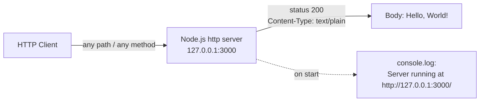

### 1.2.3 Success Criteria

Because the repository defines no explicit objectives, metrics, or acceptance tests, the only success criteria that can be stated are those directly observable from the code, and they are functional and binary in nature.

**Measurable objectives (observed).** The single observable objective is that executing `server.js` under a Node.js runtime causes the process to bind to `127.0.0.1:3000` and return the fixed `HTTP 200` `Hello, World!\n` response to any request. Successful startup is evidenced by the console message `Server running at http://127.0.0.1:3000/`.

**Critical success factors.** Operation depends on a small number of environmental preconditions: a Node.js runtime that provides the built-in `http` module must be available, and TCP port `3000` on the loopback interface must be free. Because there are no dependencies to install, dependency resolution is removed as a failure mode.

**Key performance indicators.** No KPIs, SLAs, latency/throughput targets, monitoring, or logging beyond the single startup message are defined anywhere in the repository. Notably, the only npm script — `test` — is a placeholder that runs `echo "Error: no test specified" && exit 1`, so the project has no passing automated test and no quantitative quality gate. These absences are characteristic of a minimal fixture and must not be interpreted as undocumented guarantees.

| Dimension | Observed in repository | Notes |
|---|---|---|
| Runtime success condition | Bind `127.0.0.1:3000`; return `200` with `Hello, World!\n` | Derived from `server.js`; not asserted by any test |
| Automated test coverage | None | `package.json` `test` script echoes an error and exits `1` |
| Defined KPIs / SLAs | None defined | No metrics, thresholds, or monitoring present |

## 1.3 Scope

This section delimits what the repository actually contains and does (in-scope) versus the capabilities, integrations, and use cases that are absent or explicitly unsupported (out-of-scope). Boundaries are drawn strictly from the tracked files; an item is treated as out-of-scope when no code or configuration in the repository implements it.

### 1.3.1 In-Scope

The in-scope elements are limited to the artifacts physically present in the eleven tracked files and the single runtime behavior they support.

**Core features and functionalities.** The only must-have, runtime-observable capability is the static HTTP greeting endpoint; the remaining items are static assets and metadata that are present in the repository but not consumed by the running server.

| Capability | Implementation | Notes |
|---|---|---|
| Static HTTP greeting endpoint | `server.js` | Returns `200` + `Hello, World!\n` for any request |
| npm packaging metadata | `package.json`, `package-lock.json` | Defines package identity; declares no dependencies |
| Static industry reference data | `industry.csv` | 43-category list present as a file (not read at runtime) |
| Binary sample fixtures | `100Pages.pdf`, `demo.jpg`, `sample.doc` | Present as fixtures (not read at runtime) |

The **primary workflow** in scope is singular: an operator starts the process (e.g., `node server.js`), the server binds the loopback address and logs its URL, and any HTTP client issuing a request to `http://127.0.0.1:3000/` receives the constant greeting. **Essential integrations** are limited to the Node.js built-in `http` module; there are no third-party or external integrations. **Key technical requirements** in scope are a Node.js runtime providing the `http` module, a free loopback TCP port `3000`, and the CommonJS execution model used by `server.js`.

**Implementation boundaries.** The system's operational footprint is deliberately narrow.

| Boundary dimension | Coverage |
|---|---|
| System boundary | A single Node.js process listening only on `127.0.0.1:3000` |
| User groups covered | Engineering / QA consumers of the fixture; no end users |
| Geographic / market coverage | Not applicable (no deployment, market, or locale features) |
| Data domains included | One static domain — industry categories (`industry.csv`), unused at runtime |

### 1.3.2 Out-of-Scope

Everything not enumerated above is out-of-scope. The items below are explicitly absent from the repository, not merely undocumented.

**Explicitly excluded features and capabilities.**

| Excluded capability | Status / evidence |
|---|---|
| Routing or multiple endpoints | Absent; `server.js` handles every request identically |
| Request-specific handling (method/path/query/body) | Absent; the response is constant |
| Authentication, login, or sessions | Not implemented; `LoginTest.java` is an incomplete, non-compiling scaffold |
| Data persistence or database | Absent; no storage and no state |
| Configuration or environment variables | Absent; host and port are hard-coded constants |
| HTTPS/TLS or remote (non-loopback) access | Absent; plain HTTP bound to `127.0.0.1` only |
| Runtime consumption of bundled data/binaries | Absent; `industry.csv`, `100Pages.pdf`, `demo.jpg`, `sample.doc` are never read |
| Logging, monitoring, or error handling | Only a single startup `console.log`; no error handling |
| Functional automated testing | `test` script exits `1`; `test.py.txt` and `test.txt.txt` are empty |

**Future-phase considerations.** The repository documents no roadmap, backlog, or planned enhancements. The presence of an incomplete `LoginTest.java` scaffold and two empty placeholder files (`test.py.txt`, `test.txt.txt`) may hint at intended-but-unrealized test additions, but nothing is committed or specified; these should be read as unfinished artifacts rather than as scoped future work.

**Integration points not covered.** No external APIs, databases, message queues, authentication providers, third-party services, or enterprise systems are integrated or referenced. The `main` entrypoint declared in `package.json` (`index.js`) does not exist in the repository, so even the conventional npm module-entry integration point is not fulfilled; the runnable file is `server.js`.

**Unsupported use cases.** The artifact does not support production or public-facing hosting, dynamic or content-negotiated responses, multi-tenant or high-concurrency load handling, secure (TLS) transport, or any workflow that depends on the bundled CSV/PDF/JPG/DOC files being parsed or served. Such uses are outside the demonstrated behavior of the code.

## 1.4 References

The following repository artifacts and Git metadata were examined as evidence for this section.

**Files**

- `README.md` — Established the repository name (`hao-backprop-test`), the stated purpose ("test project for backprop integration"), and the "Do not touch!" directive.
- `server.js` — Established the sole runtime component: a loopback HTTP server on `127.0.0.1:3000`, hard-coded host/port constants, the constant `HTTP 200` `Hello, World!\n` response, and the startup `console.log`.
- `package.json` — Established package identity (`hello_world` v1.0.0), MIT license, author `hxu`, the declared `main` entrypoint `index.js`, the placeholder `test` script (`echo "Error: no test specified" && exit 1`), and the absence of declared dependencies.
- `package-lock.json` — Established the lockfile version (3), MIT license, and the absence of any resolved dependency packages.
- `industry.csv` — Established the single static data domain: a one-column list (`Industry`) of 43 industry categories.
- `LoginTest.java` — Established the incomplete, non-compiling Java login-test scaffold in package `com.blitzyTest` (used to place authentication/login functionality out of scope).
- `test.py.txt` — Established an empty (0-byte) placeholder file.
- `test.txt.txt` — Established an empty (0-byte) placeholder file.
- `100Pages.pdf` — Established a binary sample fixture (PDF 1.7, ~9.46 MB) not consumed at runtime.
- `demo.jpg` — Established a binary sample fixture (JPEG, 3840×2160, ~2.12 MB) not consumed at runtime.
- `sample.doc` — Established a binary sample fixture (legacy OLE2 Word document, ~96 KB, containing a generic IEEE paper template) not consumed at runtime.

**Folders**

- Repository root (`""`) — Established the flat structure (no subfolders) and the full inventory of tracked files.

**Git metadata**

- `git ls-files` — Established the complete set of 11 tracked files, including the three binary files not surfaced by the file index.
- `git log` — Established the single commit `93b779e` ("Add files via upload"), authored by `Sandeep02Kumar02 <sandeepblitzyqa@gmail.com>` (Dec 12 2025).
- `git branch -a` — Established the branch topology (`main`, `QA-20-july-branch`, and remote Linux-container / Windows-VM branches) supporting the integration-fixture characterization.

# 2. Product Requirements

## 2.1 Feature Catalog

The `hao-backprop-test` repository is a deliberately minimal integration-test fixture whose only executable runtime is `server.js` (as established in Section 1.2 System Overview and Section 1.3 Scope). Accordingly, this catalog is derived **strictly from tracked code and packaging metadata**, and every entry corresponds to a discrete, independently testable behavior directly observed in the repository. This section documents features exactly as implemented; it does not propose, infer, or extrapolate capabilities beyond what the code demonstrates.

Static and unreferenced artifacts — `industry.csv`, the incomplete `LoginTest.java` scaffold, the binary sample fixtures (`100Pages.pdf`, `demo.jpg`, `sample.doc`), and the empty placeholder files (`test.py.txt`, `test.txt.txt`) — contain no executable code path in the running application and are therefore **not** catalogued as features. They are enumerated and dispositioned as non-integrated artifacts in Section 2.6.

### 2.1.1 Feature Inventory and Scope Basis

Three features are identified. Each is realized in the single tracked commit (`93b779e`, "Add files via upload") and maps to concrete source evidence.

| Feature ID | Feature Name | Category | Primary Source Evidence |
|---|---|---|---|
| F-001 | HTTP Server Lifecycle and Loopback Binding | Runtime / Network Service | `server.js` (L1, L6, L12–L14) |
| F-002 | Static "Hello, World!" HTTP Response | Runtime / Request Handling | `server.js` (L6–L10) |
| F-003 | npm Package Definition and Dependency Lock | Packaging / Configuration | `package.json`, `package-lock.json` |

**Feature selection basis.** An artifact is treated as a feature only if it (a) contributes an executable runtime behavior or (b) defines the package/build identity of the project. F-001 and F-002 are the two distinct, separately verifiable runtime behaviors implemented within the 14-line `server.js` module (process/network lifecycle versus response content). F-003 captures the npm packaging surface. No other tracked artifact meets either criterion.

**Version tracking.** The repository contains exactly one commit and one declared package version. All features and their requirements are therefore documented at **version 1.0.0** (per `package.json`/`package-lock.json`) as of commit `93b779e`. There is no changelog, backlog, or roadmap in the repository, so no feature carries a "Proposed," "Approved," or "In Development" status — all implemented features are recorded as "Completed," with one known defect noted against F-003.

### 2.1.2 F-001: HTTP Server Lifecycle and Loopback Binding

**Feature Metadata**

| Attribute | Value |
|---|---|
| Unique ID | F-001 |
| Feature Name | HTTP Server Lifecycle and Loopback Binding |
| Feature Category | Runtime / Network Service |
| Priority Level | Critical |
| Status | Completed |

**Description**

- **Overview.** F-001 instantiates a Node.js HTTP server and binds it to the loopback interface. In `server.js`, the built-in `http` module is imported (`const http = require('http')`, L1), the server is created with `http.createServer(...)` (L6), and `server.listen(port, hostname, callback)` (L12–L14) binds the process to host `127.0.0.1` and port `3000`. On successful bind, the listen callback emits a single startup confirmation via `console.log` — `Server running at http://127.0.0.1:3000/` (L13).
- **Business Value.** As an integration/QA fixture, this feature provides a deterministic, reproducible network target that starts with no dependency installation and no external services, minimizing failure modes for the tooling that consumes it.
- **User Benefits.** The identified consumers (engineering and QA tooling, per Section 1.1) obtain a predictable local endpoint whose readiness is explicitly signaled by the startup log line.
- **Technical Context.** The host (`127.0.0.1`, L3) and port (`3000`, L4) are hard-coded module-scoped constants; there is no environment-based configuration. The server runs as a single Node.js process on the loopback interface and is therefore unreachable from other hosts by default. The module uses the CommonJS system and has no build step.

**Dependencies**

| Dependency Type | Detail |
|---|---|
| Prerequisite Features | None (F-001 is the foundational runtime feature) |
| System Dependencies | A Node.js runtime providing the built-in `http` module; TCP port `3000` free on the loopback interface |
| External Dependencies | None — `package.json` declares no dependencies and `package-lock.json` records none |
| Integration Requirements | Hosts the F-002 request handler (passed as the `createServer` callback); no external integration |

### 2.1.3 F-002: Static "Hello, World!" HTTP Response

**Feature Metadata**

| Attribute | Value |
|---|---|
| Unique ID | F-002 |
| Feature Name | Static "Hello, World!" HTTP Response |
| Feature Category | Runtime / Request Handling |
| Priority Level | Critical |
| Status | Completed |

**Description**

- **Overview.** F-002 is the request handler registered as the callback to `http.createServer(...)` (`server.js` L6–L10). For every inbound request — regardless of method, path, query string, headers, or body — it sets `res.statusCode = 200` (L7), sets the header `Content-Type: text/plain` (L8), and terminates the response with the body `Hello, World!\n` (L9). The response is constant and fully deterministic.
- **Business Value.** A single, invariant response provides a stable assertion target: integration and packaging tests can rely on a known status code, content type, and body without accounting for routing or state.
- **User Benefits.** Any HTTP client issuing any request to `http://127.0.0.1:3000/` receives an identical, predictable plain-text greeting.
- **Technical Context.** There is no routing, request parsing, statefulness, persistence, authentication, or content negotiation. Because the handler ignores all request attributes, no input validation is performed and no error branches exist.

**Dependencies**

| Dependency Type | Detail |
|---|---|
| Prerequisite Features | F-001 — the handler is only invoked once the server has been created and is listening |
| System Dependencies | The same Node.js `http` module runtime that hosts F-001 |
| External Dependencies | None |
| Integration Requirements | Registered as the `createServer` callback within the same `server.js` module; no external integration |

### 2.1.4 F-003: npm Package Definition and Dependency Lock

**Feature Metadata**

| Attribute | Value |
|---|---|
| Unique ID | F-003 |
| Feature Name | npm Package Definition and Dependency Lock |
| Feature Category | Packaging / Configuration |
| Priority Level | High |
| Status | Completed (with one known defect — declared `main` entrypoint absent) |

**Description**

- **Overview.** F-003 defines the project's npm identity and dependency-resolution surface. `package.json` declares the package name `hello_world`, version `1.0.0`, description "Hello world in Node.js", the `main` entrypoint `index.js`, author `hxu`, MIT license, and a single `test` script (`echo "Error: no test specified" && exit 1`). `package-lock.json` (lockfile version 3, `requires: true`) records only the root package entry with the MIT license and no resolved dependencies.
- **Business Value.** Standard npm metadata enables tooling to identify the package, apply the MIT license terms, and perform reproducible (here, trivially empty) dependency resolution.
- **User Benefits.** Consumers can run npm lifecycle commands (`npm install`, `npm test`) against a well-formed manifest, and the license and authorship are unambiguous.
- **Technical Context.** The declared `main` entrypoint `index.js` **does not exist** in the repository; the actual runnable file is `server.js`. Therefore the conventional npm module-entry integration point is unfulfilled. The `test` script is a placeholder that always exits with status `1`, so there is no passing automated test (consistent with Section 1.2.3 and Section 1.3.2).

**Dependencies**

| Dependency Type | Detail |
|---|---|
| Prerequisite Features | None |
| System Dependencies | An npm/Node.js toolchain to parse the manifest and execute lifecycle scripts |
| External Dependencies | None (zero declared or locked packages) |
| Integration Requirements | The declared `main` (`index.js`) is a broken conventional entry point (file absent); no runtime code imports the manifest |

## 2.2 Functional Requirements

Each feature from Section 2.1 is decomposed below into testable functional requirements using the identifier format `F-XXX-RQ-YYY`. Requirements are expressed exactly as the code behaves; acceptance criteria are stated as directly verifiable conditions against `server.js`, `package.json`, and `package-lock.json`.

**Applicability note on performance criteria.** The repository defines **no** latency, throughput, concurrency, or resource-utilization targets, and no KPIs or SLAs (confirmed in Section 1.2.3 Success Criteria). Where the prompt calls for "Performance Criteria," this is stated explicitly as *none defined* rather than inferred. All requirements are complexity **Low**, reflecting the 14-line, dependency-free implementation.

### 2.2.1 F-001 — HTTP Server Lifecycle and Loopback Binding

**Requirement Details**

| Requirement ID | Description | Priority | Complexity |
|---|---|---|---|
| F-001-RQ-001 | Create an HTTP server instance using the Node.js built-in `http` module | Must-Have | Low |
| F-001-RQ-002 | Bind and listen on host `127.0.0.1`, TCP port `3000` | Must-Have | Low |
| F-001-RQ-003 | Emit a startup confirmation log line once the server is listening | Should-Have | Low |

**Acceptance Criteria**

| Requirement ID | Acceptance Criteria (verifiable) |
|---|---|
| F-001-RQ-001 | `server.js` imports `http` (L1) and invokes `http.createServer(...)` (L6), yielding an `http.Server` object |
| F-001-RQ-002 | After `server.listen(3000, '127.0.0.1', ...)` (L12), a TCP client can connect to `127.0.0.1:3000`; the endpoint is not exposed on any non-loopback interface |
| F-001-RQ-003 | On successful bind, stdout contains exactly `Server running at http://127.0.0.1:3000/` (L13) |

**Technical Specifications**

| Requirement ID | Input Parameters | Output / Response | Data Requirements |
|---|---|---|---|
| F-001-RQ-001 | None (no arguments or environment variables) | An `http.Server` instance | None |
| F-001-RQ-002 | Module-scoped constants `hostname='127.0.0.1'` (L3), `port=3000` (L4) | A bound, listening TCP socket | None |
| F-001-RQ-003 | Interpolated `hostname` and `port` constants | One stdout line via `console.log` | None |

Performance criteria: none defined in the repository.

**Validation Rules**

| Requirement ID | Business & Data Validation | Security Requirements | Compliance Requirements |
|---|---|---|---|
| F-001-RQ-001 | Server object must exist before `listen` is called | Plain HTTP only — no TLS is configured | None defined |
| F-001-RQ-002 | Host/port are fixed constants (no validation of external input) | Loopback-only binding constrains reachability to the local host | None defined |
| F-001-RQ-003 | Single confirmation emitted per successful start | No secrets or credentials are logged | None defined |

### 2.2.2 F-002 — Static "Hello, World!" HTTP Response

**Requirement Details**

| Requirement ID | Description | Priority | Complexity |
|---|---|---|---|
| F-002-RQ-001 | Respond with HTTP status `200` to every request | Must-Have | Low |
| F-002-RQ-002 | Set the response header `Content-Type: text/plain` | Should-Have | Low |
| F-002-RQ-003 | Return the exact response body `Hello, World!\n` for every request | Must-Have | Low |

**Acceptance Criteria**

| Requirement ID | Acceptance Criteria (verifiable) |
|---|---|
| F-002-RQ-001 | For any HTTP method and any path, the response status code equals `200` (`res.statusCode = 200`, L7) |
| F-002-RQ-002 | Every response includes the header `Content-Type: text/plain` (`res.setHeader(...)`, L8) |
| F-002-RQ-003 | The response body is byte-for-byte `Hello, World!\n` (`res.end(...)`, L9), identical regardless of request method, path, query, headers, or body |

**Technical Specifications**

| Requirement ID | Input Parameters | Output / Response | Data Requirements |
|---|---|---|---|
| F-002-RQ-001 | HTTP request object (ignored) | Response with status `200` | None |
| F-002-RQ-002 | None | Header `Content-Type: text/plain` | None |
| F-002-RQ-003 | None (request attributes are not read) | Fixed plain-text body `Hello, World!\n` | A single hard-coded string literal |

Performance criteria: none defined in the repository.

**Validation Rules**

| Requirement ID | Business & Data Validation | Security Requirements | Compliance Requirements |
|---|---|---|---|
| F-002-RQ-001 | Constant success status; no request validation because input is ignored | No authentication or authorization gate (by design) | None defined |
| F-002-RQ-002 | Fixed content type; no content negotiation | No security headers configured | None defined |
| F-002-RQ-003 | Response is invariant and deterministic | No user input is reflected, eliminating injection exposure in the response | None defined |

### 2.2.3 F-003 — npm Package Definition and Dependency Lock

**Requirement Details**

| Requirement ID | Description | Priority | Complexity |
|---|---|---|---|
| F-003-RQ-001 | Declare package identity, authorship, and MIT license in the manifest | Must-Have | Low |
| F-003-RQ-002 | Provide a `test` npm lifecycle script | Could-Have | Low |
| F-003-RQ-003 | Maintain a lockfile recording zero resolved dependencies | Should-Have | Low |

**Acceptance Criteria**

| Requirement ID | Acceptance Criteria (verifiable) |
|---|---|
| F-003-RQ-001 | `package.json` parses as valid JSON with `name=hello_world`, `version=1.0.0`, `license=MIT`, `author=hxu`, and a `description`; `package-lock.json` `name`/`version` match |
| F-003-RQ-002 | `npm test` executes `echo "Error: no test specified" && exit 1` and terminates with exit code `1` (placeholder — no functional test runs) |
| F-003-RQ-003 | `package-lock.json` has `lockfileVersion: 3` and a `packages` object containing only the root `""` entry, so `npm install` resolves zero third-party packages |

**Technical Specifications**

| Requirement ID | Input Parameters | Output / Response | Data Requirements |
|---|---|---|---|
| F-003-RQ-001 | None (static manifest file) | Parsed package metadata | JSON key/value fields |
| F-003-RQ-002 | None | Console message plus process exit code `1` | None |
| F-003-RQ-003 | None (static lockfile) | Deterministic empty dependency graph | JSON lockfile (version 3) |

Performance criteria: none defined in the repository.

**Validation Rules**

| Requirement ID | Business & Data Validation | Security Requirements | Compliance Requirements |
|---|---|---|---|
| F-003-RQ-001 | Identity (name/version) must be consistent between manifest and lockfile; version is valid semver | No credentials stored in the manifest | MIT license declared in both `package.json` and `package-lock.json` |
| F-003-RQ-002 | Placeholder is explicitly non-functional and always fails | Not applicable | None defined |
| F-003-RQ-003 | Empty, reproducible dependency graph | Zero third-party supply-chain surface | MIT license recorded for the root package |

**Known defect (F-003).** `package.json` declares `"main": "index.js"`, but no `index.js` file exists in the repository; the only runnable file is `server.js`. Consequently, conventional entry-point resolution (`node .` or `require('hello_world')`) does not resolve to executable code. This is recorded as a defect against the "Completed" status of F-003 rather than as an unbuilt requirement.

## 2.3 Feature Relationships

This section documents only those relationships that are directly evident in the tracked source. Because the entire runtime lives in a single 14-line module and there are no third-party dependencies, the relationship graph is intentionally small.

### 2.3.1 Feature Dependencies Map

The two runtime features (F-001, F-002) are co-located in `server.js`: F-002 is the request-handler callback passed to the `http.createServer(...)` call that F-001 owns, so F-002 cannot execute until F-001 has created and started the server. F-003 (packaging) is build-time metadata that is independent of the running process — the runtime never imports the manifest — and its declared `main` entrypoint (`index.js`) is a broken link because that file does not exist.

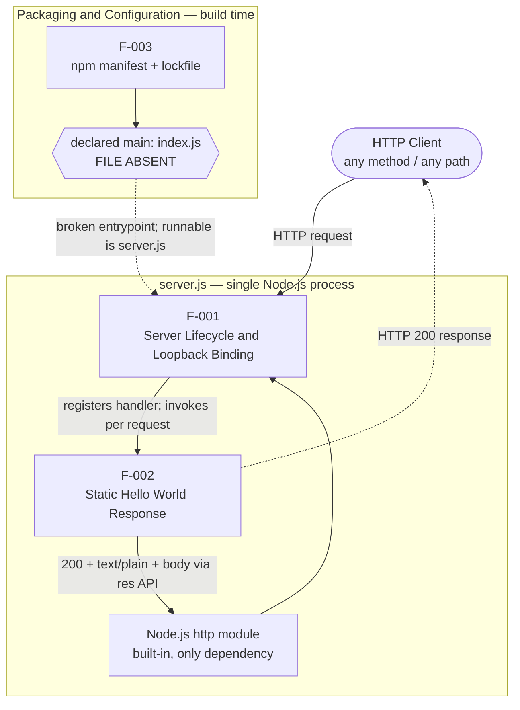

| Dependent Feature | Depends On | Nature of Dependency |
|---|---|---|
| F-002 | F-001 | Runtime — the handler is invoked only while the server is created and listening |
| F-001 | Node.js `http` module | System — requires the built-in module to create/bind the server |
| F-003 | None | Independent build-time metadata; not imported by the runtime |

The primary request-handling process flow that these features realize is depicted in the flowchart in Section 1.2.2 High-Level Description (any request → HTTP 200 + `text/plain` + `Hello, World!\n`, with a one-time startup log).

### 2.3.2 Integration Points

The application's only integration is with the Node.js standard library; it exposes exactly one network surface and has no third-party or external integrations (consistent with Section 1.3.2 Out-of-Scope).

| Integration Point | Type | Status |
|---|---|---|
| Node.js built-in `http` module | Internal (standard library) | Active — imported by `server.js` (L1) |
| Loopback network endpoint `127.0.0.1:3000` | Inbound HTTP | Active — the sole externally observable interface |
| npm `main` entrypoint (`index.js` in `package.json`) | Module resolution | Broken — declared file is absent; runnable file is `server.js` |
| External APIs / databases / queues / auth providers | External | None present or referenced |

### 2.3.3 Shared Components and Common Services

**Shared components.** Three concrete elements are shared across the runtime features:

| Shared Element | Shared By | Role |
|---|---|---|
| Node.js `http` module | F-001, F-002 | F-001 calls `createServer`/`listen`; F-002 uses the `res` response API |
| `server` object (from `http.createServer`) | F-001, F-002 | Binds F-002's handler (via `createServer`) and is started by F-001 (via `listen`) |
| Module-scoped constants `hostname` (L3), `port` (L4) | F-001 | Consumed by `listen` binding and by the startup `console.log` |

**Common services.** There are **no** common services. The repository contains no shared configuration service, database, caching layer, authentication service, or logging framework — the only diagnostic output is a single `console.log` startup line. Each cross-cutting concern is either absent by design or inlined directly in `server.js`, so no feature consumes a shared service abstraction.

## 2.4 Implementation Considerations

The considerations below are grounded in the observed implementation. Because the project is an intentionally minimal fixture, several conventional dimensions (performance targets, scaling strategy) resolve to "none defined" or "not applicable," which is stated explicitly rather than filled with assumed values.

### 2.4.1 F-001 — HTTP Server Lifecycle and Loopback Binding

| Consideration | Detail |
|---|---|
| Technical constraints | Host (`127.0.0.1`) and port (`3000`) are hard-coded module-scoped constants with no environment/config override; CommonJS single-file module; requires a Node.js runtime providing the built-in `http` module; the `listen` call has no error handler, so a bind failure (e.g., port `3000` already in use) would surface as an unhandled error |
| Performance requirements | None defined; startup is a single bind plus one `console.log`; execution is single-threaded on the Node.js event loop |
| Scalability considerations | Single process with no clustering, worker threads, or process manager; loopback-only binding prevents access from other hosts; the server cannot scale horizontally as configured |
| Security implications | Plain HTTP only (no TLS); binding to `127.0.0.1` constrains network exposure to the local host; no authentication or authorization |
| Maintenance requirements | 14-line file with zero dependencies to patch; no configuration surface; the `README.md` "Do not touch!" directive signals the fixture is meant to remain fixed |

### 2.4.2 F-002 — Static "Hello, World!" HTTP Response

| Consideration | Detail |
|---|---|
| Technical constraints | Response is fully constant; no routing, request parsing, or web framework; the request object is ignored entirely; status, header, and body are literals |
| Performance requirements | None defined; the handler performs no I/O, persistence, or non-trivial computation — only a small fixed-string write — but no measured latency or throughput target exists |
| Scalability considerations | The handler is stateless, but there is no explicit concurrency, backpressure, or load handling; behavior under high concurrency is neither configured nor documented |
| Security implications | No request data is read or reflected, eliminating input-driven injection vectors in the response; no security headers (e.g., HSTS/CSP) and no rate limiting are configured |
| Maintenance requirements | Trivial — a single handler; altering the greeting, status, or content type is a one-line change in `server.js` |

### 2.4.3 F-003 — npm Package Definition and Dependency Lock

| Consideration | Detail |
|---|---|
| Technical constraints | Static JSON manifest and lockfile; `lockfileVersion 3` requires a compatible npm; the declared `main` (`index.js`) is absent, so entry-point resolution does not reach executable code |
| Performance requirements | Not applicable at runtime (build-time metadata); the zero-dependency graph makes `npm install` effectively instantaneous |
| Scalability considerations | Not applicable; a zero-dependency graph avoids dependency-resolution complexity entirely |
| Security implications | No third-party dependencies means no supply-chain attack surface and no transitive vulnerabilities; no secrets are stored in the manifest |
| Maintenance requirements | The absent-`index.js` defect should be resolved (add `index.js` or point `main` at `server.js`); the placeholder `test` script always exits `1`, so it cannot serve as a CI quality gate; the MIT license is permissive and low-maintenance |

## 2.5 Requirements Traceability Matrix

This matrix links every functional requirement to its parent feature, the exact source evidence, and a verification method. All requirements are at **version 1.0.0** as of commit `93b779e` (the repository's only commit). The listed verification methods describe how each requirement can be validated by inspection or manual execution; note that the repository ships **no automated tests** — the `npm test` script is a placeholder that exits `1` — so verification is currently observational rather than automated.

### 2.5.1 Requirement-to-Source Traceability

| Requirement ID | Feature | Source Evidence | Verification Method |
|---|---|---|---|
| F-001-RQ-001 | F-001 | `server.js` L1, L6 | Confirm `require('http')` and `http.createServer(...)` produce a server object |
| F-001-RQ-002 | F-001 | `server.js` L3–L4, L12 | Open a TCP/HTTP connection to `127.0.0.1:3000` and confirm it is accepted |
| F-001-RQ-003 | F-001 | `server.js` L13 | Assert stdout contains `Server running at http://127.0.0.1:3000/` |
| F-002-RQ-001 | F-002 | `server.js` L7 | Issue any HTTP request and assert response status `200` |
| F-002-RQ-002 | F-002 | `server.js` L8 | Assert response header `Content-Type: text/plain` |
| F-002-RQ-003 | F-002 | `server.js` L9 | Assert response body equals `Hello, World!\n` |
| F-003-RQ-001 | F-003 | `package.json` L2–L5, L9–L10; `package-lock.json` L2–L3, L10 | Parse JSON and assert name/version/license/author/description |
| F-003-RQ-002 | F-003 | `package.json` L6–L8 | Run `npm test`; confirm the placeholder message and exit code `1` |
| F-003-RQ-003 | F-003 | `package-lock.json` L4, L6–L12 | Assert `lockfileVersion: 3` and only the root `""` package entry (no dependencies) |

### 2.5.2 Coverage Summary and Specification Cross-References

**Coverage summary.** Three features decompose into nine requirements, all realized in code and recorded as "Completed" (with the F-003 known defect noted in Sections 2.1.4 and 2.2.3). Automated test coverage is zero.

| Metric | Count | Notes |
|---|---|---|
| Features cataloged | 3 | F-001, F-002, F-003 |
| Functional requirements | 9 | F-001-RQ-001 … F-003-RQ-003 |
| Requirements implemented in code | 9 | All verifiable by inspection/manual execution |
| Requirements covered by automated tests | 0 | `test` script exits `1`; no test files present |

**Specification cross-references.** Each feature is discussed in the following already-documented sections of this specification:

| Feature | Related Specification Sections | Focus of Cross-Reference |
|---|---|---|
| F-001 | 1.2.2, 1.2.3, 1.3.1 | Runtime capability, observed success criteria, in-scope endpoint |
| F-002 | 1.2.2, 1.3.1, 1.3.2 | Constant-response behavior; in-scope greeting; out-of-scope routing |
| F-003 | 1.1, 1.2.2, 1.3.2 | Package identity/version/license; manifest and lockfile; absent `index.js` |

## 2.6 Assumptions, Constraints, and Non-Integrated Artifacts

This section records the assumptions and constraints that bound the requirements above, and it formally dispositions the tracked repository artifacts that are **not** features.

### 2.6.1 Assumptions

- A Node.js runtime providing the built-in `http` module is available on the host that executes `server.js`.
- TCP port `3000` on the loopback interface (`127.0.0.1`) is free when the process starts.
- An npm/Node.js toolchain is available for F-003 lifecycle operations (`npm install`, `npm test`).
- The repository represents a single fixed version — `1.0.0` at commit `93b779e` — so no upgrade, migration, or backward-compatibility behavior is assumed.
- Consumers reach the endpoint from the same host, since the loopback binding is not remotely reachable.

### 2.6.2 Constraints

- **Network:** binding is loopback-only (`127.0.0.1`); the endpoint is not reachable from other hosts, and there is no TLS.
- **Configuration:** host and port are hard-coded constants with no environment-variable or config-file override.
- **Quality gates:** there are no automated tests; the `npm test` script exits `1`, so it cannot act as a CI gate.
- **Resilience:** there is no error handling — a bind failure or runtime error is unhandled.
- **Packaging:** the declared `main` entrypoint (`index.js`) is absent, so conventional module-entry resolution is broken; the runnable file is `server.js`.
- **Change control:** the `README.md` "Do not touch!" directive constrains modification of the fixture.
- **History:** a single commit and single declared version means no roadmap, backlog, or changelog exists.

### 2.6.3 Non-Integrated Artifacts (Excluded from the Feature Catalog)

The repository tracks 11 files, but only the three feature-bearing files (`server.js`, `package.json`, `package-lock.json`) contribute executable behavior or package identity. The remaining tracked artifacts are present but have **no executable code path in the running application** and are therefore excluded from the feature catalog (consistent with Section 1.3.1 and Section 1.3.2). They are listed here for completeness and traceability.

| Artifact | Nature | Disposition |
|---|---|---|
| `industry.csv` | Single-column dataset — header `Industry` plus 43 categories | Never read by any code; not a feature |
| `LoginTest.java` | Incomplete, non-compiling Java scaffold (`com.blitzyTest.LoginTest`) | Not integrated; corroborates that authentication/login is out of scope |
| `100Pages.pdf` | Binary sample fixture (~9.46 MB PDF) | Static; not served, parsed, or referenced at runtime |
| `demo.jpg` | Binary sample fixture (~2.12 MB JPEG) | Static; not served, parsed, or referenced at runtime |
| `sample.doc` | Binary sample fixture (~96 KB legacy Word document) | Static; not served, parsed, or referenced at runtime |
| `test.py.txt` | Zero-byte placeholder | Empty; defines no behavior |
| `test.txt.txt` | Zero-byte placeholder | Empty; defines no behavior |

## 2.7 References

The following repository artifacts, Git metadata, and specification sections were examined as evidence for the features and requirements documented above.

**Files**

- `server.js` — Established features F-001 and F-002: the `http` import (L1), the hard-coded `hostname`/`port` constants (L3–L4), the `createServer` request handler returning status `200`, `Content-Type: text/plain`, and body `Hello, World!\n` (L6–L10), and the `listen` binding plus startup `console.log` (L12–L14).
- `package.json` — Established F-003 identity and configuration: package `hello_world` v1.0.0, description, declared `main` (`index.js`, absent), placeholder `test` script, author `hxu`, MIT license, and the absence of dependencies.
- `package-lock.json` — Established the lockfile (version 3), the MIT license, and the zero-dependency resolution used by F-003.
- `industry.csv` — Established a tracked, non-integrated dataset (header `Industry` plus 43 categories) confirmed as excluded from the feature catalog.
- `LoginTest.java` — Established the incomplete, non-compiling Java scaffold (`com.blitzyTest.LoginTest`) supporting the exclusion of authentication/login from scope.
- `README.md` — Established the repository name (`hao-backprop-test`), the stated purpose ("test project for backprop integration"), and the "Do not touch!" change-control constraint.
- `100Pages.pdf` — Established a non-integrated binary sample fixture (~9.46 MB).
- `demo.jpg` — Established a non-integrated binary sample fixture (~2.12 MB).
- `sample.doc` — Established a non-integrated binary sample fixture (~96 KB legacy Word document).
- `test.py.txt` — Established a zero-byte placeholder file with no behavior.
- `test.txt.txt` — Established a zero-byte placeholder file with no behavior.

**Folders**

- Repository root (`""`) — Established the flat structure (no subfolders) and the full inventory of tracked files used to bound the feature catalog.

**Git metadata**

- `git ls-files` — Established the complete set of 11 tracked files, including the three binaries not surfaced by the file index.
- `git log` — Established the single commit `93b779e` ("Add files via upload"), fixing the version baseline (1.0.0) for all requirements.
- Terminal inspection (`ls`, `git branch -a`) — Confirmed the absence of `index.js` and `node_modules`, that `server.js` is the only JavaScript file, and the branch topology consistent with an integration fixture.

**Cross-referenced specification sections**

- 1.1 Executive Summary — Package identity/version/license, authorship, and the single-commit fixture framing.
- 1.2 System Overview (1.2.2, 1.2.3) — Runtime capability, the request-handling process flowchart, observed success criteria, and the absence of KPIs/automated tests.
- 1.3 Scope (1.3.1, 1.3.2) — In-scope greeting endpoint and packaging metadata; out-of-scope routing, authentication, persistence, and runtime consumption of bundled data/binaries.
- 1.4 References — Corroborated the binary sample-fixture details and Git metadata.

# 3. Technology Stack

## 3.1 Programming Languages

The repository is an intentionally minimal integration-test fixture (consistent with the framing in §1.2 System Overview and §2.6 Assumptions, Constraints, and Non-Integrated Artifacts), and its language footprint reflects that scope. Only two programming languages appear in the tracked source files, and only one of them is executable. No language or runtime version is pinned anywhere in the repository — there is no `engines` field in `package.json`, no `.nvmrc`, `.tool-versions`, or `.java-version`, and no build or toolchain descriptor — so the table below reports each version as *declared* or *inferred*, never assumed.

| Language | Component / Platform | Source file(s) | Status | Version constraint |
|---|---|---|---|---|
| JavaScript (Node.js, CommonJS) | Backend HTTP server (runtime) | `server.js` | Functional — the sole runnable component | None declared; toolchain lower bound inferred as npm ≥ 7 / Node.js ≥ 15 (see §3.3) |
| Java (Java SE) | Login-test scaffold | `LoginTest.java` | Incomplete / non-compiling; not integrated | None declared; no JDK version or build file present |

**JavaScript on Node.js (CommonJS) — primary language.** `server.js` is written in plain CommonJS JavaScript: it acquires the runtime capability via `const http = require('http')`, declares module-scoped constants for the host (`127.0.0.1`) and port (`3000`), creates a server with `http.createServer(...)`, and starts it with `server.listen(...)`. It is the only file that produces runtime behavior. JavaScript/Node.js was selected because the project's single purpose is to expose a fixed "Hello, World!" HTTP endpoint for integration testing; the canonical Node.js pattern satisfies that purpose with zero third-party code, which maximizes portability and reproducibility across execution environments (the Git branch topology names Linux-container and Windows-VM environments — see §1.2.1). *Selection criteria:* minimal footprint, no build step, and reliance solely on the standard library. *Constraints and dependencies:* a Node.js runtime that provides the built-in `http` module must be present, and the code uses the CommonJS module system rather than ES modules.

**Java (Java SE) — non-integrated scaffold.** `LoginTest.java` declares `package com.blitzyTest;` and a single `public class LoginTest` whose `main(String[] args)` method contains only a bare `Web` identifier with no declaration, statement, or terminating semicolon. As written it does not compile, there is no Maven or Gradle build descriptor, and nothing invokes it; it is therefore an unfinished scaffold rather than an active platform component (corroborated by §2.6.3, which dispositions it as a non-integrated artifact). It contributes no runtime capability and pins no JDK version.

**Python — named by a placeholder only, not used.** The file `test.py.txt` is a zero-byte placeholder, and there is no `.py` source anywhere in the repository. Although the organization's default technology stack names Python as a backend language, this repository contains no Python code; Python is therefore *not* part of this system's stack.

The diagram below maps the languages to their components and marks which are runnable versus non-integrated.

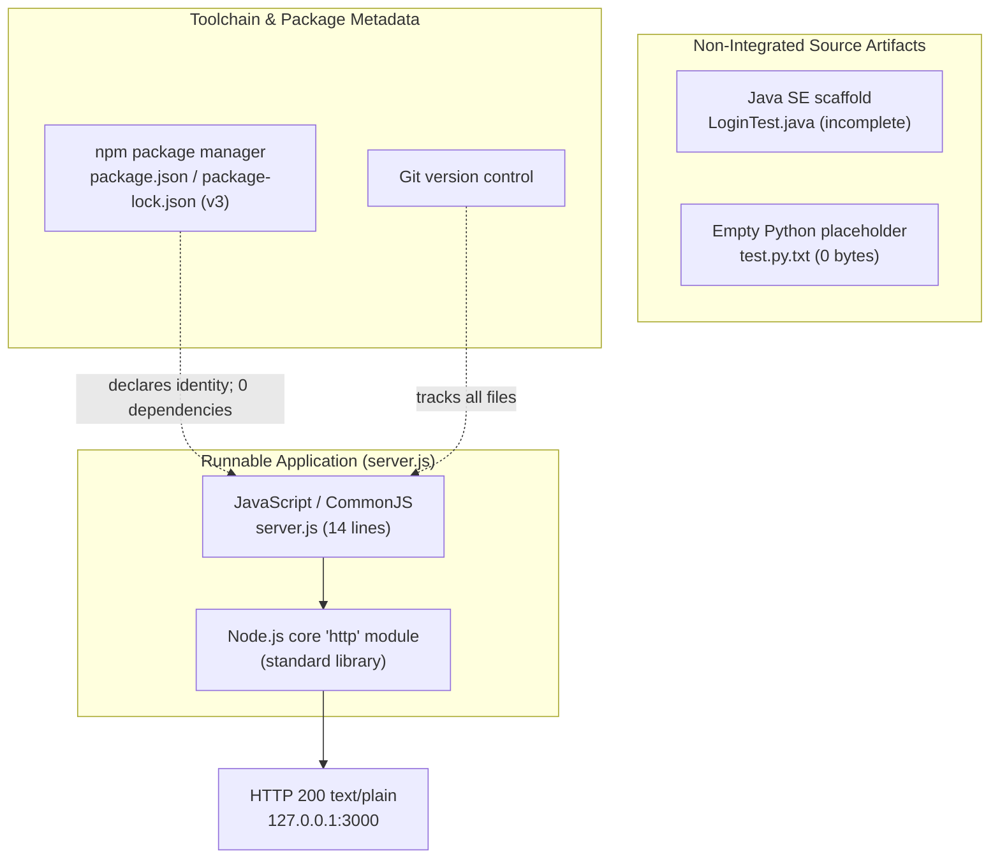

## 3.2 Frameworks & Libraries

This system uses **no application framework and no third-party libraries**. The single runnable component, `server.js`, is built exclusively on the Node.js standard library: its only import is the built-in `http` module (`require('http')`). There is no web framework (e.g., Express, Koa, Fastify), no build/transpilation library, and no runtime library of any kind. `package.json` declares neither `dependencies` nor `devDependencies`, and `package-lock.json` resolves no packages (see §3.3), which confirms the framework-free design at the manifest level.

| Layer | Framework / Library | Version | Role & justification |
|---|---|---|---|
| HTTP server | Node.js core `http` module (standard library) | Bundled with the Node.js runtime; not independently versioned or pinned | Supplies `createServer()` and `server.listen()`; chosen so the fixture depends only on the runtime |
| Web framework | None (no Express/Koa/Fastify) | — | A single constant response needs no routing, middleware, or templating layer |
| Frontend framework | None (no React, React Native, TailwindCSS) | — | The system has no UI or client-side code |
| Backend framework | None (no Flask) | — | The backend is Node.js, not Python; no server framework is present |
| AI framework | None (no LangChain) | — | No AI/LLM or agentic functionality exists |

**Justification for the standard-library-only approach.** Because the sole capability is returning a fixed `HTTP 200` `text/plain` body of `Hello, World!\n` for every request (see §1.2.2 and §2.4.2), a framework would add install steps, a dependency graph, and a supply-chain surface with no functional benefit. Relying only on the built-in `http` module keeps the fixture reproducible and immediately runnable across the Linux-container and Windows-VM environments implied by the branch topology (§1.2.1).

**Compatibility requirements.** The `http` module is part of the Node.js core API, so the only compatibility requirement is a Node.js runtime that exposes it; the code targets the CommonJS module system (`require`), not ECMAScript modules, so it must be executed as CommonJS. No transpiler, bundler, or polyfill is required or present.

**Security implications.** The absence of frameworks and libraries means there are no framework-level CVEs or transitive advisories to track and patch. Conversely, no security middleware is provided either: there is no TLS termination, no security headers (e.g., HSTS/CSP), no input validation layer, and no rate limiting. As documented in §2.4.1–§2.4.2, the effective network-exposure control is the loopback-only bind (`127.0.0.1`), and the handler reads no request data, which removes input-driven injection vectors from the response path.

## 3.3 Open Source Dependencies

This project has **zero third-party or open-source runtime and development dependencies**. Two pieces of evidence confirm this at the manifest and lockfile levels:

- `package.json` contains no `dependencies` and no `devDependencies` objects at all.
- `package-lock.json` uses `lockfileVersion` 3 with `requires: true`, and its `packages` object contains only the root-package entry (the empty-string key `""`); there are no resolved dependency entries.

The only package described anywhere is the project itself.

| Package | Version | Type | Source registry | License |
|---|---|---|---|---|
| `hello_world` (this repository) | `1.0.0` | Root package (local; never published) | Not published to any registry | MIT |
| Third-party / open-source packages | None | — | npm public registry (`registry.npmjs.org`) would apply if any existed | — |

**Package registry.** As a Node.js/npm project, the applicable registry for any dependency would be the npm public registry; however, because the dependency graph is empty, nothing is ever fetched or resolved, and no registry access is required to run the application.

**Lockfile format and toolchain requirement.** The `lockfileVersion: 3` declaration is a meaningful version indicator even though there are no dependencies to lock. Per the npm documentation, <cite index="3-10:11">lockfileVersion 3 is the lockfile version used by npm v9, and is backwards compatible to npm v7.</cite> The npm CLI describes v3 as containing <cite index="8-10:12">only the new lockfile information introduced in npm version 7, smaller on disk than lockfile version 2 but not interoperable with older npm versions, and ideal if all users are on npm version 7 and higher.</cite> In practice this means the lockfile requires an npm CLI of **version 7 or newer** to be consumed faithfully (npm v6 and earlier cannot interpret it), and npm v9 emits this format by default. Because npm ships bundled with Node.js, this establishes an inferred toolchain lower bound of Node.js ≥ 15 (which shipped npm 7). This is consistent with §2.4.3, which notes that `lockfileVersion 3` "requires a compatible npm."

**Security implications.** An empty dependency graph is the strongest possible supply-chain posture: as noted in §2.4.3, there are no third-party packages, hence no transitive vulnerabilities and no supply-chain attack surface, and `npm install` is effectively instantaneous. There are also no dependency-license obligations to reconcile; the project's own license is the permissive **MIT** license declared in both `package.json` and `package-lock.json`.

## 3.4 Third-Party Services

This system integrates with **no third-party services of any kind** — no external APIs, no authentication provider, no monitoring/observability tooling, and no cloud services. The evidence is direct: `server.js` imports only the Node.js built-in `http` module, contains no HTTP/SDK client and makes no outbound calls, exposes only a loopback endpoint (`127.0.0.1:3000`), and reads no configuration or credentials; `package.json` declares no dependencies that could supply a service client. §1.2.1 reaches the same conclusion ("the application integrates with nothing").

The table maps each service category from the organization's default technology stack to its actual presence here.

| Service category | Default-stack expectation | Present? | Evidence |
|---|---|---|---|
| External API / integration | — | No | `server.js` imports only the built-in `http` module; no HTTP client, SDK, or outbound request exists |
| Authentication service | Auth0 | No | No authentication code; `LoginTest.java` is an incomplete, non-integrated scaffold (§1.3.2, §2.6.3) |
| Monitoring / observability | — | No | Only a single startup `console.log`; no metrics, APM, tracing, or logging agent (§1.2.3) |
| Cloud services | AWS | No | No cloud SDK, service configuration, or credentials; no infrastructure-as-code (see §3.6) |
| Managed database service | MongoDB | No | No database client, driver, or connection string (see §3.5) |
| AI / LLM service | LangChain | No | No AI/LLM code or model-API client |

**Integration requirements.** The only "integrations" the running process requires are local: a Node.js runtime that provides the built-in `http` module, and an available loopback TCP port `3000` (§2.6.1). No network egress, API keys, service accounts, or external endpoints are involved.

**Security implications.** Because there are no third-party services, the system holds no secrets, API tokens, or service credentials, and it establishes no external trust relationships or outbound connections. Combined with the loopback-only bind (§2.4.1), the process is not remotely reachable by default and has no egress path, which minimizes the external attack surface to essentially nil.

## 3.5 Databases & Storage

The system uses **no database, no caching layer, and no storage service**. The application is fully stateless: `server.js` contains no database driver, ORM, connection string, or state of any kind, and it returns an identical constant response to every request (§2.4.2). Nothing is read from or written to a data store at runtime.

The only "storage" that physically exists is a handful of static files tracked in the Git working tree. Critically, none of these are opened, served, or parsed by the running application — they are inert artifacts (as established in §1.3.1 and dispositioned in §2.6.3).

| Store | Type | Used at runtime? | Notes |
|---|---|---|---|
| Primary database | None | — | No engine, driver, ORM, or connection (MongoDB from the default stack is absent) |
| Secondary database | None | — | None present |
| Cache | None | — | No in-memory or external cache (no Redis/Memcached) |
| Object / blob storage service | None | — | No S3/GCS/Azure Blob client or configuration |
| `industry.csv` | Flat-file CSV on local disk (header `Industry` + 43 category rows) | No | Static lookup data; never read by `server.js` |
| `100Pages.pdf`, `demo.jpg`, `sample.doc` | Binary sample fixtures on local disk (~9.46 MB PDF, ~2.12 MB JPEG, ~96 KB legacy Word doc) | No | Present as fixtures; never served, parsed, or referenced |

**Data persistence strategy.** There is none. The process holds no session, cache, or database state; it performs no I/O beyond writing the fixed response body and a single startup log line (§2.4.2). Consequently there is no schema, migration, backup, or retention concern to document.

**Caching solutions.** None are configured. The constant response is produced directly by the handler with no memoization or cache tier.

**Storage services.** No managed or self-hosted storage service is integrated; the CSV and binary files are ordinary version-controlled files on the local filesystem.

**Security implications.** With no database or storage service, there are no data-store credentials, no data-at-rest encryption concerns for managed stores, and no query-injection surface. The only data at rest is the inert static content above; `industry.csv` contains generic industry-category labels (no personal or sensitive data), and the binary fixtures are generic sample documents/images, so the data-privacy footprint is negligible.

## 3.6 Development & Deployment

The development and deployment surface is as minimal as the runtime. The repository is flat (its only subdirectory is `.git`), and a full enumeration of the working tree confirms there are no build, container, infrastructure, or CI/CD descriptors of any kind.

| Concern | Tool / mechanism | Version | Status |
|---|---|---|---|
| Package management | npm (`package.json` + `package-lock.json`) | `lockfileVersion` 3 (npm ≥ 7; default in npm v9) | Present |
| Version control | Git | — | Present — single commit `93b779e` ("Add files via upload"); branches include `main`, `QA-20-july-branch`, and remote Linux-container / Windows-VM branches |
| Build system | None — direct CommonJS execution | — | Not present; `node server.js` runs the source as-is |
| Lint / format / type-check | None | — | No ESLint, Prettier, EditorConfig, or TypeScript configuration files |
| Automated testing | npm `test` script | — | Non-functional placeholder: runs `echo "Error: no test specified" && exit 1` |
| Containerization | None | — | No `Dockerfile`, Compose file, or `.dockerignore` (Docker from the default stack is absent) |
| Infrastructure as Code | None | — | No Terraform (or other IaC) descriptors |
| CI/CD | None in-repo | — | No GitHub Actions, Jenkins, GitLab CI, or CircleCI configuration |

**Development tools.** The toolchain is npm plus Git. npm provides package identity and the (placeholder) `test` script; the `lockfileVersion 3` lockfile implies an npm ≥ 7 CLI (see §3.3). Git provides version control — the history is a single commit, and the branch naming (Linux-container and Windows-VM variants) indicates the fixture is exercised by external tooling across multiple execution environments rather than built by an in-repo pipeline (§1.2.1). No editor, linter, formatter, or type-checker configuration is committed.

**Build system.** There is no build step. The application is plain CommonJS JavaScript executed directly by Node.js (`node server.js`); there is no bundler or transpiler (no webpack/rollup/Babel/tsc) and no `build` script in `package.json`. The Java scaffold likewise has no Maven or Gradle descriptor and does not compile (§3.1).

**Containerization, IaC, and CI/CD.** None are present in the repository. There is no container image definition, no infrastructure-as-code, and no continuous-integration or deployment workflow. The placeholder `test` script cannot serve as a CI quality gate because it always exits `1` (§2.4.3, §2.6.2), so even if a pipeline were added, there is no passing automated check for it to run.

**Deployment / run model.** Deployment is a manual local launch: start the process with `node server.js`, which binds `127.0.0.1:3000` and logs `Server running at http://127.0.0.1:3000/`. The binding is loopback-only, so the endpoint is not reachable from other hosts and there is no production or public-facing hosting posture (§1.3.2); there is also no process manager, clustering, or worker model (§2.4.1). The end-to-end developer flow is summarized below.

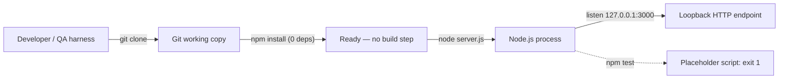

**Security implications.** The lack of a functioning test gate means there is no automated regression or vulnerability check in the repository; the lack of containerization means no image-level isolation or reproducible runtime is defined; and deployment being a manual, loopback-bound local run keeps network exposure minimal but provides no orchestration, TLS, or process supervision (§2.4.1).

## 3.7 References

**Repository files examined and cited as evidence**

- `server.js` — Established JavaScript (Node.js, CommonJS) as the sole runnable language; use of only the built-in `http` module; loopback bind to `127.0.0.1:3000`; the fixed `HTTP 200` `text/plain` response; and the absence of any framework, routing, or outbound integration.
- `package.json` — Established package identity `hello_world` `1.0.0`, MIT license, the placeholder `test` script, the declared-but-absent `main` (`index.js`), and the absence of `dependencies`/`devDependencies` and an `engines` field.
- `package-lock.json` — Established `lockfileVersion` 3, `requires: true`, a root-only `packages` entry, and the zero-dependency graph.
- `LoginTest.java` — Established the incomplete, non-compiling Java SE scaffold (`com.blitzyTest.LoginTest`) and the absence of any Java build descriptor.
- `industry.csv` — Established the static, single-column lookup dataset (header + 43 categories) that is never read at runtime.
- `README.md` — Established the project's self-description as a "test project for backprop integration."
- `test.py.txt` — Zero-byte placeholder; established that no Python code exists in the repository.
- `test.txt.txt` — Zero-byte placeholder; confirmed no additional source content.
- `100Pages.pdf`, `demo.jpg`, `sample.doc` — Binary sample fixtures (~9.46 MB PDF, ~2.12 MB JPEG, ~96 KB legacy Word doc); established the inert on-disk artifacts that are not served, parsed, or referenced.

**Repository folders examined**

- `` (repository root) — Enumerated the complete, flat file inventory used throughout this section; confirmed no `src/`, `.github/`, container, or IaC directories exist.
- `.git/` — Established version-control usage: a single commit (`93b779e`, "Add files via upload") and the multi-environment branch topology (`main`, `QA-20-july-branch`, and remote Linux-container / Windows-VM branches).

**Web sources**

- [web] npm Docs — *package-lock.json* (`docs.npmjs.com/cli/v9/configuring-npm/package-lock-json/`) — Confirmed that `lockfileVersion` 3 is used by npm v9 and is backwards compatible to npm v7 (and that v1 = npm v5/v6, v2 = npm v7/v8).
- [web] npm CLI — *"feat: use v3 lockfiles by default"* (`github.com/npm/cli`) — Confirmed that v3 contains only the lockfile information introduced in npm v7, is smaller than v2, is not interoperable with older npm versions, and is emitted by default from npm v9.

**Cross-referenced Technical Specification sections**

- §1.2 System Overview — System framing, the single runtime capability, the component/file inventory, and the "no KPIs/SLAs" position.
- §1.3 Scope — In-scope vs. out-of-scope boundaries (no routing, auth, persistence, TLS, config, or tests).
- §2.4 Implementation Considerations — Technical constraints and security implications, including the `lockfileVersion 3` compatibility note and the zero-dependency supply-chain posture.
- §2.6 Assumptions, Constraints, and Non-Integrated Artifacts — Runtime assumptions (Node.js/`http`, free port 3000, npm toolchain) and the disposition of non-integrated artifacts.

# 4. Process Flowchart

## 4.1 System Workflows

This section documents the process and control flows that are actually realized by the tracked source. The repository (`hao-backprop-test`) implements exactly one functional runtime — the dependency-free Node.js HTTP server in `server.js`, which realizes features **F-001 (HTTP Server Lifecycle and Loopback Binding)** and **F-002 (Static "Hello, World!" HTTP Response)** from Section 2.1 — so the process landscape is deliberately small and fully deterministic. Every workflow below is grounded in observed code and in runtime behavior verified against Node.js v22. Where a conventional element (batch jobs, message queues, database transactions, authorization gates, service-level agreements) has no basis in the code, it is called out explicitly as **absent** rather than inferred, consistent with the boundaries established in Section 1.3 Scope.

**Diagram conventions used throughout Section 4.** Swim-lane subgraphs represent distinct actors and systems: the **Operator / QA harness** that launches the process, the **Node.js process** (`server.js`) itself, the **OS loopback interface** (`127.0.0.1:3000`), and the **HTTP client** that issues requests. Rounded (stadium) nodes denote start/end states, rectangles denote process steps, and diamonds denote decision points. Because the request handler ignores every request attribute (F-002), the entire system contains exactly **one** genuine runtime decision point — the TCP bind check performed at startup (F-001-RQ-002).

The following diagram is the high-level, end-to-end system workflow. It spans the one-time startup sequence (Operator lane) and the repeating request/response cycle (Client lane), and shows the single decision point and the single error path.

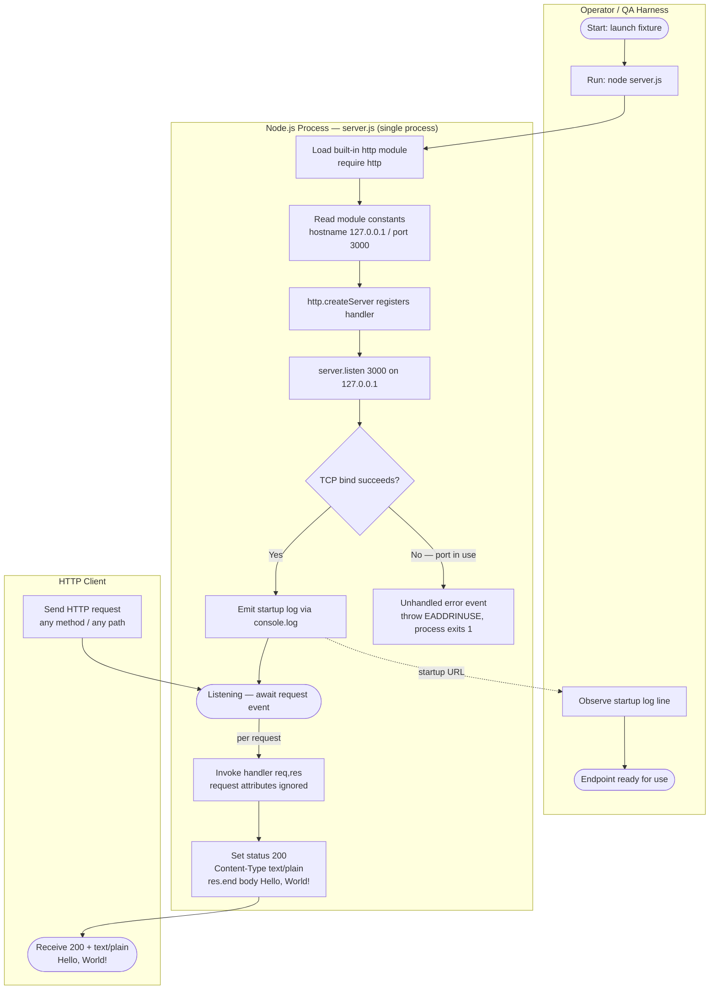

The actors and system boundaries in the workflow above are summarized below.

| Swim lane (actor / system) | Role in the workflow | Boundary | Source evidence |
|---|---|---|---|
| Operator / QA harness | Launches the process (`node server.js`) and reads the startup log to confirm readiness | External process invoker | Section 3.6; `package.json` |
| Node.js process (`server.js`) | Creates the server, binds the socket, and handles every request identically | Single OS process | `server.js` L1, L6, L12–L14 |
| OS loopback interface `127.0.0.1:3000` | The only network surface; not reachable from other hosts | Loopback-only (no remote access) | `server.js` L3–L4, L12 |
| HTTP client | Issues requests and receives the constant greeting | External network client | Verified: any method/path → HTTP 200 |

### 4.1.1 Core Business Processes

The repository contains no business or domain logic (established in Section 1.2.1); the term "business process" is used here purely to organize the two end-to-end technical journeys the code supports. Both journeys are realized within the single 14-line `server.js` module, and neither reads any of the bundled data or binary artifacts (`industry.csv`, `100Pages.pdf`, `demo.jpg`, `sample.doc`), which participate in no runtime process.

**End-to-end user journeys.** Two distinct journeys exist, driven by two different actors:

1. **Operator startup journey (one-time, F-001).** An operator or QA harness launches the process with `node server.js`. The module loads the built-in `http` module, reads the hard-coded constants `hostname = 127.0.0.1` (L3) and `port = 3000` (L4), creates the server (L6), and calls `server.listen(3000, '127.0.0.1', callback)` (L12). On a successful bind the listen callback emits the single confirmation line `Server running at http://127.0.0.1:3000/` (L13), after which the process idles in its listening state awaiting connections.
2. **Client request journey (repeating, F-002).** Any HTTP client issues a request to `http://127.0.0.1:3000/`. Node's event loop delivers the request to the handler registered on `createServer` (L6). The handler sets `res.statusCode = 200` (L7), sets header `Content-Type: text/plain` (L8), and terminates the response with the body `Hello, World!\n` (L9). The cycle then repeats identically for the next request with no retained state.

**System interactions.** The startup journey involves the Operator ↔ Node.js process interaction (launch and log observation) and the Node.js process ↔ OS loopback interaction (socket bind). The request journey involves the HTTP client ↔ OS loopback ↔ Node.js process interaction (request delivery and response). Internally, both features interact only with the Node.js built-in `http` module — the sole integration point (Section 2.3.2). There are no interactions with databases, caches, external APIs, or other processes.

**Decision points.** The system exposes exactly one decision point, and it lives entirely in the startup journey:

| Decision point | Location | Branches | Requirement |
|---|---|---|---|
| Does the TCP bind on `127.0.0.1:3000` succeed? | `server.listen(...)` (L12) | Yes → emit startup log and enter listening state; No → unhandled `error` event, process throws and exits `1` | F-001-RQ-002 |

The request journey (F-002) contains **no** decision points: because the handler never inspects the request method, path, query, headers, or body, control flow is linear and the response is invariant (verified — `GET /`, `POST /anything?q=1`, and `DELETE /x` all returned `HTTP/1.1 200 OK` with `Content-Type: text/plain`).

**Error handling paths.** The only error path is bind failure at startup (for example, `EADDRINUSE` when port `3000` is already occupied). Because `server.js` registers no listener for the server's `error` event, Node re-throws it as an unhandled `error` event and the process terminates with exit code `1`. There are no request-level error paths, because the handler performs no work that can fail (no parsing, I/O, or external calls). The full error and recovery treatment is provided in Section 4.5.

**Timing and SLA considerations.** The repository defines **no** SLAs, latency/throughput targets, or application-level timeouts (confirmed in Sections 1.2.3 and 2.2). The application code sets no timeout values. The only observable timing constant is a Node.js runtime default surfaced on responses — `Keep-Alive: timeout=5` (a 5-second default keep-alive), which originates from the Node `http` server defaults and not from any code in this repository.

### 4.1.2 Integration Workflows

The application's integration surface is minimal and was confirmed in Section 2.3.2: it integrates only with the Node.js standard library and exposes a single inbound network endpoint. This subsection describes the data-flow, API-interaction, event-processing, and batch-processing dimensions requested by the prompt, noting which are present and which are absent.

**Data flow between systems.** The only "systems" that exchange data are the **HTTP client** and the **Node.js process**, communicating over the OS **loopback** interface `127.0.0.1:3000`. The request payload (whatever it contains) flows into the process but is discarded unread; a fixed 14-byte plain-text body (`Hello, World!\n`) flows back out. No data crosses any other boundary: `industry.csv` and the binary fixtures are never opened, so there is no file-ingestion or data-pipeline flow, and there is no outbound call to any external system (`package.json` declares zero dependencies).

**API interactions.** The process exposes a single, implicit HTTP "endpoint" that answers on every path and method rather than a routed API. The end-to-end interaction — startup plus one stateless request/response cycle — is shown as a sequence diagram below.

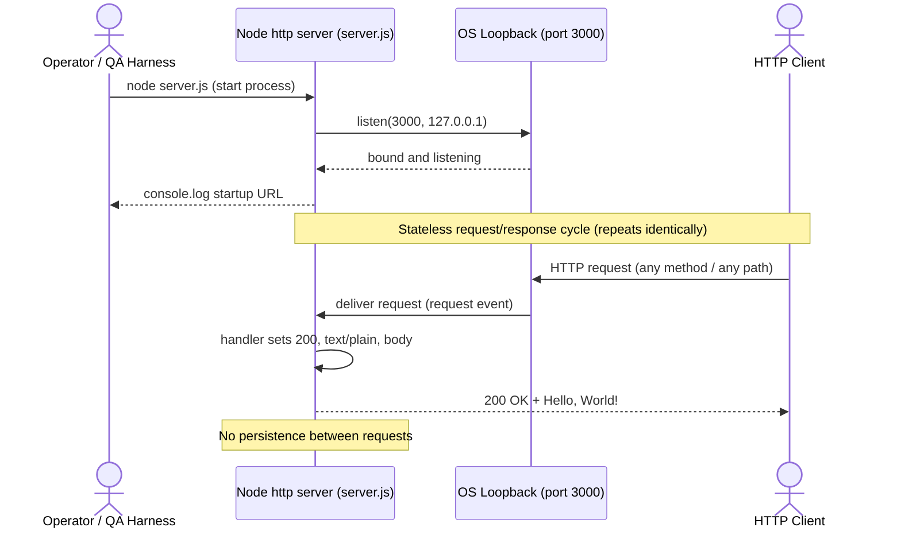

**Event processing flows.** The only event mechanism in play is the Node.js event loop. Two server events are relevant: the `request` event (implicitly handled by the callback passed to `http.createServer`, driving F-002) and the `error` event (**not** handled, causing the crash described in Section 4.5). The application defines no higher-level event processing — there is no publish/subscribe, no message bus, no queue consumer, and no domain events.

**Batch processing sequences.** There are **none**. The repository contains no scheduler, cron definition, worker pool, job queue, or bulk-data routine, and the placeholder `test` script (`echo "Error: no test specified" && exit 1`) performs no batch work. The static `industry.csv` (43 rows) is not processed by any code.

The integration points below consolidate the above (aligned with Section 2.3.2).

| Integration point | Type | Direction | Status |
|---|---|---|---|
| OS loopback endpoint `127.0.0.1:3000` | Inbound HTTP | Client → process | Active — the sole externally observable interface |
| Node.js built-in `http` module | Internal (standard library) | In-process | Active — imported at `server.js` L1 |
| npm `main` entrypoint (`index.js`) | Module resolution | Build/tooling | Broken — declared file absent; runnable file is `server.js` |
| External APIs / databases / queues / auth providers | External | — | None present or referenced |
| Batch / scheduled / event-driven pipelines | Internal | — | None present or referenced |

## 4.2 Detailed Process Flows for Core Features

This subsection decomposes each of the three catalogued features from Section 2.1 into a step-level process flow. F-001 and F-002 are the two runtime behaviors co-located in `server.js`; F-003 is the build-time packaging surface defined by `package.json` and `package-lock.json`. Each flow shows start/end points, process steps, decision diamonds (where any exist), and error states, and each step is traced back to the source line(s) and the functional requirement it satisfies (Section 2.2).

### 4.2.1 F-001 — HTTP Server Lifecycle and Loopback Binding

F-001 is the foundational runtime flow: it loads the `http` module, creates the server, and binds it to the loopback interface, emitting a startup log on success. It contains the system's single decision point — whether the TCP bind succeeds — and the system's single error path.

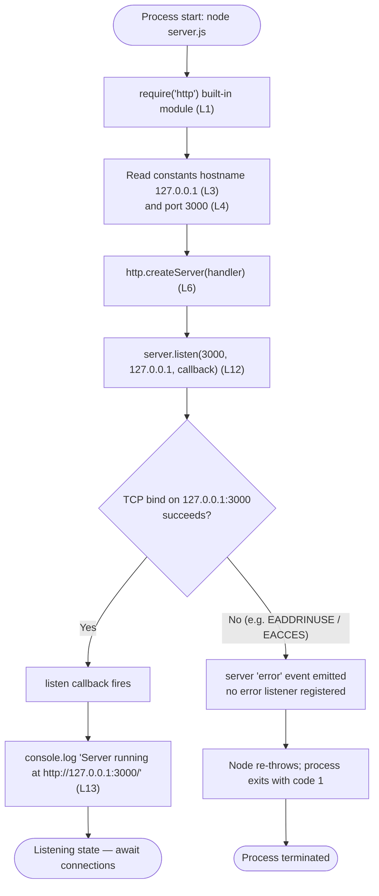

| Step | Source | Requirement | Notes |
|---|---|---|---|
| Import `http` | `server.js` L1 | F-001-RQ-001 | Yields an `http.Server` via `createServer` (L6) |
| Bind `127.0.0.1:3000` | `server.js` L12 | F-001-RQ-002 | Loopback-only; not exposed on any external interface |
| Emit startup log | `server.js` L13 | F-001-RQ-003 | Exact line `Server running at http://127.0.0.1:3000/` (verified) |
| Bind-failure exit | `server.js` L12 (no handler) | — | Verified: second instance on port 3000 → `EADDRINUSE`, exit `1` |

### 4.2.2 F-002 — Static "Hello, World!" Response Handling

F-002 is the request handler registered as the `createServer` callback. Its defining characteristic is the deliberate **absence** of branching: every request is handled by the same linear sequence, so the flow contains no decision diamonds, no validation, and no error branches.

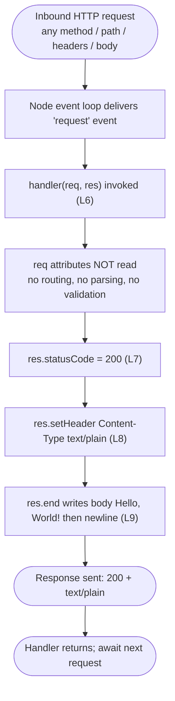

Because the handler ignores `req` entirely, the response is byte-for-byte identical for every request (verified across `GET`, `POST`, and `DELETE` to varied paths). The flow maps directly to the F-002 requirements: `res.statusCode = 200` satisfies F-002-RQ-001, `Content-Type: text/plain` satisfies F-002-RQ-002, and the fixed body satisfies F-002-RQ-003. There is no persisted state between iterations of this loop, so the next request re-enters the flow at the top with no carried context (see Section 4.4).

### 4.2.3 F-003 — npm Packaging and Test Script Execution

F-003 has no runtime flow inside the server; it governs how npm/Node tooling interacts with the package metadata. The flow below covers the four commands a consumer might issue and their observed outcomes, including the two defects noted in Section 2.2: the always-failing placeholder `test` script (F-003-RQ-002) and the broken `main` entrypoint (`index.js` is absent).

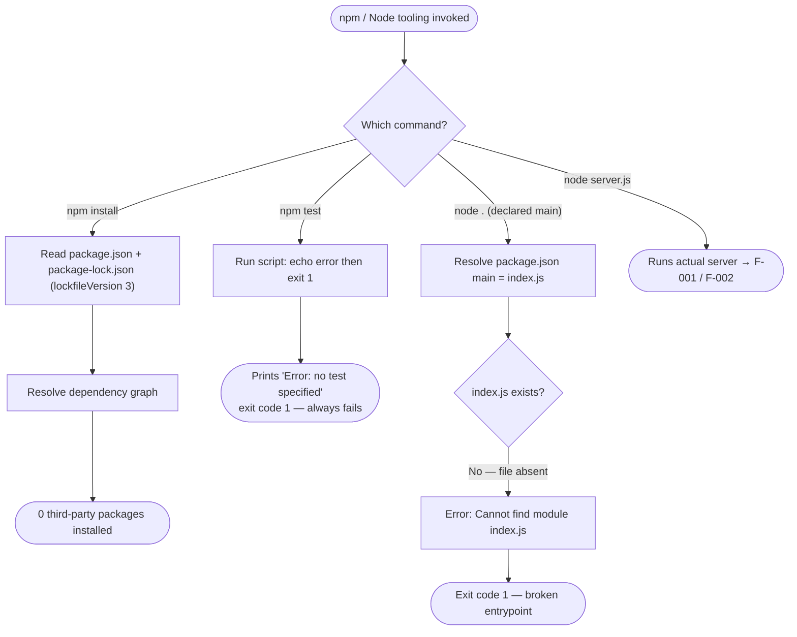

| Command | Observed outcome | Requirement / defect |
|---|---|---|
| `npm install` | Resolves zero third-party packages (empty, reproducible graph) | F-003-RQ-003 |
| `npm test` | Prints `Error: no test specified`, exits `1` (verified) | F-003-RQ-002 (placeholder) |
| `node .` | Fails: `Cannot find module .../index.js` (verified) | Known defect — declared `main` absent |
| `node server.js` | Starts the server (enters the F-001 flow) | Actual runnable entrypoint |

## 4.3 Validation Rules, Decision Points, and Compliance Checkpoints

The prompt calls for the business rules, data-validation requirements, authorization checkpoints, and regulatory-compliance checks that gate each workflow step. For this repository the honest finding — consistent with the Validation Rules columns of Section 2.2 — is that almost all of these gates are **absent by design**, because the runtime never inspects request input and enforces no domain rules. This subsection documents the few real gates that exist and states the remainder as explicitly absent rather than inferred.

**Consolidated decision-point inventory.** Across every flow in Sections 4.1 and 4.2 there are exactly three decision diamonds — one at runtime and two in build-time tooling:

| # | Decision point | Flow / location | Branches | Basis |
|---|---|---|---|---|
| 1 | Does the TCP bind on `127.0.0.1:3000` succeed? | F-001 runtime — `server.listen` (L12) | Yes → listening; No → unhandled `error`, exit `1` | F-001-RQ-002; verified |
| 2 | Which npm/Node command was issued? | F-003 tooling dispatch | `install` / `test` / `node .` / `node server.js` | `package.json` scripts + main |
| 3 | Does `index.js` (declared `main`) exist? | F-003 module resolution (`node .`) | No → `Cannot find module`, exit `1` | Known defect; verified |

The request-handling flow (F-002) contains **zero** decision points: the handler is a straight-line sequence, so no branch, guard, or gate is evaluated per request.

**Business rules at each step.** The only "rules" enforced are structural invariants baked into constants and metadata; there are no configurable or domain business rules.

| Workflow step | Business rule enforced | Evidence |
|---|---|---|
| Server bind | Host/port are fixed constants (`127.0.0.1`, `3000`); no override or validation of external input | `server.js` L3–L4 (F-001-RQ-002 validation) |
| Startup log | Exactly one confirmation line emitted per successful start | `server.js` L13 (F-001-RQ-003 validation) |
| Response | Status, content type, and body are invariant and deterministic for every request | `server.js` L7–L9 (F-002-RQ-001/002/003 validation) |
| Package identity | `name`/`version` must be consistent between manifest and lockfile; `version` is valid semver | `package.json`, `package-lock.json` (F-003-RQ-001 validation) |

**Data validation requirements.** There are **none** at runtime. Because the handler never reads the request method, path, query, headers, or body (F-002), no input is parsed and therefore nothing is validated; as noted in Section 2.2, this also means no user input is reflected into the response, eliminating injection exposure in the output. The only data-shape checking that occurs anywhere is performed by external tooling, not by repository code: npm parses `package.json`/`package-lock.json` as JSON and treats `version` as semver during `install`/`test`.

**Authorization checkpoints.** There are **none**. The server applies no authentication or authorization gate to any request — every caller receives the same `200` response (F-002-RQ-001 validation: "No authentication or authorization gate (by design)"). No sessions, tokens, API keys, or role checks exist. The `LoginTest.java` file is not an authorization mechanism: it is an incomplete, non-compiling scaffold (its `main` body is a bare `Web` token) and is wired into no runtime path (Section 2.6). No secrets or credentials are stored in the manifest or logged at startup.

**Regulatory compliance checks.** No regulatory or standards-compliance checks (for example, GDPR, HIPAA, PCI-DSS, or audit logging) are defined or performed anywhere in the repository. The single compliance-adjacent artifact is the **MIT license**, declared in both `package.json` and `package-lock.json` (F-003-RQ-001/RQ-003 compliance columns), which governs redistribution terms only. Because the endpoint is bound to the loopback interface and stores no data, it processes no personal or regulated data in its demonstrated behavior (Section 1.3.2).

## 4.4 State Management and Transaction Boundaries

This subsection covers the state transitions, data-persistence points, caching, and transaction boundaries of the running system. The only state that exists is the **process/server lifecycle** state held in memory; there is no application-level, session, or persisted state of any kind, which was confirmed empirically (after the process is killed, no residual listener remains and nothing is written to disk).

**State transitions.** The lifecycle of the single Node.js process is captured by the state machine below. The `Handling` state is transient and carries no data forward — after `res.end` the process returns to `Listening` with no memory of the request just served.

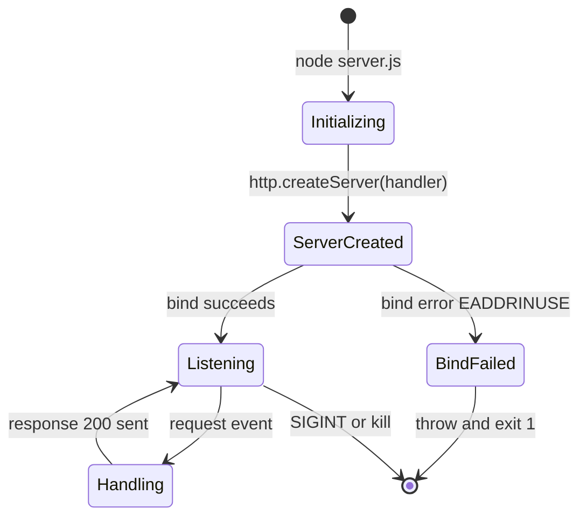

| State | Meaning | Entry action | Source |
|---|---|---|---|
| Initializing | Module loaded; constants read | `require('http')`, read `hostname`/`port` | `server.js` L1, L3–L4 |
| ServerCreated | `http.Server` instance exists | `http.createServer(handler)` | `server.js` L6 |
| Listening | Bound to `127.0.0.1:3000`, awaiting connections | `server.listen(...)` + startup log | `server.js` L12–L13 |
| Handling (transient) | Executing the handler for one request | `res.statusCode`/`setHeader`/`end` | `server.js` L7–L9 |
| BindFailed → exit | Bind error with no handler | unhandled `error` event → `throw` | verified (EADDRINUSE, exit `1`) |

**Data persistence points.** There are **none**. The application performs no writes to a database, file, or cache and reads none at runtime — `industry.csv` and the binary fixtures are never opened, and no log file is produced (only a single `console.log` to stdout at startup). The system is fully stateless: every request is served from the hard-coded string literal `Hello, World!\n` (`server.js` L9), and no counter, session store, or accumulator is maintained across requests.

**Caching requirements.** There are **none**. No caching layer, in-memory memoization, or CDN/edge cache is present or required (the response is a compile-time constant, not computed data that would benefit from caching). The handler sets only `Content-Type: text/plain` (L8) and does not emit `Cache-Control`, `ETag`, `Last-Modified`, or any other cache-governing header, so no HTTP caching semantics are defined by the application. (The `Keep-Alive: timeout=5` header observed on responses is a Node.js transport default for TCP connection reuse, not an application cache.)

**Transaction boundaries.** There are no database, message, or distributed transactions, and therefore no commit/rollback semantics, no two-phase commit, and no compensating actions. The only transaction-like unit is the **single, atomic HTTP request/response cycle**: it either completes when `res.end` sends the response (L9) or the connection is dropped, with nothing partially committed in between. Each cycle is completely **isolated** from every other cycle because the process holds no shared mutable state, so concurrent requests cannot interfere with one another's data (there is no data to share). The boundary of each unit of work is thus the invocation of the `createServer` handler; it opens when the `request` event fires and closes when the response is flushed.

## 4.5 Error Handling and Recovery Flows

Error handling in this repository is minimal and was verified empirically. The application contains **no** `try/catch` blocks and registers **no** `error` listener on the server, so the only failure mode with an observable flow is a startup bind failure, which crashes the process. The request path cannot fail because the handler performs no fallible work. The diagram below shows the three relevant lanes: startup error handling (F-001), request-time handling (F-002), and the manual recovery loop.

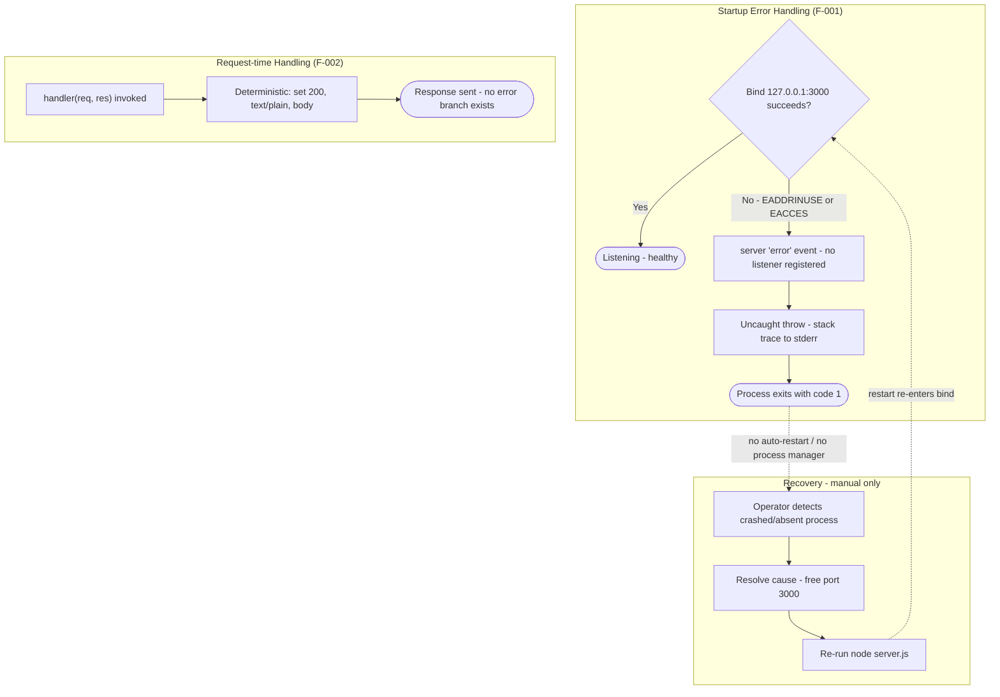

**Retry mechanisms.** There are **none** in the application. No retry loop, exponential backoff, or reconnection logic exists in `server.js`; a failed bind is attempted exactly once and then the process aborts (verified). Any retry would have to be supplied by an external caller re-invoking `node server.js`.

**Fallback processes.** There are **none**. There is no secondary port, no degraded-mode response, no circuit breaker, and no alternate handler. Because the response is a single constant, there is nothing to fall back from at request time; because there is only one process and one port, there is no failover target at startup.

**Error notification flows.** Diagnostics are limited to the process streams. On successful start, a single line is written to **stdout** (`Server running at http://127.0.0.1:3000/`, L13). On a bind failure, Node writes the error and stack trace to **stderr** and the process exits `1` (verified: `Error: listen EADDRINUSE: address already in use 127.0.0.1:3000`). There is no logging framework, no structured logging, no metrics, no alerting, and no error-tracking or monitoring integration anywhere in the repository (consistent with Sections 1.3.2 and 2.3.3). Consequently, notification of a crash depends entirely on whoever is watching the console or the exit code.

**Recovery procedures.** Recovery is **manual**. There is no process manager, supervisor, clustering, or worker model committed to the repository (Sections 3.6 and 2.4), so the process does not restart itself after a crash. The operator must observe the failure, resolve its cause (for example, free TCP port `3000` or stop the conflicting process), and re-run `node server.js`, which re-enters the F-001 bind flow. There is no health-check endpoint to probe readiness; the startup log line is the only readiness signal.

The error scenarios observed or reasoned from the code are summarized below.

| Scenario | Detection | Application handling | Recovery |
|---|---|---|---|
| Port `3000` already in use (`EADDRINUSE`) | Node emits server `error` event | None — unhandled, process throws and exits `1` (verified) | Manual — free the port, re-run `node server.js` |
| Insufficient privilege to bind (`EACCES`) | Node emits server `error` event | None — same unhandled crash path | Manual — run with adequate privilege, restart |
| Request-time failure | N/A — handler is deterministic and performs no fallible work | No error branch; always returns `200` | N/A — no request-level failure mode exists |
| `npm test` invoked | Exit code `1` printed to console | Placeholder script always fails by design | N/A — build-time only, not a runtime error |
| `node .` (declared `main`) invoked | Module resolution error to stderr | Crash — `index.js` absent (verified) | Use the actual entrypoint `node server.js` |

## 4.6 References

The following repository files, Technical Specification sections, and runtime observations were used as evidence for the workflows, diagrams, and validation/error/state analysis in Section 4.

**Repository files inspected**

- `server.js` - The single functional runtime; source of the startup flow (F-001), the request/response flow (F-002), the sole bind decision point (L12), and the unhandled `error` path (no `error` listener).
- `package.json` - npm manifest; established the placeholder `test` script, the declared `main` (`index.js`) entrypoint defect, the MIT license, and zero declared dependencies (F-003).
- `package-lock.json` - Lockfile (version 3) confirming zero resolved third-party dependencies (F-003).
- `LoginTest.java` - Incomplete, non-compiling scaffold; cited to establish that no authorization mechanism is wired into any flow.
- `industry.csv` - Single-column static lookup (43 categories) confirmed to be read by no runtime flow (no data pipeline / batch process).
- `README.md` - Project identity as the `hao-backprop-test` integration-test fixture.
- `100Pages.pdf`, `demo.jpg`, `sample.doc` - Binary sample fixtures confirmed to be read by no runtime flow.
- `test.py.txt`, `test.txt.txt` - Empty (zero-byte) placeholder files participating in no process.

**Technical Specification sections cross-referenced**

- `1.2 System Overview` - High-level request-handling flow and success criteria (no KPIs/SLAs); component categorization.
- `1.3 Scope` - In-scope/out-of-scope boundaries (no persistence, auth, TLS, logging, or monitoring).
- `2.1 Feature Catalog` - Feature identifiers F-001, F-002, F-003.
- `2.2 Functional Requirements` - Requirement identifiers (F-00X-RQ-YYY) and the Validation Rules columns reused in Section 4.3.
- `2.3 Feature Relationships` - Integration points, shared components, and the "no common services" finding.
- `2.4 Implementation Considerations` - Confirmation that `listen` has no error handler and that no process manager/clustering exists.
- `2.6 Assumptions, Constraints, and Non-Integrated Artifacts` - Disposition of `LoginTest.java` and the other non-integrated artifacts.
- `3.6 Development & Deployment` - Manual run/deploy model (`node server.js`); absence of containerization, CI/CD, and process supervision.

**Runtime verification and external sources**

- [runtime] Node.js v22.23.1 execution of `server.js` - Verified the startup log line, method/path-agnostic `HTTP 200` `text/plain` responses (`GET`, `POST`, `DELETE`), the `EADDRINUSE` unhandled-error crash (exit `1`), the `npm test` exit `1`, and the `node .` broken-entrypoint failure (`index.js` absent).
- No external web sources were used for this section; all findings are grounded in the repository and cross-referenced Technical Specification sections.

# 5. System Architecture

## 5.1 High-Level Architecture

This section describes the architecture that the repository actually implements. The tracked code defines a single, self-contained system: one Node.js process that serves a fixed HTTP greeting on the loopback interface. There are no subsystems, no data tier, and no external integrations. In keeping with the repository's stated purpose — the `README.md` describes it as a "test project for backprop integration" — the architecture is deliberately minimal, and this section documents it honestly, naming absent architectural dimensions explicitly rather than inferring capabilities that the code does not contain.

### 5.1.1 System Overview

**Overall architectural style and rationale.** The system is a **single-process, single-tier, monolithic HTTP service** built directly on the Node.js built-in `http` module using the CommonJS module system (`const http = require('http')`, `server.js` L1). It is best characterized as the canonical Node.js "hello world" server: `http.createServer()` registers one request handler, and `server.listen(3000, '127.0.0.1', ...)` binds a TCP socket on the loopback interface (`server.js` L6, L12). There is no layering (no controller/service/repository separation), no framework, no build step, and no configuration layer. The rationale for this style is evidenced by the repository itself — it is an integration/QA fixture (`README.md`; Git branches named for Linux-container and Windows-VM environments per §1.2.1), so the design optimizes for **portability and reproducibility** by remaining dependency-free rather than for feature richness or scale.

**Key architectural principles and patterns observed in the code:**

- **Event-driven, single-threaded request handling** — the server uses Node.js's event loop; the handler passed to `http.createServer()` is invoked on each `request` event (`server.js` L6–L10).
- **Statelessness** — no state is retained between requests; empirical verification confirmed that after the process is killed no listener or on-disk state remains (§4.4).
- **Determinism** — every request receives an identical response irrespective of method, path, headers, or body (verified: `GET /`, `POST /anything?q=1`, and `DELETE /x/y/z` all return `HTTP/1.1 200 OK`, `Content-Type: text/plain`, `Content-Length: 14`).
- **Zero external dependencies** — `package.json` declares no dependencies and `package-lock.json` records only the root package, so the runtime relies solely on the Node.js standard library.
- **Hard-coded, immutable configuration** — `hostname` and `port` are module-scoped constants (`server.js` L3–L4); there is no environment-variable or file-based configuration.
- **Network isolation by default** — binding to `127.0.0.1` (loopback) makes the endpoint unreachable from other hosts (§1.2.1, §1.3.2).

**System boundaries and major interfaces.** The **system boundary is a single operating-system process**. That process exposes exactly one inbound interface — a TCP listener speaking **HTTP/1.1 on `127.0.0.1:3000`** — and one diagnostic egress: a single startup line to **stdout** (`Server running at http://127.0.0.1:3000/`, `server.js` L13), plus a stack trace to **stderr** if the bind fails. There are no outbound network calls, no runtime filesystem I/O, and no inter-process communication. The diagram below fixes these boundaries and interfaces.

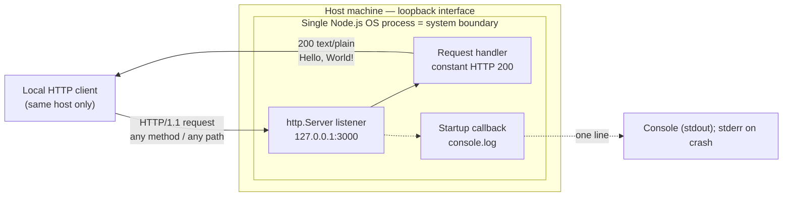

### 5.1.2 Core Components

The running architecture comprises three logical components, all defined within `server.js` and its packaging manifests. The table below (limited to four columns per the documentation standard) lists each component's responsibility, dependencies, and integration points; component-specific critical considerations follow as bullets.

| Component | Primary Responsibility | Key Dependencies | Integration Points |
|---|---|---|---|
| HTTP Server Runtime (`server.js`) | Create the `http.Server`, bind the loopback socket, and own the process lifecycle | Node.js runtime & event loop; built-in `http` module | Inbound TCP/HTTP on `127.0.0.1:3000`; stdout startup log |
| Request Handler (`http.createServer` callback, `server.js` L6–L10) | Produce the constant `HTTP 200` `text/plain` `Hello, World!\n` response | The `http.Server` (invokes it); Node `ServerResponse` API | Consumes the `request` event; emits the HTTP response |
| Package & Dependency Manifest (`package.json`, `package-lock.json`) | Declare package identity, entrypoint, license, and (empty) dependency graph | npm CLI (`lockfileVersion` 3 ⇒ npm ≥ 7) | npm `install`/`test` tooling; declares `main` entry |

**Critical considerations per component:**

- **HTTP Server Runtime** — runs on a single-threaded event loop; registers **no** `error` listener, so a bind failure (e.g., `EADDRINUSE`) escalates to an unhandled `error` event and the process exits with code `1` (verified). The loopback-only bind limits exposure but also precludes remote access; host and port are hard-coded with no override.
- **Request Handler** — fully **deterministic** and **method/path-agnostic**; it never reads the request, so no input validation or parsing exists and there is no error branch. It sets only `Content-Type`; `Content-Length`, `Date`, `Connection: keep-alive`, and `Keep-Alive: timeout=5` observed on responses are Node transport defaults, not application-set values.
- **Package & Dependency Manifest** — the declared `main` (`index.js`) **does not exist**, so `node .` fails (verified); the `test` script is a placeholder that always exits `1` and cannot serve as a quality gate; the zero-dependency graph means there is effectively no supply-chain attack surface.

Several tracked files are **not** components of the running system and are documented as non-integrated artifacts in §2.6: `industry.csv` (a static 43-row lookup never read by the code), `LoginTest.java` (an incomplete, non-compiling scaffold), the binary fixtures `100Pages.pdf` / `demo.jpg` / `sample.doc`, and the empty `test.py.txt` / `test.txt.txt`. They participate in no runtime data flow or interface.

### 5.1.3 Data Flow Description

**Primary data flow.** There is exactly one runtime data flow: the **synchronous HTTP request/response cycle**. A client opens a TCP connection to `127.0.0.1:3000`; the `http.Server` emits a `request` event; the handler sets the status code and `Content-Type` header and calls `res.end('Hello, World!\n')`; Node serializes the fixed body and headers into an HTTP/1.1 response and flushes it to the client (`server.js` L6–L10). A separate one-way flow occurs once at startup: the listen callback writes a single line to stdout (`server.js` L13).

**Integration patterns and protocols.** The only protocol is **HTTP/1.1 over TCP**, following a strictly **synchronous request/response** pattern. There is no asynchronous messaging, publish/subscribe, streaming (beyond the single `res.end` write), batching, or callback/webhook pattern. Inbound request data — the request line, headers, and body — is **never inspected or consumed**, so there is no inbound parsing or content negotiation.

**Data transformation points.** There are effectively **none at the application level**. The response body is a compile-time **string literal** (`Hello, World!\n`), not data derived from any input or store, so no serialization/deserialization, mapping, or enrichment of business data occurs. The only "transformation" is Node's own framing of that constant string into an HTTP response (including the Node-computed `Content-Length: 14`).

**Key data stores and caches.** There are **none**. The system uses no database, file store, in-memory store, session store, or message queue, and reads nothing from disk at runtime — `industry.csv` and the binary fixtures are never opened (§4.4). No caching layer exists: the response is a constant rather than computed data, and the handler emits no `Cache-Control`, `ETag`, or `Last-Modified` headers, so no HTTP caching semantics are defined. The `Keep-Alive: timeout=5` header seen on responses is a Node.js TCP connection-reuse default, not an application cache. The end-to-end request sequence is depicted in §5.2.

### 5.1.4 External Integration Points

The system has **no external system integrations**. `server.js` imports only the built-in `http` module, `package.json` declares zero dependencies, the process makes no outbound network calls, and the listener is bound loopback-only. The single externally-observable interface is the **inbound loopback HTTP/1.1 endpoint** itself (`127.0.0.1:3000`), which accepts requests from clients on the same host and returns the constant greeting. No **Service Level Agreements (SLAs)** — latency, throughput, availability, or otherwise — are defined anywhere in the repository for this interface or for any dependency.

Because no external systems are integrated, the following table records the assessment of each conventional integration category against the code rather than describing live integrations (three columns, all uniformly "not present"):

| Integration Category | Status | Evidence |
|---|---|---|
| Databases / persistence services | Not present | No DB driver or connection string; `package.json` declares no dependencies |
| Third-party / external APIs | Not present | `server.js` makes no outbound calls; `http` is used only as a server |
| Message brokers / queues / event buses | Not present | No queue or messaging client anywhere in the tree |
| Authentication / identity providers | Not present | No auth library or flow; `LoginTest.java` is a non-compiling scaffold, not integrated |
| Monitoring / logging / tracing / cloud SDKs | Not present | No agents or SDKs; only a single startup `console.log`; no IaC or credentials |

## 5.2 Component Details

This section details each major component identified in §5.1.2. Because the entire runnable system lives in one 14-line file (`server.js`) plus two manifest files, "components" here are the logical units within that process rather than independently deployable services. For each, the purpose, technologies, interfaces, persistence, and scaling posture are described from the code. The component-interaction diagram below shows how these units and their runtime substrate relate.

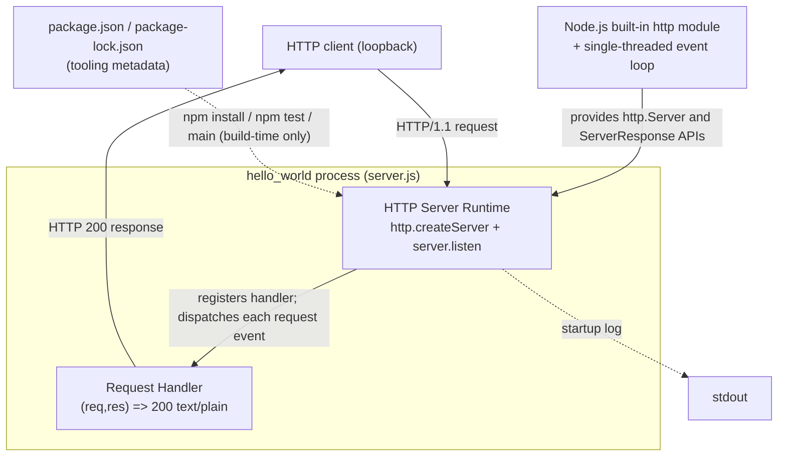

### 5.2.1 HTTP Server Runtime (`server.js`)

- **Purpose and responsibilities.** The top-level orchestrator for the whole application: it constructs the `http.Server` instance, binds the TCP socket on the loopback interface, owns the single process's lifecycle, and confirms readiness by logging the listening URL (`server.js` L6, L12–L13).
- **Technologies and frameworks.** Node.js runtime (verified `v22.23.1`) executing plain **CommonJS JavaScript**; the only imported module is the Node.js **built-in `http`** module (`server.js` L1). No web framework (no Express/Koa/Fastify), no transpiler, and no build step (§3.6).
- **Key interfaces and APIs.** Outward-facing input is the `http.createServer(handler)` factory and `server.listen(port, hostname, callback)` (`server.js` L6, L12). The externally reachable interface is the inbound **HTTP/1.1 listener on `127.0.0.1:3000`**. It consumes no configuration API — host and port are hard-coded constants.
- **Data persistence requirements.** None. The component holds only the in-memory `http.Server` object for the process lifetime; nothing is written to disk, and no state survives the process (verified: the port is immediately free after the process is killed).
- **Scaling considerations.** Single process, single thread, single loopback port. There is **no clustering, worker model, process manager, or load balancer** committed to the repository (§3.6, §4.4), so vertical throughput is bounded by one Node event loop and horizontal scaling would require external orchestration that does not exist. The loopback bind additionally prevents multi-host distribution. As a fixture, the component is not designed to scale, and no throughput/latency targets are defined.

### 5.2.2 Request Handler (`http.createServer` callback)

- **Purpose and responsibilities.** For every `request` event, produce the constant response: status `200`, header `Content-Type: text/plain`, body `Hello, World!\n` (`server.js` L7–L9). It is the sole business logic in the system.
- **Technologies and frameworks.** A plain JavaScript arrow function using the Node.js **`http` `ServerResponse`** API. There is no routing table, middleware chain, controller, or templating engine.
- **Key interfaces and APIs.** Signature `(req, res)`. It calls `res.statusCode = 200`, `res.setHeader('Content-Type', 'text/plain')`, and `res.end('Hello, World!\n')`. It **ignores `req` entirely** — method, URL, query string, headers, and body are never read (verified: identical responses across `GET`/`POST`/`DELETE` and arbitrary paths).
- **Data persistence requirements.** None. The response body is a compile-time string literal; the handler reads from and writes to no store.
- **Scaling considerations.** The handler performs **O(1)** constant work per request and holds **no shared mutable state**, so it is inherently concurrency-safe and each request is isolated (§4.4). There is no backpressure or streaming concern given the 14-byte payload. Aggregate throughput is nonetheless capped by the single-threaded runtime and loopback interface; no target is specified.

### 5.2.3 Package & Dependency Manifest (`package.json`, `package-lock.json`)

- **Purpose and responsibilities.** Declare package identity (`hello_world@1.0.0`), the declared entrypoint (`main`), the `MIT` license, and the `test` script; and lock the (empty) dependency graph via `package-lock.json` (`lockfileVersion` 3).
- **Technologies and frameworks.** **npm** package management. The lockfile format (v3) implies an **npm ≥ 7** CLI (default emission in npm v9), per §3.6/§3.3.
- **Key interfaces and APIs.** The npm lifecycle scripts (`npm install`, `npm test`) and the `main` field consumed by `node .`/`require`. There are no `dependencies`, `devDependencies`, `engines`, or `build` fields.
- **Data persistence requirements.** Not applicable at runtime — these are build/tooling metadata files on disk, not runtime state.
- **Scaling considerations.** The zero-dependency graph makes `npm install` effectively instantaneous and fully reproducible, with no transitive resolution to scale. Two defects limit tooling: the declared `main` (`index.js`) is **absent** (so `node .` fails; the runnable entry is `node server.js`), and the `test` script always exits `1` (so it cannot gate CI).

### 5.2.4 Runtime Lifecycle and Request Sequence

The single process moves through a small set of lifecycle states. The state-transition diagram below (consistent with §4.4) shows the happy path and the one failure edge; the `Handling` state is transient and carries no data forward.

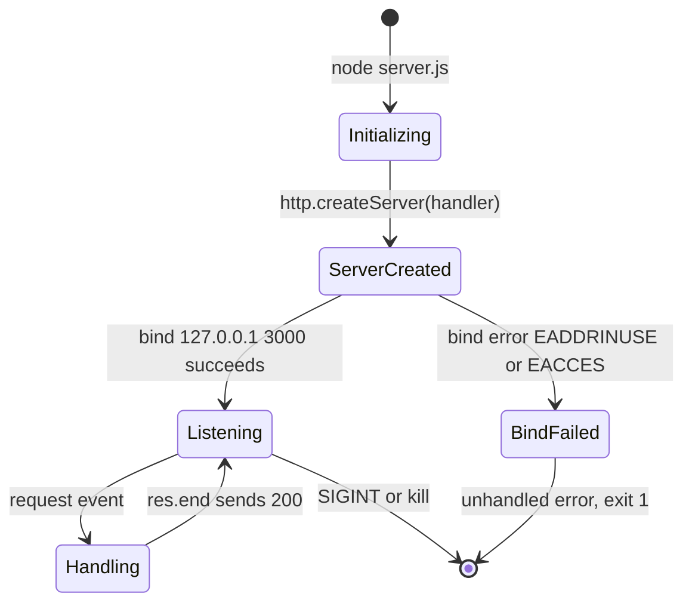

The sequence diagram below captures the two key flows — startup and a single request/response cycle — for the healthy path.

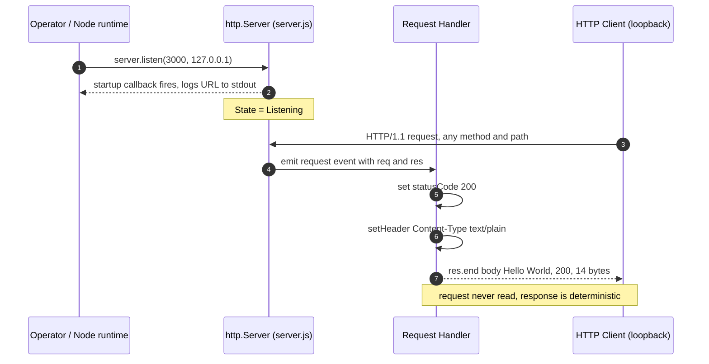

## 5.3 Technical Decisions

The repository contains no design documents, so the decisions below are **reverse-engineered from the as-built code** and framed against the project's stated purpose as an integration/test fixture (`README.md`; §1.2.1). Each decision is grounded in an observable property of the code, and its objective tradeoff is stated. The summary table (four columns) captures the five key decisions; the subsections and Architecture Decision Records that follow expand on them.

| Decision Area | Choice (as-built) | Rationale (evidenced) | Primary Tradeoff |
|---|---|---|---|
| Architecture style | Single-process, single-file, dependency-free Node.js `http` server | Maximizes portability/reproducibility for a fixture (`server.js`; zero deps) | No modularity, routing, or scale-out |
| Communication pattern | Synchronous HTTP/1.1 request/response | Simplest model; no other actors to coordinate | No async decoupling, events, or backpressure control |
| Data storage | None (stateless, constant response) | No data to persist; body is a string literal (`server.js` L9) | No durability, query, or history |
| Caching | None | Response is a compile-time constant; nothing to recompute | No cache headers/semantics defined |
| Security | Network isolation via loopback bind only | No sensitive data; local fixture (`127.0.0.1`, `server.js` L3) | No authN/authZ, no TLS; not exposable as-is |

### 5.3.1 Architecture Style Decision and Tradeoffs

The as-built choice is a **monolithic, single-file, zero-dependency HTTP server** on the Node.js standard library rather than a framework-based or layered/service-oriented design. The evidence is the code itself: a single `require('http')` and no declared dependencies (`server.js` L1; `package.json`; `package-lock.json`). The **benefit** is extreme portability and reproducibility — nothing to install, no build, no version drift — which suits a fixture exercised across Linux-container and Windows-VM environments (§1.2.1). The **tradeoffs** are the absence of routing, middleware, request validation, modular boundaries, and any scale-out mechanism; adding real capability would require introducing a framework or additional modules that are deliberately not present (§3.6).

### 5.3.2 Communication Pattern Choice

The system uses a single **synchronous HTTP/1.1 request/response** pattern (§5.1.3). There is no asynchronous messaging, event bus, publish/subscribe, streaming, or webhook/callback pattern in the code. The justification is that there is exactly one interaction — a client requesting the greeting — and no second party to coordinate with, so the simplest possible pattern is sufficient. The tradeoff is that the design offers no decoupling, buffering, or backpressure handling; because the workload is a single constant-size response, none of those are required.

### 5.3.3 Data Storage Solution Rationale

**No data storage solution was adopted**, and this is appropriate given the requirements evidenced in the code. The response is a hard-coded literal (`server.js` L9), so there is no dynamic data to store, index, or query, and consequently no relational, document, key-value, or file-based datastore is present or needed (§4.4). The lone dataset on disk, `industry.csv`, is a static fixture that the running code never reads. The tradeoff — no durability, no query capability, no history — carries no cost here because the system holds no data.

### 5.3.4 Caching Strategy Justification

**No caching strategy is implemented, and none is warranted.** Caching accelerates the re-delivery of data that is expensive to compute or fetch; this system returns a compile-time constant, so there is nothing to memoize, and no in-memory cache, CDN, or edge cache exists. The handler emits no cache-governing headers (`Cache-Control`, `ETag`, `Last-Modified`), so no HTTP caching semantics are defined; the `Keep-Alive: timeout=5` header observed on responses is a Node transport default for TCP connection reuse, not an application cache (§4.4). The decision to omit caching therefore has no meaningful downside for this workload.

### 5.3.5 Security Mechanism Selection

The **only security mechanism present is network isolation via the loopback bind** (`127.0.0.1`, `server.js` L3), which makes the endpoint unreachable from other hosts by default (§1.2.1, §1.3.2). No other controls exist: there is no TLS/HTTPS (plain HTTP), no authentication or authorization, no input validation (the request is never read, so there is no injectable input surface), no rate limiting, and no security headers. The selection is defensible for a **local, data-free fixture** — the attack surface is minimal and the zero-dependency graph eliminates supply-chain risk (§2.4) — but the same posture makes the service unsuitable for public or multi-host exposure without adding these controls.

### 5.3.6 Decision Rationale Tree

The following decision tree shows how the fixture's minimal requirements map, step by step, to the observed architecture. Every branch resolves to "No," which is precisely why the architecture is so small.

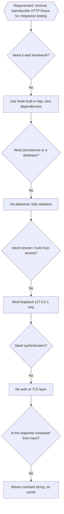

### 5.3.7 Architecture Decision Records (ADRs)

The ADRs below record the significant as-built decisions. All are marked **Accepted** because they are realized in the committed code; they are documented retrospectively (the repository contains no formal ADR files).

**ADR-001 — Use the Node.js built-in `http` module with no web framework.**
- *Context:* A minimal, portable HTTP fixture is required, runnable across multiple environments with no setup friction.
- *Decision:* Depend only on the Node.js standard library (`require('http')`); declare zero npm dependencies.
- *Consequences:* No supply-chain attack surface and instantaneous, reproducible installs; but no routing, middleware, or framework conveniences — all behavior is hand-written.

**ADR-002 — Bind to the loopback interface (`127.0.0.1:3000`) only.**
- *Context:* The fixture is executed locally by test/QA harnesses; no remote consumers exist.
- *Decision:* Hard-code `hostname = '127.0.0.1'` and `port = 3000` as module constants.
- *Consequences:* Provides security-by-isolation (unreachable from other hosts) and deterministic addressing; but prevents remote access and offers no configurability, and the port cannot be changed without editing source.

**ADR-003 — Serve a stateless, constant response with no persistence or caching.**
- *Context:* The endpoint's job is to return a fixed greeting.
- *Decision:* Respond to every request with the string literal `Hello, World!\n`, holding no state and using no datastore or cache.
- *Consequences:* Fully deterministic, trivially concurrency-safe, and easy to verify; but the service has no data, history, or dynamic behavior.

**ADR-004 — Omit authentication, authorization, and TLS.**
- *Context:* The service handles no sensitive data and is loopback-bound.
- *Decision:* Implement no auth layer, no TLS, and no request validation.
- *Consequences:* Keeps the fixture simple and dependency-free; but the service must not be exposed publicly as-is.

**ADR-005 — Run by direct execution with npm and Git only (no build, container, or CI).**
- *Context:* Minimal tooling footprint for a fixture.
- *Decision:* Launch via `node server.js`; use npm solely for package identity and a placeholder `test` script; no Dockerfile, IaC, or CI workflow.
- *Consequences:* Trivial to run and clone; but the placeholder `test` cannot gate CI (always exits `1`) and the declared `main` (`index.js`) is absent, so `node .` fails — both known defects (§2.4, §3.6).

## 5.4 Cross-Cutting Concerns

Cross-cutting concerns are documented here as they actually exist in the code. For a fixture of this size most of these concerns are either minimal or deliberately absent; each is reported honestly with its supporting evidence rather than described aspirationally. The summary table (three columns) orients the reader before the detailed subsections.

| Concern | Status in repository | Evidence |
|---|---|---|
| Monitoring / observability | Absent (only a startup log line) | No metrics or health endpoint; `server.js` L13 |
| Logging / tracing | Minimal (one stdout line; stderr on crash) | `console.log` at L13; no logging library |
| Error handling | Minimal (unhandled bind error crashes the process) | No `try/catch`, no server `error` listener (verified) |
| Authentication / authorization | Absent | No auth code; access limited only by the loopback bind |
| Performance requirements / SLAs | None defined | No targets, benchmarks, or load tests anywhere |
| Disaster recovery | Manual restart only | No backups, failover, or process supervisor |

### 5.4.1 Monitoring and Observability

There is **no monitoring or observability stack**. The application exposes no health-check or metrics endpoint — because the handler ignores the request path, there is no `/health` or `/metrics` route — and there is no Application Performance Monitoring (APM) agent, Prometheus exporter, or OpenTelemetry instrumentation anywhere in the tree. The **only observability signals** are the single startup line written to stdout (`Server running at http://127.0.0.1:3000/`, `server.js` L13) and the process exit code (`1` on a bind crash). Consequently, the startup log line is the sole readiness signal (§4.5), and detecting a failure depends entirely on whoever is watching the console or the exit code.

### 5.4.2 Logging and Tracing

Logging is limited to **one `console.log` at startup**; there is no logging framework, no structured/JSON logging, no log levels, and no log file. Requests are **not logged** — the handler writes nothing per request. On a fatal bind error, Node itself writes an error and stack trace to **stderr** (verified). There is **no distributed tracing**: no trace or correlation identifiers are generated or propagated, which is consistent with a single-process system that makes no downstream calls. This posture matches the absence of logging/monitoring noted in §1.3.2 and §4.5.

### 5.4.3 Error Handling Patterns

The application contains **no `try/catch` blocks and registers no `error` listener** on the server (`server.js`), so error handling reduces to two observable behaviors:

- **Startup/bind errors** (e.g., `EADDRINUSE` when port `3000` is occupied, or `EACCES`): the server's `error` event is unhandled, so Node throws, prints a stack trace to stderr, and the process exits with code `1` (verified). There is no retry, exponential backoff, fallback port, or reconnection logic.
- **Request-time errors:** none can occur. The handler performs no fallible work — it reads no input and touches no I/O — so there is no error branch and every request returns `200` (§4.5).

Recovery is **manual**: with no process manager, supervisor, or clustering committed (§3.6), the process does not restart itself; an operator must free the port (or resolve the cause) and re-run `node server.js`. The error-handling flow below reflects this behavior.

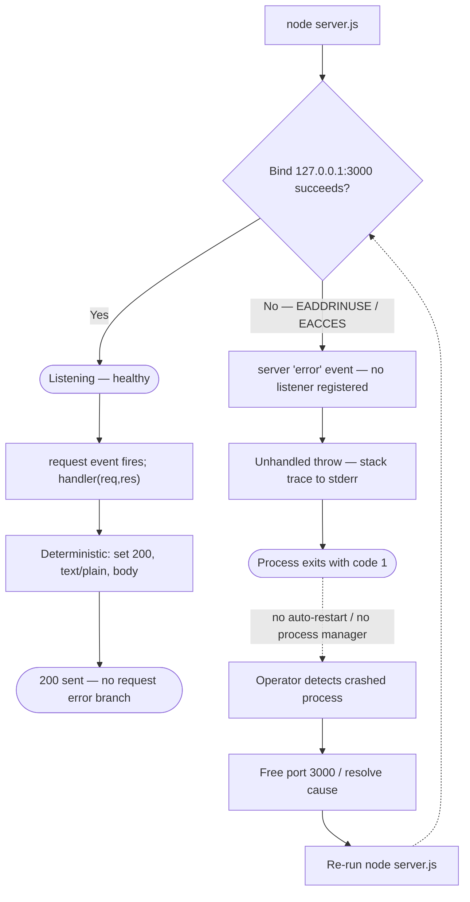

The scenarios reasoned from the code are summarized below (three columns).

| Error Scenario | Application Handling | Recovery |
|---|---|---|
| Port `3000` in use (`EADDRINUSE`) | None — unhandled, process throws and exits `1` (verified) | Manual — free the port, re-run `node server.js` |
| Insufficient privilege (`EACCES`) | None — same unhandled crash path | Manual — run with adequate privilege, restart |
| Request-time failure | No branch — handler is deterministic and fallible-work-free | Not applicable — no such failure mode exists |
| `node .` invoked (declared `main`) | Crash — `index.js` absent (verified) | Use the actual entrypoint `node server.js` |

### 5.4.4 Authentication and Authorization

There is **no authentication or authorization framework**. No identity provider, session store, token/JWT handling, API key, or role/permission model exists in the code, and no auth library is declared as a dependency. The incomplete `LoginTest.java` scaffold implies auth-related testing was once contemplated, but it does not compile and is not wired into the running system (§2.6). The **only access control is the network boundary**: binding to `127.0.0.1` limits callers to the local host (§5.3.5). Any consumer that can reach the loopback port receives the full response with no credential check.

### 5.4.5 Performance Requirements and SLAs

**No performance requirements or SLAs are defined anywhere in the repository** — there are no latency, throughput, or availability targets, no benchmarks, and no load tests (§1.2.3). What can be stated are *observed characteristics*, not commitments: the handler performs **O(1)** constant work and returns a fixed 14-byte body; the runtime is a **single-threaded** Node.js event loop; and responses carry Node's default `Keep-Alive: timeout=5` for TCP connection reuse (a transport default, not a tuned parameter). These observations must not be read as guarantees; the absence of defined SLAs is a property of the fixture and should not be interpreted as an implied guarantee.

### 5.4.6 Disaster Recovery

There are **no disaster-recovery procedures**. The repository defines no backups, replication, failover target, redundancy, or `RTO`/`RPO` objectives, and no process supervisor or clustering to restart the service automatically (§3.6, §4.5). Two factors make this low-impact for the fixture as-built: the system is **fully stateless with a constant response**, so there is no application data that could be lost or would need restoring; and the authoritative source of truth is the **Git repository** itself (a single commit, `93b779e`). "Recovery" therefore reduces to an operator re-running `node server.js` after resolving any bind conflict — the same manual loop shown in §5.4.3.

## 5.5 References

The following repository files, folders, and Technical Specification sections were examined as evidence for this section. Runtime behavior was verified directly by executing the application with Node.js `v22.23.1` against the repository checkout.

**Repository files:**

- `server.js` - The sole runnable component; established the entire runtime architecture (CommonJS `require('http')`, hard-coded `127.0.0.1:3000` bind, deterministic `HTTP 200` `text/plain` `Hello, World!\n` response, startup `console.log`, and the absence of any `error` listener, routing, or configuration).
- `package.json` - Established package identity (`hello_world@1.0.0`), the declared `main` (`index.js`, which is absent), the placeholder `test` script (always exits `1`), the `MIT` license, and the zero declared dependencies.
- `package-lock.json` - Established `lockfileVersion` 3 (implying npm ≥ 7) and the empty resolved-dependency graph confirming no external components.
- `README.md` - Established the project's purpose as a "test project for backprop integration" and the "Do not touch!" directive, framing the minimal-fixture rationale.
- `LoginTest.java` - Confirmed a non-compiling, non-integrated Java auth scaffold (not part of the running architecture).
- `industry.csv` - Confirmed a static 43-row lookup dataset never read by the running code.
- `test.py.txt`, `test.txt.txt` - Confirmed as empty (zero-byte) placeholders with no runtime role.
- `100Pages.pdf`, `demo.jpg`, `sample.doc` - Confirmed as binary sample fixtures unrelated to the runtime data flow.

**Repository folders:**

- `` (repository root) - Established the flat layout (no subdirectories other than `.git`) and the complete 11-file component inventory, confirming there are no additional subsystems.

**Cross-referenced Technical Specification sections:**

- `1.2 System Overview` - Reused for consistent terminology, the component-category framing, and the request-handling context (§1.2.1–§1.2.3).
- `3.6 Development & Deployment` - Reused for the run/deploy model, the absence of build/container/IaC/CI-CD tooling, and the npm/Git toolchain and `lockfileVersion` 3 rationale.
- `4.4 State Management and Transaction Boundaries` - Reused for the process lifecycle state model, statelessness, and the absence of persistence, caching, and transactions.
- `4.5 Error Handling and Recovery Flows` - Reused for the error-handling behavior (unhandled bind error, manual recovery) and the error-scenario catalog.
- `1.3 Scope`, `2.4 Implementation Considerations`, `2.6 Assumptions, Constraints, and Non-Integrated Artifacts` - Referenced for consistency on out-of-scope items, known defects (absent `index.js`, placeholder test), and the disposition of non-integrated artifacts.

**Empirical verification (runtime):**

- Node.js `v22.23.1` - Used to execute `server.js` and confirm the startup log, the method/path-agnostic `200` responses (`Content-Length: 14`), the Node transport-default headers, the `EADDRINUSE` unhandled-crash exit (`1`), the freed port after termination, the failing `npm test`, and the failing `node .` (absent `index.js`).

# 6. SYSTEM COMPONENTS DESIGN

## 6.1 Core Services Architecture

### 6.1.1 Applicability Assessment

**Core Services Architecture is not applicable for this system.**

This determination is made on the basis of direct inspection of the tracked repository, and it is consistent with the architecture already documented in §5.1 High-Level Architecture and §1.2 System Overview. The system is a **single-process, single-tier, monolithic HTTP service**: the entire runtime is defined in one 15-line CommonJS file, `server.js`, which imports only the Node.js built-in `http` module, binds one TCP socket on the loopback interface (`127.0.0.1:3000`), and returns a constant `HTTP 200` / `text/plain` / `Hello, World!\n` response to every request. There are no additional processes, no subordinate services, no network peers, and no external integrations of any kind. The `README.md` frames the repository as a "test project for backprop integration," and the working tree is flat (its only subdirectory is `.git`), confirming that the project was never structured as a service-oriented system.

A "Core Services Architecture" — the discipline of decomposing a system into cooperating services with defined boundaries, inter-service communication, discovery, load balancing, and resilience patterns — presupposes that the system is composed of *more than one* service or distributed component. This precondition is not met here. The three qualifying conditions named in the section prompt are each evaluated against the observed code below.

| Qualifying Criterion | Definition | Present? | Evidence |
|---|---|---|---|
| Microservices | Multiple independently deployable services, each owning a bounded capability | No | One application (`hello_world` in `package.json`); the only runnable code is `server.js`; no service modules or subdirectories exist |
| Distributed architecture | Components running across multiple processes/hosts that coordinate over a network | No | Single OS process; loopback-only bind `127.0.0.1:3000`; `server.js` makes no outbound calls and performs no IPC (verified: only `require` is `http`) |
| Distinct service components | Separately scalable/deployable units with independent lifecycles | No | One `http.Server` plus one request handler inside one process; `package-lock.json` records zero dependencies; no orchestration descriptors |

**Rationale.** Every structural marker of a service-oriented or distributed system is absent from the repository. Direct filesystem inspection found **no** container definitions (`Dockerfile`, Compose), **no** orchestration manifests (Kubernetes), **no** infrastructure-as-code (Terraform), **no** reverse-proxy/gateway configuration (nginx), **no** service-mesh, message-broker, database, or load-balancer configuration, and **no** environment or `.yaml`/`.yml` descriptors — a finding corroborated by §3.6 Development & Deployment, which records that containerization, IaC, and CI/CD are all "Not present." The application declares zero runtime dependencies (`package.json`, `package-lock.json`), so it cannot rely on any service-framework, discovery client, or resilience library. Because the system is a single stateless process serving a compile-time constant, the concerns that Core Services Architecture exists to address — partitioning work across services, routing between them, and keeping a fleet of them healthy — have no subject matter in this repository.

**How this section is organized.** Rather than omit the prompt's required areas, the remaining sub-sections document each one explicitly and honestly, mapping every requested topic (service boundaries, inter-service communication, discovery, load balancing, circuit breakers, retry/fallback, scaling, auto-scaling, resource allocation, capacity planning, fault tolerance, disaster recovery, redundancy, failover, and degradation) to the observed evidence and stating why it does not apply. The three required diagrams are included to depict the actual single-service reality. The system-context diagram below fixes the complete topology; note that it contains exactly one node inside the system boundary.

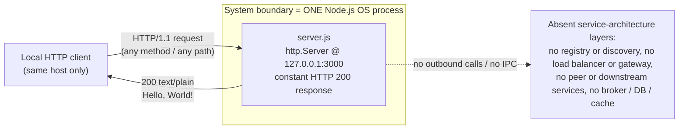

*Figure 6.1.1 — System-context topology. The entire system is a single process with one inbound loopback HTTP interface; all conventional service-architecture layers are absent.*

### 6.1.2 Service Components

Because the system comprises exactly one process (§6.1.1), the classic service-component concerns — boundaries between services, communication among them, discovery, load balancing, and resilience wrappers — have no multi-service subject matter. Each is nonetheless assessed against the observed code below, and the sole interaction that does exist is diagrammed.

**Service boundaries and responsibilities.** There is a single boundary — one Node.js OS process — enclosing one responsibility: accept an inbound HTTP request on `127.0.0.1:3000` and return the constant `Hello, World!\n` greeting. As documented in §5.1.2, the process contains three *logical* (not independently deployable) components, all defined in `server.js` and its manifests: the HTTP Server Runtime (creates the server, binds the socket, owns the process lifecycle), the Request Handler (produces the constant `HTTP 200` `text/plain` response), and the Package/Dependency Manifest (`package.json`, `package-lock.json`). These are collaborating code units within one deployable unit, not separable services; they share the same process, thread, and lifecycle and cannot be scaled or deployed independently.

**Inter-service communication patterns.** None exist. The only interaction is the synchronous, client-initiated HTTP/1.1 request/response cycle depicted in *Figure 6.1.2*. The handler never inspects the request and issues no downstream call — `server.js` imports only the built-in `http` module (verified: it contains exactly one `require`), makes no outbound network calls, opens no sockets to peers, and performs no inter-process communication. There is consequently no synchronous RPC/gRPC, no asynchronous messaging, no publish/subscribe, and no event bus anywhere in the system (consistent with §5.1.3).

**Service discovery mechanisms.** None exist and none are needed. The listening address and port are hard-coded as module-scoped constants (`hostname = '127.0.0.1'`, `port = 3000` in `server.js`), with no environment-variable or file-based override. There is no service registry, DNS-based service discovery, sidecar, or configuration server, because there are no peers to locate.

**Load balancing strategy.** None exists. The system runs as a single-threaded, single-instance process with one listener socket; §5.4.5 records that the runtime is a single-threaded Node.js event loop. There is no reverse proxy, gateway, or load balancer (no nginx/HAProxy/Envoy configuration), no clustering, and no worker pool (verified: `server.js` uses neither the `cluster` nor `worker_threads` module). All requests are handled serially by the one event loop.

**Circuit breaker patterns.** None exist and none are applicable. Circuit breakers guard calls to dependencies that can fail or become slow; this system has zero dependencies (`package-lock.json` records only the root package) and makes no downstream calls, so there is nothing to trip a breaker on. No circuit-breaker library is present.

**Retry and fallback mechanisms.** None exist. As detailed in §4.5, there is no retry loop, exponential backoff, or reconnection logic: a failed socket bind is attempted exactly once, and because no `error` listener is registered, the process throws and exits with code `1`. There is likewise no fallback — no secondary port, no degraded-mode response, and no alternate handler. At request time there is nothing to fall back from, since every response is the same constant.

| Service-Component Concern | Status | Observed Evidence |
|---|---|---|
| Service boundaries & responsibilities | Single boundary (one process) | `server.js` is the whole system; one responsibility — return the constant greeting |
| Inter-service communication | None | Only `require` is `http`; no outbound calls, no IPC, no messaging (§5.1.3) |
| Service discovery | None | Host/port hard-coded (`127.0.0.1:3000`); no registry, DNS-SD, or config server |
| Load balancing | None | Single-threaded, single instance; no proxy/LB; no `cluster`/`worker_threads` |
| Circuit breakers | None | Zero dependencies and no downstream calls to protect; no breaker library |
| Retry & fallback | None | Bind attempted once, then crash (§4.5); no backoff, secondary port, or fallback handler |

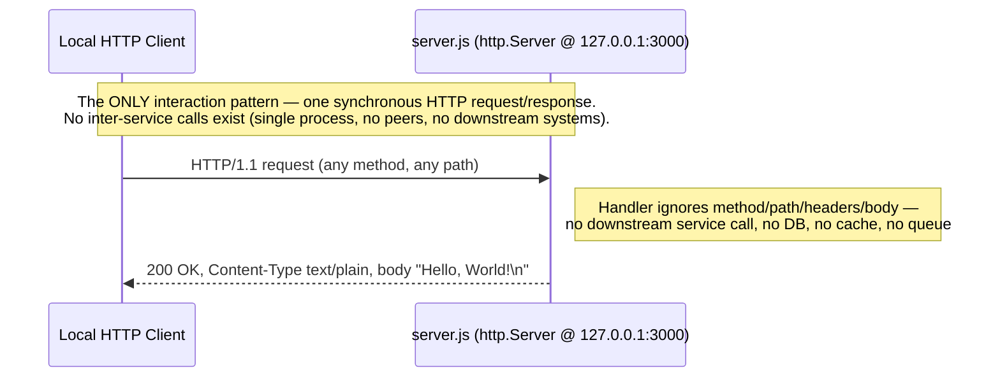

*Figure 6.1.2 — Service interaction diagram. The system exposes exactly one interaction (client-to-service HTTP request/response); there are no service-to-service interactions to depict.*

### 6.1.3 Scalability Design

The repository implements **no scalability design**. There is no scaling infrastructure, no auto-scaling policy, no resource-allocation configuration, and no capacity plan anywhere in the tracked files. The paragraphs below report what is actually observable and explicitly distinguish *implemented behavior* from *absent capability*; no throughput, latency, or availability numbers are asserted because none are defined in the repository (§1.2.3, §5.4.5).

**Horizontal and vertical scaling approach.** Neither is implemented. Horizontally, the system runs as a single instance: there is no clustering and no worker pool (verified — `server.js` uses neither the Node `cluster` module nor `worker_threads`), no second process, and no load balancer to distribute traffic across replicas (§6.1.2). Vertically, there is no mechanism to grant the process more resources at runtime — the host and port are hard-coded constants, there are no environment variables, no `NODE_OPTIONS`/heap-size flags, and no container resource requests/limits (§3.6). The process therefore executes on one single-threaded event loop with Node.js default resource behavior.

**Auto-scaling triggers and rules.** None exist. Auto-scaling requires an orchestration platform and a metrics feedback loop, both of which are absent: §3.6 records no containerization, IaC, or CI/CD (hence no Kubernetes Horizontal Pod Autoscaler and no cloud auto-scaling group), and §5.4.1 records that there is no monitoring, metrics, or health endpoint to drive a scaling decision. No scaling thresholds, cooldowns, or policies are defined.

**Resource allocation strategy.** None is defined. The application sets no CPU or memory limits and includes no process manager to allocate or supervise workers (§4.5, §3.6). The only resource the process reserves is TCP port `3000` on the loopback interface. Memory and CPU usage are governed entirely by Node.js defaults, and the workload itself is negligible because the handler holds no per-request state.

**Performance optimization techniques.** No deliberate optimizations are applied, but the workload is intrinsically light: the request handler performs **O(1)** constant work and returns a fixed 14-byte body, reading no input and touching no I/O (§5.4.5). Because the response is a compile-time constant, there is no computation to cache and no caching layer is present; the handler sets no `Cache-Control`, `ETag`, or `Last-Modified` headers (§5.1.3), and there is no compression or CDN. The `Keep-Alive: timeout=5` header observed on responses is a Node.js TCP connection-reuse default, not an application-level tuning parameter (§5.4.5).

**Capacity planning guidelines.** None are defined. There are no load tests, benchmarks, throughput/latency targets, or SLAs in the repository (§1.2.3, §5.4.5), so no capacity figures can be stated without inventing them. What can be said structurally: throughput is bounded by a single event loop on one host, and the loopback-only bind restricts callers to the same machine, so the system as-built is scoped to local, low-volume integration-test use rather than to any production capacity target.

| Scalability Dimension | Status | Observed Evidence |
|---|---|---|
| Horizontal scaling | Not implemented | Single instance; no `cluster`/`worker_threads`; no load balancer (§6.1.2) |
| Vertical scaling | Not implemented | Hard-coded host/port; no env vars, heap flags, or container limits (§3.6) |
| Auto-scaling triggers/rules | None | No orchestration (§3.6); no metrics/health signal to trigger on (§5.4.1) |
| Resource allocation | None defined | No CPU/memory limits; no process manager; Node.js defaults only |
| Performance optimization | None applied (O(1) workload) | Constant 14-byte body, no I/O; Keep-Alive is a Node default (§5.4.5) |
| Capacity planning | None defined | No load tests, benchmarks, targets, or SLAs (§1.2.3, §5.4.5) |

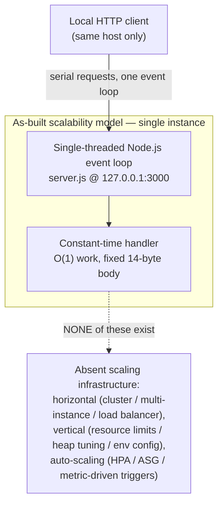

*Figure 6.1.3 — Scalability architecture. The as-built model is a single single-threaded instance; all horizontal, vertical, and auto-scaling infrastructure is absent from the repository.*

### 6.1.4 Resilience Patterns

The repository implements **no automated resilience patterns**. There is no fault-tolerance wrapper, no disaster-recovery procedure beyond a manual restart, no data redundancy, no failover target, and no service-degradation policy. The characterization below is drawn directly from §4.5 Error Handling and Recovery Flows and §5.4.6 Disaster Recovery, and it is balanced: while automated resilience is absent, the system's statelessness bounds the blast radius of a failure to *process unavailability* — there is no data to corrupt or lose.

**Fault tolerance mechanisms.** These are minimal. `server.js` contains no `try/catch` blocks and registers no `error` listener on the server, so the single process is a single point of failure with no self-healing. A startup bind failure (`EADDRINUSE` if port `3000` is occupied, or `EACCES`) surfaces as an unhandled `error` event: Node throws, writes a stack trace to stderr, and the process exits with code `1` (§4.5). At request time no fault can occur, because the deterministic handler performs no fallible work. There is no process manager, supervisor, or clustering committed to the repository (§3.6) that could keep the service running through a fault.

**Disaster recovery procedures.** Recovery is **manual only**. The repository defines no backups, replication, `RTO`/`RPO` objectives, or recovery runbook (§5.4.6). Two properties keep this low-impact for the fixture as-built: the service is fully stateless with a constant response, so no application data could be lost or would need restoring; and the authoritative source of truth is the Git repository itself (a single commit, `93b779e`). "Recovery" therefore reduces to an operator resolving any bind conflict and re-running `node server.js`, which re-enters the startup flow (§4.5, §5.4.6).

**Data redundancy approach.** Not applicable. The system has no data stores of any kind — no database, file store, in-memory store, session store, cache, or message queue — and reads nothing from disk at runtime (§5.1.3). The response body is a compile-time string literal (`Hello, World!\n`), not persisted or replicated state, so there is nothing to make redundant. No replication, mirroring, or backup mechanism exists or is required for the running system.

**Failover configurations.** None exist. With a single process bound to a single loopback port and no standby instance, there is no failover target at startup and no health-check endpoint to drive a failover decision (§4.5, §5.4.1). A bind conflict does not fail over to an alternate port; it terminates the process.

**Service degradation policies.** None exist. There is no degraded-mode response, no graceful-degradation path, no fallback handler, no rate limiting, no load shedding, and no bulkhead isolation. Availability is effectively binary: while the process is up it returns the full constant `HTTP 200` response to every caller, and while it is down the loopback port simply refuses connections (verified in §4.5: after the process is killed the port immediately frees and connections are refused). There is no intermediate, partially-degraded service state.

| Resilience Concern | Status | Observed Evidence |
|---|---|---|
| Fault tolerance | Minimal (crash on fault) | No `try/catch`, no server `error` listener; bind failure exits `1` (§4.5); no supervisor (§3.6) |
| Disaster recovery | Manual restart only | No backups/replication/RTO/RPO; Git is source of truth; stateless (§5.4.6) |
| Data redundancy | Not applicable | No data stores at all; response is a constant literal, nothing to replicate (§5.1.3) |
| Failover | None | Single process/port; no standby; no health-check-driven failover (§4.5, §5.4.1) |
| Service degradation | None | No degraded mode, fallback, rate limiting, or load shedding; availability is binary |

```mermaid
flowchart TD
    Start["node server.js"] --> Bind{"Bind 127.0.0.1:3000 succeeds?"}
    Bind -->|"Yes"| Up(["Running — serves constant HTTP 200"])
    Bind -->|"No — EADDRINUSE / EACCES"| Crash["Unhandled 'error' event (no listener);<br/>process exits with code 1"]
    Up -->|"process killed / fault"| Down(["Crashed — loopback port refuses connections"])
    Crash --> Down
    Down -.->|"NO auto-restart, NO failover,<br/>NO supervisor — manual only"| Op["Operator detects failure<br/>via console output / exit code"]
    Op --> Fix["Resolve cause; free TCP port 3000"]
    Fix --> Start
```

*Figure 6.1.4 — Resilience pattern implementation. The only implemented pattern is a manual operator recovery loop; automated fault tolerance, failover, and degradation are absent, and there is no persistent state to protect.*

### 6.1.5 References

**Repository files examined for this section:**

- `server.js` — the entire runtime; established the single-process, single-threaded design (one `require`, `http` only; no `cluster`/`worker_threads`/`child_process`), the loopback bind (`127.0.0.1:3000`) via hard-coded constants, the constant `HTTP 200` `text/plain` response, and the absence of routing, outbound calls, `try/catch`, and any server `error` listener
- `package.json` — established the single-application identity (`hello_world` v1.0.0), zero declared dependencies, and the placeholder `test` script; confirmed there is no build/start/scaling tooling
- `package-lock.json` — confirmed zero resolved dependencies (lockfile v3, only the root-package entry), proving no service-framework, discovery, load-balancing, or resilience library is present
- `README.md` — established the project's purpose as a "test project for backprop integration," supporting the fixture (non-service-oriented) characterization

**Repository folder examined:**

- Repository root (`/`, working tree) — confirmed a flat structure whose only subdirectory is `.git`; direct inspection found no service/module subdirectories and no `Dockerfile`/Compose, Kubernetes, Terraform, nginx, `.env`, or `.yaml`/`.yml` orchestration, service-mesh, broker, or load-balancer descriptors

**Cross-referenced Technical Specification sections:**

- §1.2 System Overview — fixture context, single-commit history (`93b779e`), and the absence of KPIs/SLAs
- §3.6 Development & Deployment — confirmed no containerization, IaC, or CI/CD, manual `node server.js` deployment, and no process manager/clustering/worker model
- §4.5 Error Handling and Recovery Flows — bind-failure crash path, manual-only recovery, and absence of retry/backoff/fallback/failover
- §5.1 High-Level Architecture — single-process, single-tier monolith; three logical (non-deployable) components; no external integrations
- §5.4 Cross-Cutting Concerns — monitoring/observability absence, single-threaded event loop, O(1) constant workload, and disaster recovery as manual restart only

**Inspection environment / external sources:**

- Node.js `v22.23.1` was available in the inspection environment and matches the runtime behavior documented in the cross-referenced sections. No external web sources were used for this section; all findings are grounded in the repository and in previously authored specification sections.

## 6.2 Database Design

### 6.2.1 Applicability Assessment

**Database Design is not applicable to this system.**

This determination follows from direct inspection of the tracked repository and is fully consistent with §3.5 Databases & Storage, §4.4 State Management and Transaction Boundaries, and §6.1 Core Services Architecture. The application is a single-process, single-file, **stateless** Node.js HTTP service: the entire runtime is `server.js` (14 lines), which imports only the Node.js built-in `http` module, binds one TCP socket on the loopback interface (`127.0.0.1:3000`), and returns a compile-time-constant `HTTP 200` / `text/plain` / `Hello, World!` response to every request. It reads from and writes to **no data store** at runtime.

A "Database Design" — the discipline of modeling persistent entities and relationships, defining a schema with indexes and constraints, and governing storage, replication, backup, migration, and query performance — presupposes that the system persists and retrieves state through a database or an equivalent durable store. That precondition is not met here. Every marker of a persistence layer was searched for and found absent, as summarized below.

| Database / Persistence Marker | Present? | Evidence |
|---|---|---|
| Relational or NoSQL database engine | No | No engine, driver, or connection string in any file; §3.5 records that even the default-stack MongoDB is absent |
| ORM / ODM / query builder | No | `package.json` declares zero dependencies and `package-lock.json` (lockfileVersion 3) resolves none — no Sequelize/TypeORM/Prisma/Mongoose/Knex |
| Embedded / file-based database | No | No SQLite/LevelDB/RocksDB file or driver; the only files on disk are inert source and fixtures |
| Migration / schema-definition files | No | No migration directory, DDL, or schema file anywhere in the flat tree |
| Cache tier (in-memory or external) | No | No Redis/Memcached client or configuration; §4.4 records "caching requirements: none" |
| Runtime persistence (file / session / state) | No | `server.js` performs no file I/O and holds no cross-request state; the response is a string literal (§4.4) |

**The only data at rest** is a handful of static, version-controlled files in the Git working tree. Critically, none of them is opened, parsed, or served by the running application — they are inert artifacts, not a datastore (established in §3.5 and dispositioned in §2.6).

| Artifact on Disk | Kind | Read by `server.js` at runtime? |
|---|---|---|
| `industry.csv` | Flat CSV lookup (header `Industry` + 43 rows) | No |
| `100Pages.pdf` | Binary sample fixture (~9.46 MB PDF) | No |
| `demo.jpg` | Binary sample fixture (~2.12 MB JPEG) | No |
| `sample.doc` | Binary sample fixture (~96 KB legacy Word doc) | No |

Because there is no database or durable store, the sub-sections that follow (§6.2.2–§6.2.5) document each area the prompt enumerates — schema design, data management, compliance considerations, and performance optimization — and state explicitly why each has no subject matter in this repository, rather than omitting them. The three required diagrams (schema/ERD, data flow, and replication architecture) are included to depict the actual reality. The data-flow diagram below fixes the complete runtime data path; note that it terminates entirely in memory with no persistence tier.

```mermaid
flowchart LR
    Client["Local HTTP client<br/>(same host only)"]
    subgraph Proc["Single Node.js process (server.js @ 127.0.0.1:3000)"]
        Handler["Request handler<br/>ignores method / path / body"]
        Const["Constant response body:<br/>Hello, World!"]
        Handler --> Const
    end
    Client -->|"HTTP/1.1 request"| Handler
    Const -->|"HTTP 200 text/plain"| Client
    Handler -.->|"no read, no write"| Absent["Absent persistence layers:<br/>no SQL / NoSQL database, no ORM,<br/>no cache, no file / session store,<br/>no object / blob storage"]
```

*Figure 6.2.1 — Runtime data-flow. Every request is served from an in-memory constant; no data ever crosses a persistence boundary, because none exists.*

### 6.2.2 Schema Design

**No database schema exists in this system, because there is no database.** This sub-section nonetheless addresses each schema-design dimension the prompt enumerates and records the observed reality against it.

**Entity relationships.** None. The system persists no entities, so there are no primary or foreign keys, no relationships, and no cardinality to model. The only record-like structure anywhere in the tree is the single-column `industry.csv` lookup (header `Industry` plus 43 category values); it is a flat, version-controlled file that `server.js` never opens, and it defines no keys, no relations, and no runtime data model.

**Data models and structures.** The sole runtime data is the compile-time string literal returned by the request handler (`Hello, World!` in `server.js`), together with the two module-scoped constants `hostname` (`127.0.0.1`) and `port` (`3000`). No records, documents, tables, collections, or typed schemas are defined, and no per-request state is accumulated (consistent with §4.4).

**Indexing strategy.** Not applicable — there are no tables or collections to index. No indexes, primary keys, unique constraints, check constraints, or foreign-key constraints are declared anywhere in the repository.

**Partitioning approach.** Not applicable — with no dataset there is nothing to partition; no range, hash, or list partitioning and no sharding are present or required.

**Replication configuration.** None. The system runs as a single process with no datastore, so there is no primary/replica topology, no synchronous or asynchronous replication, and no replica set or cluster. Durability of the source itself is provided solely by the Git repository (single commit `93b779e`), not by any data-replication mechanism.

**Backup architecture.** No database backup architecture exists. There are no snapshots, logical dumps, point-in-time-recovery configuration, or backup schedules, because there is no data to back up. This is consistent with §6.1.4, which records disaster recovery as a manual restart only; the Git repository is the sole authoritative copy of the static files.

| Schema-Design Dimension | Status | Evidence |
|---|---|---|
| Entity relationships | None | No persistent entities; `industry.csv` is an unreferenced flat file |
| Data models / structures | Constant literal only | Response body + `hostname`/`port` constants in `server.js` (§4.4) |
| Indexing strategy | Not applicable | No tables/collections; no indexes or constraints defined |
| Partitioning | Not applicable | No dataset to partition or shard |
| Replication configuration | None | Single process, no datastore; Git is the only durable copy |
| Backup architecture | None | No snapshots/dumps/PITR; DR = manual restart (§6.1.4) |

**Documented indexes and constraints.** The prompt requires that all indexes and constraints be documented. There are none; the table below records this explicitly and exhaustively.

| Schema Object Type | Count | Notes |
|---|---|---|
| Tables / collections | 0 | No database engine exists |
| Indexes (primary / secondary / unique) | 0 | Nothing to index |
| Constraints (PK / FK / unique / check / not-null) | 0 | No schema is defined |

A conventional entity-relationship diagram (ERD) cannot be produced because the system defines zero persistent entities and zero relationships. To depict the actual data-at-rest reality honestly, the diagram below shows the empty schema layer alongside the inert static files (which are ordinary version-controlled files, **not** database tables) and the in-memory runtime state.

```mermaid
flowchart TB
    subgraph Runtime["Runtime state (in-memory only)"]
        Lit["String literal:<br/>Hello, World!"]
        Cfg["Constants:<br/>hostname, port"]
    end
    subgraph Disk["Static files on disk (version-controlled, NOT a database)"]
        CSV["industry.csv<br/>1 column: Industry (43 rows)"]
        Bin["Binary fixtures:<br/>100Pages.pdf,<br/>demo.jpg, sample.doc"]
    end
    subgraph Schema["Database schema layer"]
        Empty["EMPTY:<br/>0 tables / collections,<br/>0 indexes, 0 constraints"]
    end
    CSV -.->|"never read at runtime"| Lit
    Lit -.->|"never persisted"| Empty
```

*Figure 6.2.2 — Schema depiction (ERD substitute). The schema layer is empty; the CSV and binary files are inert, never read by the runtime, and are not modeled entities.*

**Replication architecture.** No replication topology exists. The diagram below depicts the as-built reality — a single process with no datastore and therefore no primary, no replica, and no replication stream.

```mermaid
flowchart LR
    Client["Local HTTP client"]
    subgraph Single["As-built: single instance, no datastore"]
        App["server.js (single process)<br/>127.0.0.1:3000, stateless"]
    end
    Client -->|"HTTP request / response"| App
    App -.->|"NONE of these exist"| Repl["Absent replication topology:<br/>no primary / replica, no replica set,<br/>no sync / async replication,<br/>no failover node"]
```

*Figure 6.2.3 — Replication architecture. The system is a single stateless instance with no datastore; all primary/replica and replication constructs are absent.*

### 6.2.3 Data Management

**Data management is not applicable in the conventional sense, because there is no persistent data to manage.** Each area the prompt enumerates is reported below against the observed system.

**Migration procedures.** None. There is no schema and no database, hence no migration framework (no Flyway, Liquibase, Sequelize migrations, Prisma Migrate, or Alembic), no migration scripts, and no versioned `up`/`down` changesets. Nothing is created, altered, or dropped at deploy time.

**Versioning strategy.** The only versioning present is source-code versioning through Git (a single commit, `93b779e`) and the semantic package version `1.0.0` declared identically in `package.json` and `package-lock.json`. The lockfile uses `lockfileVersion 3`, which requires an npm CLI of version 7 or newer to consume faithfully (§3.3). There is no data versioning, no schema-version table, and no API-versioning scheme.

**Archival policies.** None. With no accumulated data, there is nothing to archive, tier to cold storage, or expire. No archival jobs, retention windows, or storage-class transitions are defined.

**Data storage and retrieval mechanisms.** There are none at runtime. The handler neither stores nor retrieves data: it returns the constant literal directly, performing no query, lookup, file read, or network fetch (§4.4). The static files on disk are read only by developer tooling and Git — never by the application.

**Caching policies.** None. No application cache, memoization, or external cache tier is present, and the response is a compile-time constant that would not benefit from caching. The handler sets `Content-Type: text/plain` only and emits no `Cache-Control`, `ETag`, or `Last-Modified` header, so no HTTP caching semantics are defined (§4.4). The `Keep-Alive: timeout=5` header observed on responses is a Node.js transport default for TCP connection reuse, not an application cache.

| Data-Management Area | Status | Evidence |
|---|---|---|
| Migration procedures | None | No schema/DB; no migration framework or changesets |
| Versioning strategy | Source/package only (Git + `1.0.0`) | Single commit `93b779e`; `lockfileVersion 3` ⇒ npm ≥ 7 (§3.3) |
| Archival policies | None | No accumulated data to archive or expire |
| Storage & retrieval | None at runtime | Constant literal returned; no query/lookup/file read (§4.4) |
| Caching policies | None | No cache tier; no `Cache-Control`/`ETag`/`Last-Modified` (§4.4) |

### 6.2.4 Compliance Considerations

**Because the system stores no data, the compliance obligations that ordinarily attach to a database have no subject matter here.** Each area is assessed against the observed system, and the favorable privacy posture is noted where relevant.

**Data retention rules.** None are defined, and none are needed: the application collects, stores, and logs no user or business data. Each request is served and forgotten; nothing is retained beyond the lifetime of the in-memory response buffer (§4.4).

**Backup and fault-tolerance policies.** There is no data backup, because there is no data. Fault tolerance is minimal and is documented in §6.1.4: the single process has no supervisor, no clustering, and no failover; a startup bind failure (for example `EADDRINUSE`) crashes the process with exit code 1, and recovery is a manual restart. The Git repository (commit `93b779e`) is the only authoritative copy of the source and static files.

**Privacy controls.** No privacy controls are implemented, and the privacy footprint is negligible because no personal data is processed or stored. Per §3.5, `industry.csv` contains only generic industry-category labels (no personal or sensitive data), and the binary fixtures are generic sample documents and images. There is therefore no PII/PHI handling, no data-subject workflow, and no encryption-at-rest requirement for a managed store — there is no store.

**Audit mechanisms.** None. There is no audit log, access log, or change-data-capture. The application emits exactly one `console.log` line to stdout at startup and, on a crash, a stack trace to stderr; it produces no request log and no persisted audit trail (§4.4, §5.4). Change history for the code is available only through Git.

**Access controls.** There are no database-level access controls, because there is no database — no users, roles, grants, row-level security, or data-store credentials (§3.5). The only access boundary that exists is the network bind: `server.js` listens on the loopback address `127.0.0.1`, which restricts callers to the same host. There is no application-level authentication or authorization (§5.4), and the endpoint returns an identical response to every caller.

| Compliance Area | Status | Evidence |
|---|---|---|
| Data retention rules | None (no data collected) | Requests served and forgotten; nothing retained (§4.4) |
| Backup & fault tolerance | Manual restart; no data backup | No supervisor/failover; crash → exit 1 (§6.1.4); Git is source of truth |
| Privacy controls | None needed; negligible footprint | No PII; `industry.csv` holds generic labels (§3.5) |
| Audit mechanisms | None | Single startup log line; no request/audit log (§4.4, §5.4) |
| Access controls | None at data layer; loopback bind only | No DB users/roles/credentials (§3.5); no authN/Z (§5.4) |

### 6.2.5 Performance Optimization

**No database performance-optimization technique applies, because there is no database to optimize.** The application's request path is nonetheless intrinsically light; each area is reported below.

**Query optimization patterns.** Not applicable — the system issues no queries. There is no SQL or NoSQL query, no execution plan, no query cache, and no denormalization or covering-index tuning, because there is no datastore to query.

**Caching strategy.** None (see also §6.2.3). No result cache, object cache, or query cache is present; the constant response is produced directly by the handler with no memoization tier, and no HTTP cache headers are emitted (§4.4).

**Connection pooling.** Not applicable — there are no outbound database connections to pool. `server.js` opens no client connections of any kind; it only accepts inbound HTTP connections on its listener socket and configures no pool, keep-alive tuning, or connection-lifetime setting (the observed `Keep-Alive: timeout=5` is a Node.js transport default, not an application-managed pool).

**Read/write splitting.** Not applicable — with no database there are no reads or writes to route to separate primary and replica endpoints. There is no primary/replica topology (§6.2.2) and no data-access routing layer.

**Batch processing approach.** None. There is no batch job, scheduled task, ETL pipeline, cron worker, or bulk-processing routine anywhere in the repository. The system performs only synchronous, per-request work: an O(1) handler that returns a fixed body and touches no I/O (consistent with §6.1.3).

| Optimization Area | Status | Evidence |
|---|---|---|
| Query optimization | Not applicable | No queries; no datastore to query |
| Caching strategy | None | No cache tier; no HTTP cache headers (§4.4) |
| Connection pooling | Not applicable | No DB connections; no pool configured (§4.4) |
| Read/write splitting | Not applicable | No primary/replica; no data-access routing (§6.2.2) |
| Batch processing | None | No batch/ETL/cron; synchronous O(1) per-request work (§6.1.3) |

### 6.2.6 References

**Repository files examined for this section:**

- `server.js` — the entire runtime; established the fully stateless design (single `require('http')`, no database call, no file I/O, no cross-request state), the compile-time-constant response body, and the loopback bind (`127.0.0.1:3000`) — proving no storage or retrieval occurs at runtime
- `package.json` — established zero declared `dependencies`/`devDependencies` and the package identity `hello_world` v1.0.0 (MIT); confirmed no ORM/ODM, database driver, or cache client is present
- `package-lock.json` — confirmed `lockfileVersion 3` with only the root-package entry and zero resolved dependencies, proving no persistence, migration, connection-pool, or caching library exists
- `industry.csv` — a flat single-column lookup (header `Industry` + 43 rows); established that the only record-like artifact is an inert, version-controlled file that is never read at runtime and defines no keys, indexes, or relationships
- `README.md` — established the project purpose ("test project for backprop integration"), supporting the fixture (non-persistent) characterization
- `100Pages.pdf`, `demo.jpg`, `sample.doc` — inert binary sample fixtures; confirmed they are static files on disk (never served, parsed, or referenced), not datastores

**Repository folder examined:**

- Repository root (working tree) — confirmed a flat structure whose only subdirectory is `.git`; direct inspection found no migration directory, no schema/DDL file, no ORM model directory, no database or cache configuration, and no `docker-compose`/`.env` service descriptors

**Cross-referenced Technical Specification sections:**

- §2.6 Assumptions, Constraints, and Non-Integrated Artifacts — disposition of `industry.csv` and the binary fixtures as non-integrated artifacts
- §3.3 Open Source Dependencies — zero third-party dependencies; `lockfileVersion 3` requires npm ≥ 7
- §3.5 Databases & Storage — no database, cache, or storage service; store inventory; `industry.csv` holds only generic industry labels
- §4.4 State Management and Transaction Boundaries — no data-persistence points, no caching requirements, single atomic request/response transaction boundary
- §5.4 Cross-Cutting Concerns — monitoring, logging, and authentication/authorization posture (audit and access-control evidence)
- §6.1 Core Services Architecture — single-process determination; disaster recovery as manual restart only (§6.1.3, §6.1.4)

**Inspection environment / external sources:**

- Node.js `v22.23.1` was available in the inspection environment and is consistent with the runtime behavior documented in the cross-referenced sections. No external web sources were used for this section; all findings are grounded in the repository and in previously authored specification sections.

## 6.3 Integration Architecture

### 6.3.1 Applicability Assessment

**Integration Architecture is not applicable for this system.**

The system requires no integration with any external system or service. It is a single-process, single-file Node.js HTTP service defined entirely in `server.js` (15 lines): the file imports only the Node.js built-in `http` module (its sole `require`), binds one TCP socket on the loopback interface (`127.0.0.1:3000`), and returns a compile-time constant `HTTP 200` / `text/plain` / `Hello, World!\n` response to every request. It makes no outbound network calls, declares zero dependencies (`package.json`, `package-lock.json`), and reads no configuration, credentials, or external endpoints. This determination is consistent with §3.4 Third-Party Services ("integrates with no third-party services of any kind"), §5.1.4 External Integration Points ("no external system integrations"), and §6.1 Core Services Architecture (a single OS process with no peers).

Integration Architecture — the discipline of connecting a system to external systems and services through APIs to third parties, message brokers, event streams, batch pipelines, and gateways — presupposes at least one such external boundary crossing. That precondition is not met here. Each qualifying condition implied by the section prompt is evaluated against the observed code below.

| Qualifying Criterion | Definition | Present? | Evidence |
|---|---|---|---|
| Outbound / third-party API integration | The system calls external or partner APIs | No | `server.js` imports only `http`; no HTTP/SDK client and no outbound request exists |
| Message-oriented middleware | A broker, queue, stream, or event bus links the system to others | No | No broker/queue client anywhere; `package-lock.json` records zero dependencies |
| API gateway / edge routing | A gateway, reverse proxy, or edge router fronts the system | No | No gateway/proxy/ingress descriptor in the repository; loopback bind |
| Remote reachability | The endpoint is reachable from other hosts | No | Bind address is `127.0.0.1` (loopback), unreachable off-host by default |

**Rationale.** Every structural marker of an integrated system is absent from the repository. Direct filesystem inspection found no `.env`, `Dockerfile`/Compose, `.yml`/`.yaml`, gateway/reverse-proxy, or message-broker configuration; the dependency graph is empty (`package.json` declares none, and `package-lock.json` lists only the root package); and the loopback-only bind means the process is fronted by nothing and reachable only from the local host (§3.4 security implications). Because the system neither exposes an interface to external parties nor consumes one, the concerns that Integration Architecture exists to address have no subject matter in this repository.

**How this section is organized.** Rather than omit the prompt's required areas, the remaining sub-sections document each one explicitly and honestly: §6.3.2 API Design covers the single inbound loopback HTTP interface that does exist (which serves same-host clients, not external systems) and the API-management concerns that do not; §6.3.3 Message Processing addresses event, queue, stream, and batch processing; and §6.3.4 External Systems addresses third-party integration, legacy interfaces, gateways, and service contracts. The integration-context diagram below fixes the complete topology — a single closed process with one inbound loopback interface and no external boundary crossings.

```mermaid
flowchart LR
    Client["Local HTTP client<br/>(same host only)"]
    subgraph Boundary["System boundary = one Node.js process (server.js)"]
        Svc["http.Server @ 127.0.0.1:3000<br/>constant HTTP 200 response"]
    end
    Absent["Absent integration layers:<br/>no third-party APIs, no broker/queue/stream,<br/>no API gateway/proxy, no legacy interfaces,<br/>no external service contracts"]
    Client -->|"HTTP/1.1 request (any method/path)"| Svc
    Svc -->|"200 text/plain: Hello, World!"| Client
    Svc -.->|"no outbound calls / no egress"| Absent
```

*Figure 6.3.1 — Integration context. The entire system is one Node.js process exposing a single inbound loopback HTTP interface; all external-integration layers (third-party APIs, messaging, gateway, legacy interfaces, service contracts) are absent.*

### 6.3.2 API Design

The system exposes exactly one application interface — an inbound HTTP/1.1 endpoint on the loopback interface — and it implements **none** of the API-management capabilities the prompt enumerates (authentication, authorization, rate limiting, versioning, published documentation). This interface serves same-host clients rather than integrating with any external system, but it is documented here for completeness. Each required topic is assessed against the observed code below.

**Protocol specifications.** The only protocol is **HTTP/1.1 over TCP**, served by Node's built-in `http` module (`server.js` L1, L6). The listener binds `127.0.0.1:3000` (L3–L4, L12). The interface is **not** REST (there are no resources, paths, or verbs — the handler never inspects `req.method` or `req.url`), and it is not gRPC, GraphQL, or WebSocket; there is no TLS/HTTPS. Every request — regardless of method, path, headers, or body — receives an identical response: status `200`, `Content-Type: text/plain`, body `Hello, World!\n` (14 bytes) set in `server.js` L7–L9. Determinism was verified in §5.1: `GET /`, `POST /anything?q=1`, and `DELETE /x/y/z` all return `HTTP/1.1 200 OK` with `Content-Length: 14`.

| Interface Attribute | Specification |
|---|---|
| Protocol / transport | HTTP/1.1 over TCP (Node.js built-in `http`) |
| Bind address | `127.0.0.1:3000` (loopback only) |
| Routes / resources | None — single method/path-agnostic handler |
| Request methods | All treated identically (no method dispatch) |
| Request body / query | Ignored — never parsed or consumed |
| Response | `200`, `Content-Type: text/plain`, body `Hello, World!\n` (14 bytes) |
| Transport security | None (plain HTTP; no TLS/HTTPS) |

**Authentication methods.** None. There is no authentication of any kind — no API key, bearer token, JWT, session cookie, or credential check (§5.4.4). Because the handler never reads the request, it cannot evaluate an `Authorization` header. The incomplete `LoginTest.java` scaffold does not compile and is not wired into the running system, so it provides no authentication (§5.4.4). The only access control is the network boundary: the loopback bind restricts callers to the same host.

**Authorization framework.** None. There is no role, permission, scope, policy engine, or access-control list (§5.4.4). Any caller that can reach the loopback port receives the full response with no authorization decision.

**Rate limiting strategy.** None. There is no rate limiter, throttle, quota, connection cap, or load-shedding logic; the handler performs `O(1)` work and serves every request unconditionally (§5.4.5, §6.1). No rate-limiting library is declared (`package-lock.json` records zero dependencies). The only implicit bound is that a single-threaded Node.js event loop processes requests serially.

**Versioning approach.** None at the API level. There is no URI version prefix (e.g., `/v1`), header-based versioning, or content negotiation — consistent with the path-agnostic handler. The only versioning present is the package version `1.0.0` in `package.json` and the Git history (a single commit, `93b779e`), which version the artifact, not any API contract.

**Documentation standards.** None. There is no OpenAPI/Swagger specification, API reference, JSON schema, or published contract in the repository. `README.md` documents only the project's purpose ("test project for backprop integration. Do not touch!"), not the endpoint. The de-facto contract is the constant response itself.

| API-Management Concern | Status | Evidence |
|---|---|---|
| Authentication | None | No credential check; request never inspected (§5.4.4) |
| Authorization | None | No role/permission/scope/policy model (§5.4.4) |
| Rate limiting | None | No limiter/quota; zero dependencies; serial event loop (§5.4.5) |
| Versioning | None | No URI/header versioning; path-agnostic handler |
| Documentation | None | No OpenAPI/Swagger; `README.md` states purpose only |
| Transport security | None | Plain HTTP; loopback bind is the only access control |

The API architecture diagram below shows the single inbound interface: three example clients issuing different methods and paths all converge on one handler that ignores the request and emits the same constant response, with every API-management layer absent.

```mermaid
flowchart TB
    ClientA["Local client: GET /"]
    ClientB["Local client: POST /anything?q=1"]
    ClientC["Local client: DELETE /x/y/z"]
    subgraph Proc["Node.js process — server.js"]
        Listener["http.Server listener<br/>127.0.0.1:3000 (HTTP/1.1)"]
        Handler["Request handler (L6-L10)<br/>ignores method/path/headers/body"]
        Const["Constant response builder<br/>200 / text/plain / Hello, World!"]
        Listener --> Handler
        Handler --> Const
    end
    Resp["HTTP 200 text/plain<br/>Content-Length 14"]
    Mgmt["NOT present: authentication, authorization,<br/>rate limiting, versioning, OpenAPI docs, TLS"]
    ClientA --> Listener
    ClientB --> Listener
    ClientC --> Listener
    Const -->|"identical response"| Resp
    Handler -.->|"absent"| Mgmt
```

*Figure 6.3.2 — API architecture. One loopback HTTP/1.1 listener and one method/path-agnostic handler produce a single constant response; no authentication, authorization, rate-limiting, versioning, documentation, or TLS layer exists.*

The sequence diagram below traces the one key flow the API supports — a synchronous request/response with no auth handshake, no version negotiation, and no downstream or third-party call.

```mermaid
sequenceDiagram
    participant C as Local HTTP Client
    participant S as http.Server @ 127.0.0.1:3000
    Note over C,S: The single API flow — synchronous HTTP/1.1 request/response.<br/>No auth handshake, no rate-limit gate, no downstream call.
    C->>S: HTTP/1.1 request (any method, any path, optional body)
    Note right of S: Handler ignores method/path/headers/body,<br/>no credential, rate-limit, or version check
    S-->>C: 200 OK, Content-Type text/plain, body "Hello, World!\n"
```

*Figure 6.3.3 — Key API flow. Every request follows the same synchronous path and receives the constant greeting; there is no authentication, versioning, or downstream integration step.*

### 6.3.3 Message Processing

**Message processing is not applicable for this system.** The application performs no asynchronous or message-oriented processing of any kind. Its only runtime interaction is the synchronous HTTP request/response cycle documented in §6.3.2; there is no event, queue, stream, or batch machinery, which is consistent with §5.1.3 ("no asynchronous messaging, publish/subscribe, streaming ..., batching, or callback/webhook pattern"). Each required topic is assessed against the observed code below.

**Event processing patterns.** None at the application or domain level. The system is event-driven only in the intrinsic Node.js sense — the request handler is invoked on each `http` `request` event (`server.js` L6) — but it publishes and consumes no domain events, and there is no event bus, no publish/subscribe, and no event sourcing. The handler does not even read the incoming request event's data (§5.1.3).

**Message queue architecture.** None. There is no message broker or queue client — no Kafka, RabbitMQ, Amazon SQS, Redis, NATS, or AMQP integration. `package.json` declares no dependencies and `package-lock.json` records zero resolved packages, so no queue client could exist (§3.4, §5.1.4). No producer, consumer, topic, exchange, partition, or dead-letter queue is defined anywhere.

**Stream processing design.** None. There is no stream-processing framework or pipeline. The single `res.end('Hello, World!\n')` call (`server.js` L9) is a one-shot HTTP body flush, not a data stream; the system consumes no input stream and defines no windowing, aggregation, ordering, or backpressure logic (§5.1.3).

**Batch processing flows.** None. There is no scheduler, cron job, job runner, or batch pipeline. The only npm script is a placeholder `test` that echoes an error and exits `1` (`package.json`). The static `industry.csv` lookup is never read by any code, so there is no ingestion, ETL, or bulk-processing batch (§5.1.2, §5.1.3).

**Error handling strategy.** There is no message-processing error handling because there is no message processing. For completeness, the observed error behavior of the one synchronous path (from §5.4.3) is: **request-time errors cannot occur** — the handler performs no fallible work, reads no input, and touches no I/O, so every request deterministically returns `200`; and a **startup bind failure** (`EADDRINUSE` if port `3000` is occupied, or `EACCES`) surfaces as an unhandled server `error` event — no listener is registered — which prints a stack trace to stderr and exits the process with code `1`. There is no retry, exponential backoff, dead-letter routing, poison-message handling, or compensating transaction, because none is applicable to a stateless constant responder.

| Message-Processing Concern | Status | Evidence |
|---|---|---|
| Event processing (domain) | None | Only the intrinsic Node `request` event; no bus/pub-sub (§5.1.3) |
| Message queue / broker | None | No queue client; zero dependencies (§3.4, §5.1.4) |
| Stream processing | None | Single `res.end` write; no pipeline/windowing/backpressure (§5.1.3) |
| Batch processing | None | No scheduler/cron/job; `industry.csv` never read (§5.1.2) |
| Error handling | Not applicable | Request path cannot error; bind failure → exit `1` (§5.4.3) |

The message-flow diagram below reflects the synchronous-only reality: a client's request is handled inline and answered immediately, with every asynchronous messaging layer absent.

```mermaid
flowchart LR
    Client["Local HTTP client"]
    Handler["Synchronous request handler<br/>server.js L6-L10"]
    Absent["No async messaging layer:<br/>no event bus / pub-sub,<br/>no queue or broker (Kafka/RabbitMQ/SQS/Redis),<br/>no stream pipeline, no batch/cron jobs,<br/>no dead-letter / retry queue"]
    Client -->|"HTTP request"| Handler
    Handler -->|"immediate 200 response"| Client
    Handler -.->|"none exist"| Absent
```

*Figure 6.3.4 — Message flow. The only flow is a synchronous, in-process request/response; there is no queue, broker, event stream, or batch pipeline anywhere in the system.*

### 6.3.4 External Systems

**External-system integration is not applicable for this system.** The application integrates with no external systems or services: it makes no outbound network calls, declares no dependencies, uses no third-party SDK, and defines no gateway or service contract (§3.4, §5.1.4). Each required topic is assessed below, and all external dependencies are documented.

**Third-party integration patterns.** None. `server.js` imports only the Node.js built-in `http` module and issues no outbound HTTP or SDK calls (§3.4, §5.1.4); there is no client library, API key, service account, webhook, or callback. §3.4 confirms that the organization's default-stack services — Auth0 (authentication), AWS (cloud), MongoDB (managed database), and LangChain (AI/LLM) — are all absent here, and that the process holds no secrets, tokens, or credentials.

**Legacy system interfaces.** None. There is no adapter, connector, file-drop, FTP, database link, or protocol bridge to any legacy system. The tracked artifacts that might superficially suggest legacy interfacing — `industry.csv` (a static 43-value lookup), `LoginTest.java` (an incomplete, non-compiling Java scaffold), and the binary fixtures `100Pages.pdf` / `demo.jpg` / `sample.doc` — are non-integrated: none is read or invoked by the running code, and they participate in no runtime interface (§5.1.2, §5.1.3).

**API gateway configuration.** None. There is no API gateway, reverse proxy, or edge router — no nginx, Envoy, Kong, HAProxy, or cloud-gateway configuration — and no ingress or routing descriptor exists in the repository (§6.1). Because the listener binds the loopback interface, the process is fronted by nothing and is reachable only from the local host.

**External service contracts.** None. There is no service contract, interface-definition document, OpenAPI/AsyncAPI schema, or partner agreement, and §5.1.4 records that no Service Level Agreements (SLAs) are defined anywhere in the repository. The system neither offers a versioned contract to an external consumer nor consumes one from an external provider.

**External dependencies.** At the application level there are **none**: `package.json` declares no `dependencies` or `devDependencies`, and `package-lock.json` records only the root package (zero resolved third-party packages). The only external requirements are **local runtime prerequisites** — a Node.js runtime that provides the built-in `http` module (the `lockfileVersion 3` lockfile implies an npm ≥ 7 toolchain) and an available loopback TCP port `3000` (§3.4, §2.6).

| External Dependency | Category | Status |
|---|---|---|
| Third-party npm packages | Runtime libraries | None — zero resolved dependencies |
| External APIs / SaaS providers | Outbound integration | None — no client, no network egress |
| Message brokers / queues | Middleware | None |
| API gateway / reverse proxy | Edge infrastructure | None |
| Node.js runtime (built-in `http`) | Local platform prerequisite | Required |
| Loopback TCP port `3000` | Local resource | Required |

The integration-flow diagram below shows the closed system boundary: a local client and the single process exchange traffic over loopback, and no outbound path to any external system exists.

```mermaid
flowchart TB
    subgraph Local["Local host"]
        ClientN["Local HTTP client"]
        subgraph Sys["System boundary: single Node.js process"]
            App["server.js<br/>http.Server @ 127.0.0.1:3000"]
        end
    end
    Ext["Absent external systems:<br/>no third-party APIs / SaaS,<br/>no legacy adapters,<br/>no API gateway / proxy,<br/>no external service contracts"]
    ClientN <-->|"HTTP/1.1 (loopback)"| App
    App -.->|"NO outbound integration"| Ext
```

*Figure 6.3.5 — Integration flow. All traffic stays on the local loopback interface between a same-host client and the single process; there is no outbound integration with any third-party, legacy, gateway, or contracted external service.*

### 6.3.5 References

**Repository files examined for this section:**

- `server.js` — the entire runtime; established the single inbound HTTP/1.1 interface on `127.0.0.1:3000` (loopback), the sole `require` (`http`), the method/path-agnostic handler returning a constant `HTTP 200` `text/plain` `Hello, World!\n`, and the absence of routing, outbound calls, authentication, versioning, and any messaging primitive
- `package.json` — established zero `dependencies`/`devDependencies`, package version `1.0.0`, the placeholder `test` script, and the (absent) declared `main` `index.js`; proves no API framework, gateway, broker, or third-party client is declared
- `package-lock.json` — confirmed `lockfileVersion 3` with only the root-package entry (zero resolved third-party dependencies), proving no integration/messaging/gateway library is present
- `README.md` — established the project purpose ("test project for backprop integration. Do not touch!"); documents no endpoint or API contract
- `industry.csv` — a static 43-value lookup; documented as a non-integrated artifact never read by the running code
- `LoginTest.java` — an incomplete, non-compiling Java scaffold; documented as non-integrated and not wired into any authentication flow
- `100Pages.pdf`, `demo.jpg`, `sample.doc` — binary fixtures; documented as non-integrated (participate in no runtime interface)

**Repository folder examined:**

- Repository root (working tree) — confirmed a flat structure whose only subdirectory is `.git`; direct inspection found no `.env`, `Dockerfile`/Compose, `.yml`/`.yaml`, API-gateway/reverse-proxy, message-broker, or CI/IaC descriptors

**Cross-referenced Technical Specification sections:**

- §1.2 System Overview — fixture context, loopback-only reachability, and single-commit history (`93b779e`)
- §2.6 Assumptions, Constraints, and Non-Integrated Artifacts — dispositions of the non-integrated artifacts and the local runtime prerequisites (Node.js runtime, free loopback port `3000`)
- §3.4 Third-Party Services — no third-party services of any kind; default-stack (Auth0, AWS, MongoDB, LangChain) absences; no secrets/credentials/egress
- §5.1 High-Level Architecture — single inbound HTTP/1.1 interface; strictly synchronous request/response; no external system integrations; no SLAs; non-integrated artifacts never read at runtime (§5.1.2–§5.1.4)
- §5.4 Cross-Cutting Concerns — no authentication/authorization framework; error-handling behavior (unhandled bind failure → exit `1`; request path cannot error); no monitoring; no defined SLAs (§5.4.3–§5.4.5)
- §6.1 Core Services Architecture — single-process topology with no peers, no gateway, and no message broker

**Inspection environment / external sources:**

- Node.js `v22.23.1` was available in the inspection environment and matches the runtime behavior documented in the cross-referenced sections. No external web sources were used for this section; all findings are grounded in the repository and in previously authored specification sections.

## 6.4 Security Architecture

### 6.4.1 Applicability Assessment

**Detailed Security Architecture is not applicable for this system.**

The security considerations for this repository do not extend beyond standard baseline practices, and the three domains this section is asked to specify in depth — an Authentication Framework, an Authorization System, and a Data Protection subsystem — have no implemented subject matter in the codebase. This determination is made from direct inspection of the tracked source and is fully consistent with §5.3.5 Security Mechanism Selection, §5.4.4 Authentication and Authorization, §3.4 Third-Party Services, and §6.3.2 API Design.

The entire runtime is `server.js` (14 lines): it imports only the Node.js built-in `http` module, binds one TCP socket on the loopback interface (`127.0.0.1:3000`), and returns a compile-time-constant `HTTP 200` / `text/plain` / `Hello, World!\n` response to every request. The handler never reads the request (method, path, headers, and body are all ignored), performs no I/O, holds no state, and issues no downstream call. A repository-wide scan for security primitives found none: the only match for any security keyword in the tracked source is the substring "auth" inside `"author": "hxu"` in `package.json`. There is no `require('https')`, `require('tls')`, or `require('crypto')`; no `.env`, `.npmrc`, `Dockerfile`, or `*.pem`/`*.key`/`*.crt` file; and `package-lock.json` (lockfileVersion 3) resolves zero third-party dependencies, so no security library (authentication middleware, JWT/session library, password hasher, cryptographic/TLS toolkit, or secrets client) can be present.

A "Security Architecture" — the discipline of authenticating identities, authorizing access to protected resources, and protecting data in transit and at rest through cryptographic and governance controls — presupposes that the system has identities to authenticate, protected resources to guard, and sensitive data to protect. None of these preconditions is met here. The table below evaluates each security domain the section prompt enumerates against the observed code.

| Security Domain | Status in repository | Evidence |
|---|---|---|
| Authentication (identity, MFA, sessions, tokens, passwords) | Absent | No credential check; request never inspected; `LoginTest.java` is a non-compiling scaffold (§5.4.4) |
| Authorization (RBAC, permissions, resource ACLs, policy, audit) | Absent | No role/permission/scope/policy model; identical response to every caller (§5.4.4, §6.3.2) |
| Data protection (encryption, keys, masking, TLS, compliance) | Absent | Plain HTTP; no `crypto`/`tls`; no keys/secrets; no regulated data (§5.3.5, §3.4) |
| Network access control | Loopback bind only | `hostname = '127.0.0.1'` restricts callers to the same host (§5.3.5) |
| Secrets / credential material | None present | No secrets, tokens, or credentials anywhere in source (§3.4) |
| Supply-chain surface | Zero dependencies | `package-lock.json` resolves only the root package (§3.4, §5.3.5) |

**Standard security practices followed instead.** Because a bespoke security architecture is neither present nor required for a loopback-only, data-free fixture, the system relies on a small set of standard, de-facto baseline practices that *are* observable in the code: network isolation through the loopback bind (the endpoint is unreachable from other hosts by default); a zero-dependency supply chain (no third-party or transitive code to exploit); a stateless constant response that parses no request input (eliminating the usual injection and deserialization attack surface); the absence of any secret or credential in the tracked source; and source-integrity control through Git version history. These practices are documented in full, together with their limits, in §6.4.5.

**How this section is organized.** Rather than omit the prompt's required areas, the remaining sub-sections document each one explicitly and honestly, mapping it to the observed evidence: §6.4.2 addresses the Authentication Framework, §6.4.3 the Authorization System, and §6.4.4 Data Protection — each stating why the domain has no implemented subject matter and providing a control matrix. §6.4.5 presents the security-zone model and consolidates the standard baseline practices actually in effect, and §6.4.6 lists the supporting evidence. The three required diagrams (authentication flow, authorization flow, and security zones) are included to depict the actual reality: a single unauthenticated loopback endpoint inside one trust zone.

### 6.4.2 Authentication Framework

Authentication is the process of establishing *who* a caller is before granting access. **This system implements no authentication of any kind.** The request handler in `server.js` never inspects the incoming request, so it cannot read an `Authorization` header, a cookie, or any credential; every caller — anonymous by definition — receives the identical `HTTP 200` / `Hello, World!\n` response (§5.4.4, §6.3.2). Each required capability is assessed against the observed code below.

**Identity management.** None. There is no user model, user store, directory, or identity provider. `package.json` declares no dependencies, so no identity library or client (for example an Auth0 SDK, a Passport strategy, or an LDAP client) is present, and §3.4 records that the organization's default authentication service (Auth0) is absent here. No account, principal, or user record is defined anywhere in the repository; the sole `industry.csv` file is a static category lookup that the runtime never reads and that contains no user data.

**Multi-factor authentication (MFA).** Not applicable. Because there is no primary authentication factor — no password, key, or token is ever checked — there can be no second factor. No TOTP/HOTP, WebAuthn/FIDO2, SMS/email one-time passcode, or push-approval mechanism exists, and no library capable of providing one is declared.

**Session management.** None. The service is fully stateless: the handler holds no per-request or cross-request state, sets no `Set-Cookie` header, and maintains no session store (§4.4, §6.2). There is no session identifier, no session lifetime or idle timeout, and no session fixation or rotation logic. The only connection-level attribute observed on responses is Node's default `Keep-Alive: timeout=5`, which is a TCP transport default for connection reuse — not an application session (§5.4.5).

**Token handling.** None. The system issues, validates, refreshes, and revokes no tokens. There is no JSON Web Token (JWT), opaque bearer token, API key, OAuth 2.0 flow, or refresh-token rotation; `require('crypto')` is never called, so no signing or verification of a token could occur, and no signing key or secret exists to sign one (§3.4). The `LoginTest.java` artifact — despite its name — is an incomplete, non-compiling scaffold (its `main` method contains only a bare `Web` identifier) that is not wired into the running system and provides no token or credential handling (§5.4.4, §2.6).

**Password policies.** None. The system stores, hashes, verifies, and rotates no passwords. There is no credential store, no password-hashing algorithm (no `bcrypt`, `scrypt`, `argon2`, or `crypto.pbkdf2`), and therefore no policy governing length, complexity, expiry, reuse, or lockout — because there is nothing to authenticate.

The authentication-flow diagram below depicts the actual behavior: a request is handled with no identity check, and every conventional authentication step is bypassed.

```mermaid
flowchart TD
    Req["Inbound HTTP request<br/>(any method / path; optional Authorization header)"]
    Handler["server.js request handler<br/>reads nothing from the request"]
    Q{"Any authentication performed?"}
    Resp(["HTTP 200 text/plain<br/>Hello, World! (unauthenticated)"])
    Absent["Absent authentication controls:<br/>identity provider / user directory,<br/>credential + password verification,<br/>MFA challenge, session + token issuance"]
    Req --> Handler
    Handler --> Q
    Q -->|"No — no identity check exists"| Resp
    Q -.->|"none of these are invoked"| Absent
```

*Figure 6.4.1 — Authentication flow. The handler ignores the request entirely; no identity provider, MFA challenge, session, or token step is invoked, and every caller is served the same unauthenticated response.*

The authentication control matrix records the status of each capability and its supporting evidence.

| Authentication Control | Status | Evidence |
|---|---|---|
| Identity management / user store | None | No user model or directory; Auth0 absent; zero dependencies (§3.4) |
| Multi-factor authentication | None | No primary factor exists, so no second factor; no MFA library |
| Session management | None | Stateless; no `Set-Cookie`; no session store (§4.4, §6.2) |
| Token handling (JWT / bearer / API key) | None | No token issued or validated; no `crypto`; no signing key (§3.4) |
| Password policy / credential storage | None | No credential store or hasher; `LoginTest.java` is a non-compiling scaffold (§5.4.4) |
| Transport for credentials | Not applicable (plain HTTP) | No TLS, and no credentials are ever transmitted (§5.3.5) |

**Baseline practice in effect.** In place of an authentication framework, access is constrained solely by the network boundary: the loopback bind (`127.0.0.1`) makes the endpoint reachable only from the same host (§5.3.5). This is an isolation control, not authentication — any process on the local host can call the endpoint without presenting a credential — and it is examined further in §6.4.3 and §6.4.5.

### 6.4.3 Authorization System

Authorization determines *what* an established principal may do. Because the system authenticates no one (§6.4.2) and exposes no protected resources, **it implements no authorization system.** The handler makes no access-control decision: regardless of caller, method, or path, it returns the same `HTTP 200` response (verified in §6.3.2 — `GET /`, `POST /anything?q=1`, and `DELETE /x/y/z` all return `200` with `Content-Length: 14`). Each required capability is assessed below.

**Role-based access control (RBAC).** None. There are no roles, no role assignments, and no role hierarchy. No principal exists to bear a role (§6.4.2), and no code branches on any role or claim.

**Permission management.** None. There are no permissions, grants, scopes, or entitlements, and no mechanism to define, assign, or revoke them. `package.json` declares no policy or access-control library.

**Resource authorization.** None. The service exposes exactly one logical resource — the constant greeting — and it is public to any caller that can reach the port. Because the handler ignores the request URL, there are no path-scoped or object-scoped resources to authorize, no ownership checks, and no access-control lists (ACLs) (§6.3.2).

**Policy enforcement points (PEPs).** There is no application-layer policy enforcement point — no middleware, guard, filter, or interceptor evaluates a policy before the handler runs. The **only** enforcement point in the entire system is the network boundary: binding to `127.0.0.1` causes the operating system's TCP stack to accept connections only from the local host, so off-host traffic never reaches the process (§5.3.5, §6.3.4). This is a coarse, binary, network-level control (reachable versus not reachable) rather than a policy decision point that evaluates identity, action, or resource.

**Audit logging.** None. The application writes no audit or access log. It emits exactly one `console.log` line at startup (`Server running at http://127.0.0.1:3000/`) and, on a fatal bind error, a stack trace to stderr; it logs nothing per request — no caller, timestamp, action, or outcome is recorded (§5.4.2, §6.2.4). The only change history for the system is the Git commit log (a single commit, `93b779e`).

The authorization-flow diagram below shows the single enforcement point (the loopback boundary) and the authorization controls that are never evaluated.

```mermaid
flowchart TD
    Req["Request directed at 127.0.0.1:3000"]
    PEP{"Sole enforcement point:<br/>loopback network boundary"}
    Handler["server.js request handler"]
    Grant(["HTTP 200 — full response to every local caller"])
    Blocked(["Off-host connection never established"])
    Absent["NOT evaluated (absent):<br/>RBAC roles, permissions / scopes,<br/>resource ACLs, policy engine, audit log"]
    Req --> PEP
    PEP -->|"same host — reachable"| Handler
    PEP -.->|"other host — unreachable"| Blocked
    Handler --> Grant
    Handler -.->|"no access decision made"| Absent
```

*Figure 6.4.2 — Authorization flow. The loopback network boundary is the only gate; once a same-host request reaches the handler, no role, permission, resource-ACL, policy, or audit step is applied and the full response is returned.*

The authorization control matrix records the status of each capability and its supporting evidence.

| Authorization Control | Status | Evidence |
|---|---|---|
| Role-based access control (RBAC) | None | No roles or assignments; no principal to bear a role (§6.4.2) |
| Permission management | None | No permissions/scopes/grants; no policy library declared |
| Resource authorization / ACLs | None | Single public resource; URL ignored; no ownership checks (§6.3.2) |
| Policy enforcement point (PEP) | Network boundary only | Loopback bind is the sole gate; no middleware or guard (§5.3.5) |
| Audit logging | None | Only one startup log line; no per-request or audit log (§5.4.2, §6.2.4) |

**Baseline practice in effect.** Authorization reduces to network reachability: a caller on the local host is implicitly permitted the full response, and a caller on any other host is implicitly denied because the loopback bind prevents the connection from being established. §5.3.5 notes that this posture is defensible for a local, data-free fixture but makes the service unsuitable for multi-host or public exposure without adding an explicit authorization layer.

### 6.4.4 Data Protection

Data protection safeguards data in transit and at rest through cryptography and governance. **This system implements no data-protection controls, and it also has no sensitive data to protect.** The only data the runtime handles is a compile-time string literal (`Hello, World!\n`) plus two configuration constants (`hostname`, `port`); it persists nothing and reads no data at runtime (§6.2, §5.3.3). Each required area is assessed below.

**Encryption standards.** None. No encryption is applied in transit or at rest. `require('crypto')` is never called and no cryptographic library is declared (`package-lock.json` resolves zero dependencies), so there is no symmetric or asymmetric cipher, no hashing/HMAC, and no defined algorithm suite (for example AES-GCM or RSA). Encryption at rest is moreover moot because the system persists no data (§6.2).

**Key management.** None. With no cryptography, there are no keys, certificates, or secrets to manage: no key generation, storage, rotation, or destruction; no key-management service (KMS), hardware security module (HSM), keystore, or vault; and no `.pem`/`.key`/`.crt` file or `.env` secret in the repository. §3.4 confirms the process holds no secrets, tokens, or credentials.

**Data masking rules.** None, and none are required. No field-level masking, redaction, tokenization, or format-preserving encryption exists, because no personal, financial, or otherwise sensitive data is processed. The only dataset on disk, `industry.csv`, contains generic industry-category labels (no PII/PHI) and is never read by the running code (§6.2.4, §3.5). Logs cannot leak sensitive data either, since only a fixed startup line is written and nothing is logged per request (§5.4.2).

**Secure communication.** None. The service speaks plain **HTTP/1.1 over TCP** with no TLS/HTTPS: `server.js` imports `http` (never `https` or `tls`), so there is no server certificate, no cipher negotiation, and no HTTP Strict Transport Security (§6.3.2, §5.3.5). The handler sets a single response header — `Content-Type: text/plain` (`server.js` L8) — and emits **no** security headers (no `Strict-Transport-Security`, `Content-Security-Policy`, `X-Content-Type-Options`, `X-Frame-Options`, or CORS headers). Confidentiality of the traffic instead relies entirely on the loopback bind: because packets never leave the host, they are not exposed on any network segment (§5.3.5).

**Compliance controls.** None are implemented, and no regulatory regime is mandated by the repository. The system collects, stores, and transmits no regulated data, so the obligations that ordinarily attach to a security architecture (data-subject rights, cardholder-data protection, breach notification, audit trails) have no subject matter here (§6.2.4). The only governance artifact present is the software license: `package.json` declares `"license": "MIT"`.

The data-protection control matrix records the status of each control and its supporting evidence.

| Data-Protection Control | Status | Evidence |
|---|---|---|
| Encryption in transit (TLS/HTTPS) | None | Plain HTTP; `http` imported, never `https`/`tls` (§6.3.2, §5.3.5) |
| Encryption at rest | Not applicable | No data persisted; no datastore (§6.2) |
| Key management (KMS / HSM / vault) | None | No `crypto`, keys, certs, or secrets; zero dependencies (§3.4) |
| Data masking / redaction / tokenization | None (no sensitive data) | `industry.csv` holds generic labels, never read at runtime (§6.2.4, §3.5) |
| Secure-communication / security headers | None | Only `Content-Type` is set; no HSTS/CSP/CORS (`server.js` L8) |
| Secrets management | None present | No `.env`/`.pem`/`.key`; process holds no credentials (§3.4) |

The compliance-requirements table maps common regulatory and governance frameworks to their applicability, given the system's observed (empty) data footprint. No framework is *mandated* by the repository; the assessment records why each has no obligation or a minimal surface here.

| Compliance Framework / Requirement | Applicability | Basis |
|---|---|---|
| GDPR (EU personal data) | No obligation | No personal data collected, stored, or processed (§6.2.4) |
| PCI-DSS (cardholder data) | No obligation | No payment or cardholder data anywhere in the system |
| HIPAA (protected health information) | No obligation | No PHI; `industry.csv` holds only generic labels (§6.2.4) |
| SOC 2 (security/availability controls) | Not assessed | No monitoring, audit logging, or access controls implemented (§5.4) |
| OWASP Top 10 (web application risks) | Minimal surface | Request never parsed — no injection/XSS/deserialization vector (§5.3.5) |
| Software license | Applies (MIT) | `package.json` declares `"license": "MIT"`; zero dependencies → no third-party license obligations |

**Baseline practice in effect.** Data protection is achieved here by *elimination* rather than by active control: the system holds no sensitive data, transmits nothing off-host (loopback bind), and stores no secrets, so there is no data-at-rest, data-in-transit, or key-material exposure to mitigate. §5.3.5 records the corresponding limit — the plaintext, header-free, TLS-less posture is acceptable only for a local fixture and would require TLS, security headers, and (were real data introduced) encryption and masking before any exposure beyond loopback.

### 6.4.5 Security Zones, Trust Boundaries, and Standard Security Practices

This sub-section presents the system's trust model and consolidates the standard, baseline security practices that operate in place of a dedicated security architecture (§6.4.1). Because the entire system is one process with one inbound interface, the trust model is deliberately simple: there is a single trust zone (the local host), one loopback-only entry point, and no external boundary crossings (§6.1, §6.3).

**Security zones and trust boundaries.** The system defines exactly one trust zone — the local host — inside which a same-host client and the Node.js process communicate over the loopback interface. The loopback bind (`127.0.0.1:3000`) is the system's only trust boundary: it admits connections that originate on the same host and, by construction, is not routable from any other host, so remote and external zones cannot reach the process (§5.3.5, §3.4, §6.3.4). There is no DMZ, no internal/external network segmentation beyond loopback, no firewall or security-group configuration in the repository, and no gateway or reverse proxy fronting the service (§6.3.4).

```mermaid
flowchart TB
    Remote["Remote / external hosts<br/>& public internet"]
    subgraph Host["Local host — sole trust zone"]
        Client["Local HTTP client<br/>(same-host only)"]
        subgraph Proc["Node.js OS process (server.js)"]
            Listener["http.Server @ 127.0.0.1:3000<br/>plain HTTP, constant 200 response"]
        end
        Client -->|"loopback HTTP/1.1 request"| Listener
        Listener -->|"200 text/plain: Hello, World!"| Client
    end
    Remote -.->|"BLOCKED — loopback bind is<br/>not routable from other hosts"| Listener
```

*Figure 6.4.3 — Security zone diagram. The only trust zone is the local host; the loopback bind is the sole trust boundary, admitting same-host traffic and blocking all remote/external hosts. No DMZ, gateway, proxy, or network segmentation exists.*

| Trust Zone | Reachability of the endpoint | Controls at the boundary |
|---|---|---|
| Local host (same machine) | Reachable — full `HTTP 200` response | Loopback bind admits the connection; no auth/authz applied |
| Remote / external hosts | Not reachable by default | Loopback bind prevents the connection from being established |
| Public internet | Not reachable | No public bind, gateway, proxy, or port forwarding exists |

**Standard security practices followed instead.** In lieu of a bespoke security architecture, the system relies on the baseline, standard practices below. Each is an observable property of the code, and each is stated with its security effect.

| Baseline Practice | As-built status | Security effect |
|---|---|---|
| Network isolation (loopback bind) | In effect (`127.0.0.1`) | Endpoint unreachable off-host by default (§5.3.5) |
| Minimal / zero-dependency supply chain | In effect (0 dependencies) | No third-party or transitive code to exploit; negligible CVE surface (§3.4, §5.3.5) |
| Least functionality / minimal attack surface | In effect | One 14-line file, one endpoint, no routing or parsing (§6.1) |
| No request-input processing | In effect | Request never read → no injection/deserialization/XSS vector (§5.3.5) |
| No secrets in source | In effect | No credentials, keys, or tokens that could leak (§3.4) |
| Source-integrity control | In effect (Git) | Change history and authoritative copy held in version control (§6.1.4) |
| Deterministic, stateless behavior | In effect | No cross-request state to corrupt or leak between callers (§4.4, §6.2) |

**Conditions for a hardened posture (advisory, not implemented).** The practices above are sufficient for the system's stated purpose as a local, data-free integration-test fixture (`README.md`; §1.2.1), and §5.3.5 explicitly records that this same posture makes the service unsuitable for public or multi-host exposure as-is. Should the scope ever change — exposing the endpoint beyond loopback, or handling real data — the standard controls that are currently absent would need to be introduced: TLS/HTTPS for transport confidentiality; authentication and authorization at an application policy-enforcement point; input validation; security response headers; rate limiting; audit logging; and secret/key management. These are recorded here as the gap between the current baseline and a production-grade security architecture; none is present in the repository today.

The overall security-posture matrix summarizes each domain, its single realized control, and the residual exposure.

| Security Domain | Realized control | Residual exposure |
|---|---|---|
| Authentication | None (anonymous access) | Any local process may call the endpoint (§6.4.2) |
| Authorization | Loopback boundary only | Local callers are implicitly fully authorized (§6.4.3) |
| Confidentiality in transit | Loopback isolation (no TLS) | Plaintext on the local interface; unsafe if bound off-host (§6.4.4) |
| Data at rest / secrets | None needed (no data/secrets) | None — nothing sensitive is stored (§6.4.4) |
| Auditability | None (startup log only) | No forensic or access trail beyond Git history (§6.4.3) |

### 6.4.6 References

**Repository files examined for this section:**

- `server.js` — the entire runtime; established the loopback bind (`127.0.0.1:3000`), the constant `HTTP 200` `text/plain` response, and the request-agnostic handler; confirmed the sole `require` is `http` (no `https`/`tls`/`crypto`), that only `statusCode = 200` (L7) and `Content-Type: text/plain` (L8) are set (no security headers), and the absence of any authentication, session, token, or authorization code
- `package.json` — established the MIT license, zero declared `dependencies`/`devDependencies`, and the placeholder `test` script; its `"author": "hxu"` field is the only tracked-source token matching any security keyword (the substring "auth"), confirming no security library or credential is declared
- `package-lock.json` — confirmed `lockfileVersion 3` with only the root-package entry (zero resolved dependencies), proving no authentication middleware, JWT/session library, password hasher, cryptographic/TLS toolkit, or secrets client is present
- `LoginTest.java` — an incomplete, non-compiling Java scaffold (its `main` contains only a bare `Web` identifier); established that, despite its name, it provides no authentication and is not wired into the running system
- `industry.csv` — a single-column list of generic industry-category labels; established that no PII/PHI or sensitive data exists and that the file is never read at runtime (no data-masking obligation)
- `README.md` — established the project purpose ("test project for backprop integration. Do not touch!"), supporting the local-fixture security characterization

**Repository folder examined:**

- Repository root (working tree) — confirmed a flat structure whose only subdirectory is `.git`; direct inspection found no `.env`, `.npmrc`, `Dockerfile`, `*.pem`/`*.key`/`*.crt`, or firewall/security-group/gateway/reverse-proxy configuration, corroborating the absence of secrets, TLS material, and network-segmentation controls

**Cross-referenced Technical Specification sections:**

- §1.2 System Overview — fixture context, loopback-only reachability, and single-commit history (`93b779e`)
- §2.6 Assumptions, Constraints, and Non-Integrated Artifacts — disposition of `LoginTest.java` as a non-integrated, non-compiling scaffold
- §3.4 Third-Party Services — no authentication service (Auth0 absent); the process holds no secrets, tokens, or credentials; external attack surface minimized "to essentially nil"
- §3.5 Databases & Storage — `industry.csv` holds only generic industry labels (no personal/sensitive data)
- §4.4 State Management and Transaction Boundaries — fully stateless request/response; no persisted or cross-request state
- §5.3 Technical Decisions — §5.3.5 Security Mechanism Selection (loopback isolation as the only control; no TLS, authN/authZ, input validation, rate limiting, or security headers) and ADR-002 / ADR-004
- §5.4 Cross-Cutting Concerns — §5.4.2 (single startup log line; no per-request logging), §5.4.4 (no authentication/authorization framework), §5.4.5 (`Keep-Alive: timeout=5` is a Node transport default, not an application session)
- §6.1 Core Services Architecture — single-process topology; Git as the source-integrity and authoritative copy (§6.1.4)
- §6.2 Database Design — no data at rest; §6.2.4 Compliance Considerations (no PII, no audit log, loopback-only access boundary)
- §6.3 Integration Architecture — §6.3.2 API Design (no authentication/authorization/rate-limiting/TLS; verified response determinism across methods and paths) and §6.3.4 (no API gateway, reverse proxy, or external reachability)

**Inspection environment / external sources:**

- Node.js `v22.23.1` was available in the inspection environment and matches the runtime behavior documented in the cross-referenced sections. No external web sources were used for this section; all findings are grounded in the repository and in previously authored specification sections.

## 6.5 Monitoring and Observability

### 6.5.1 Applicability Assessment

**Detailed Monitoring Architecture is not applicable for this system.**

The observability needs of this repository do not extend beyond basic liveness confirmation, and the infrastructure this section is asked to specify in depth — metrics pipelines, log aggregation, distributed tracing, alerting, and dashboards — has no implemented subject matter in the codebase. This determination is made from direct inspection of the tracked source and is fully consistent with §5.4.1 Monitoring and Observability, §5.4.2 Logging and Tracing, §3.4 Third-Party Services, and §1.2.3.

The entire runtime is `server.js` (14 lines): it imports only the Node.js built-in `http` module, binds one TCP socket on the loopback interface (`127.0.0.1:3000`), and returns a compile-time-constant `HTTP 200` / `text/plain` / `Hello, World!\n` response to every request. The handler never reads the request, performs no I/O, holds no state, and issues no downstream call. A repository-wide scan for observability tooling found none: there is no metrics client or exporter (no Prometheus, StatsD, or OpenTelemetry), no Application Performance Monitoring (APM) agent, no logging framework (no `winston`, `pino`, `bunyan`, or `morgan`), no tracing library (no Jaeger or Zipkin), no log shipper (no Fluentd, Logstash, or CloudWatch agent), no alert manager or notification integration (no Alertmanager or PagerDuty), and no dashboard descriptor (no Grafana JSON). `package-lock.json` (lockfileVersion 3) resolves zero third-party dependencies, so no observability library can be present, and direct filesystem inspection found no `*.yml`/`*.yaml`, `.env`, `Dockerfile`, or `prometheus`/`grafana` configuration anywhere (the working tree's only subdirectory is `.git`).

A "Monitoring Architecture" — the discipline of collecting metrics, aggregating logs, correlating traces, and evaluating them against defined objectives to drive alerts and dashboards for a running fleet — presupposes measurable service-level signals, more than one component or host to observe, and defined objectives to alert against. None of these preconditions is met here. The table below evaluates each area the section prompt enumerates against the observed code.

| Prompt Area | Status in repository | Evidence |
|---|---|---|
| Monitoring Infrastructure (metrics, logs, tracing, alerting, dashboards) | Absent | No metrics/log/tracing/alert/dashboard tooling; zero dependencies (§3.4, §5.4.1) |
| Observability Patterns (health, performance, business, SLA, capacity) | Minimal / none defined | No health or metrics endpoint (request path ignored); no SLAs/KPIs (§1.2.3, §5.4.5) |
| Incident Response (routing, escalation, runbooks, post-mortem, improvement) | Manual, ad-hoc only | No alerting to route; manual restart is the only recovery (§4.5, §5.4.6) |

**The only observability signals that exist** are the three verified below; every other topic in this section documents an absence.

- A single startup line written once to **stdout** — `Server running at http://127.0.0.1:3000/` (`server.js` L13) — which is the sole readiness signal (§5.4.1).
- The process **exit code** (`1` on a fatal bind error) together with a stack trace and error object written to **stderr** (verified for `EADDRINUSE`).
- Indirect **reachability**: the loopback TCP port either accepts a connection and returns `HTTP 200` (up) or refuses the connection (down), confirmed by starting, probing, and killing the process.

**Basic monitoring practices followed instead.** Because a dedicated monitoring architecture is neither present nor required for a loopback-only, stateless, data-free fixture, operations rely on the small set of standard baseline practices below. Each is an observable property of the code or runtime rather than an aspirational control.

| Basic Practice | Mechanism / Signal | Source Evidence |
|---|---|---|
| Process liveness | OS/parent observes the running process and its exit code (`1` on crash) | Verified crash path (§4.5) |
| Startup confirmation | One stdout line printed when the socket is bound | `server.js` L13 |
| Ad-hoc availability probe | Any HTTP request to `127.0.0.1:3000` returns `200` when up | Verified — path-agnostic `200` (§6.3.2) |
| TCP reachability check | Connect to loopback port `3000`; connection refused when down | Verified — refused after process kill |
| Crash diagnostics | Node writes an error object and stack trace to stderr | Verified — `EADDRINUSE` (§4.5) |
| Configuration / source of truth | Git version history (single commit `93b779e`) | §6.1 |

The monitoring "architecture" that actually exists is therefore the minimal surface shown in *Figure 6.5.1*: a single process emitting a startup line, a crash trace, and an exit code, observed by whoever is watching the console or issuing a manual probe.

```mermaid
flowchart LR
    Probe["Manual ad-hoc probe<br/>curl or TCP connect to port 3000"]
    subgraph Host["Local host — single observed process"]
        Proc["Node.js process (server.js)<br/>http.Server @ 127.0.0.1:3000"]
        Stdout["stdout: one startup line<br/>Server running at http://127.0.0.1:3000/"]
        Stderr["stderr: stack trace on fatal bind error"]
        Exit["process exit code (1 on crash)"]
        Console["Operator console / terminal<br/>(only viewing surface)"]
        Proc -->|"on listen (once)"| Stdout
        Proc -->|"on EADDRINUSE / EACCES"| Stderr
        Proc -->|"on crash"| Exit
        Stdout --> Console
        Stderr --> Console
        Exit --> Console
    end
    Probe -->|"loopback HTTP request"| Proc
    Proc -->|"200 up / refused down"| Probe
    Proc -.->|"none exist"| Absent["Absent monitoring infrastructure:<br/>metrics and exporter, log aggregation and shipper,<br/>distributed tracing, alert manager, dashboards"]
```

*Figure 6.5.1 — Monitoring architecture (as-built). The entire observability surface is one process emitting a startup log line, a stderr crash trace, and an exit code, plus an on-demand manual probe; every conventional monitoring-infrastructure layer is absent.*

**How this section is organized.** Rather than omit the prompt's required areas, the remaining sub-sections document each one explicitly and honestly, mapping it to the observed evidence and stating why it has no implemented subject matter: §6.5.2 covers the monitoring infrastructure (metrics collection, log aggregation, distributed tracing, alert management, dashboard design); §6.5.3 covers observability patterns (health checks, performance metrics, business metrics, SLA monitoring, capacity tracking); and §6.5.4 covers incident response (alert routing, escalation procedures, runbooks, post-mortem processes, improvement tracking). The three required diagrams depict the actual reality — a single process, a console-only view, and a manual detection-and-restart loop — and §6.5.5 lists the supporting evidence.

### 6.5.2 Monitoring Infrastructure

Because there is no monitoring stack (§6.5.1), each infrastructure capability the prompt enumerates is documented below with its supporting evidence; none is implemented. The paragraphs distinguish the one thing that is emitted — a startup log line — from the collection, storage, and visualization pipelines that would carry telemetry, all of which are absent.

**Metrics collection.** None. There is no metrics client, exporter, or registry — no Prometheus client, StatsD emitter, OpenTelemetry meter, or embedded process-metrics endpoint. The request handler increments no counters and records no gauges or histograms, and there is no `/metrics` route: because the request path is ignored, a request to `/metrics` returns the same constant greeting rather than a metrics payload (verified). `package-lock.json` resolves zero dependencies, so no metrics library can be present. The only quantitative signal the process itself produces is its exit code; any host-level resource figures (CPU, memory, event-loop lag) could be obtained only by external operating-system tooling that is not part of the repository.

**Log aggregation.** None. Logging consists of a single `console.log` at startup written to **stdout** (`server.js` L13); on a fatal bind error Node itself writes an error object and stack trace to **stderr** (verified). There is no logging framework (no `winston`, `pino`, `bunyan`, or `morgan`), no structured/JSON logging, no log levels, no log file, and no rotation. Requests are **not** logged — the handler writes nothing per request (§5.4.2). There is consequently no log shipper or aggregation backend (no Fluentd, Logstash, ELK, Loki, or CloudWatch Logs); "aggregation" is limited to whatever the operator's terminal, or a parent process capturing stdout/stderr, happens to retain.

**Distributed tracing.** None, and none is applicable. The system is a single process that makes no downstream calls — `server.js` imports only the built-in `http` module and issues no outbound request (§6.1.2) — so there are no spans to generate or correlate. No tracing library (OpenTelemetry, Jaeger, or Zipkin) is present, and no trace or correlation identifiers are created or propagated (§5.4.2).

**Alert management.** None. There is no alert manager, alerting rule, notification channel, or on-call integration (no Alertmanager, PagerDuty, Opsgenie, or email/Slack webhook). Because no metrics or health signals are collected, there is nothing to evaluate against a threshold, so no alert can fire automatically; failure detection is entirely manual — a human observing the console output or the absence of the process (§4.5). Alert routing and escalation are treated in detail in §6.5.4.

**Dashboard design.** None. No dashboarding tool or descriptor exists (no Grafana dashboard JSON, no Kibana, and no cloud-console definition). The de-facto — and only — "dashboard" is the operator's terminal, which shows exactly two things: the single startup line while the service is healthy and, on failure, the stderr stack trace together with the process's disappearance. A manual `curl` or TCP probe supplies the only on-demand status reading. The layout of this minimal operational view, and the panels a production dashboard would otherwise add, are depicted in *Figure 6.5.2*.

| Infrastructure Capability | Status | Observed Evidence |
|---|---|---|
| Metrics collection | None | No metrics client/exporter; `/metrics` returns the constant greeting; zero dependencies |
| Log aggregation | None (one stdout line) | `console.log` at `server.js` L13; no framework, file, or shipper (§5.4.2) |
| Distributed tracing | None (not applicable) | Single process, no downstream calls, no correlation IDs (§6.1.2, §5.4.2) |
| Alert management | None | No alert manager or notification channel; detection is manual (§4.5) |
| Dashboard design | None | No dashboard descriptor; the terminal/console is the only view |

```mermaid
flowchart TB
    subgraph View["Operator console — the only monitoring view"]
        S1["Startup / readiness (stdout, once)<br/>Server running at http://127.0.0.1:3000/"]
        S2["On-demand liveness (manual probe)<br/>curl port 3000: 200 up / refused down"]
        S3["Failure diagnostics (stderr)<br/>stack trace plus exit code 1"]
        S1 --> S2 --> S3
    end
    subgraph Missing["Panels a production dashboard would add — NONE exist"]
        M1["Request rate / latency / error rate"]
        M2["CPU / memory / event-loop lag"]
        M3["Uptime / SLA status / active alerts"]
    end
    S3 -.->|"not implemented"| M1
```

*Figure 6.5.2 — Dashboard layout. The only operational view is the console: a one-time startup line, an on-demand manual probe result, and a stderr failure trace. The request-rate, resource, and SLA/alert panels a production dashboard would provide are all absent.*

### 6.5.3 Observability Patterns

The observability patterns the prompt enumerates are assessed below against the running code. As with the infrastructure, the recurring finding is that signals which would normally be measured are either not collected or not defined; the few that can be observed are stated as observed facts, not as commitments.

**Health checks.** There is no dedicated health-check endpoint. Because the handler ignores the request path (§6.3.2), every request — including `GET /health` and `GET /metrics` — returns the identical `HTTP 200` / `text/plain` / `Hello, World!\n` response (verified). This has two consequences: any request can serve as an **ad-hoc liveness probe** (the only status distinction available is `200` versus a refused connection), but there is **no semantic health or readiness check** that reflects internal state, dependency health, or degradation — because the process has no internal state or dependencies to reflect. The startup log line is the only explicit readiness signal (§5.4.1).

The table below defines every signal that can actually be observed for this service, how it is obtained, and its current state; signals a monitored service would normally expose but this one does not are included and marked accordingly.

| Metric / Signal | Definition | Collection Method | Status |
|---|---|---|---|
| Process liveness | Whether the Node.js process is running | OS/parent process; exit code on exit | Observable (manual) |
| Startup readiness | Socket is bound and the server is listening | Single stdout line at `server.js` L13 | Emitted once at start |
| Endpoint availability | Loopback port answers an HTTP request | Manual `curl`/TCP to `127.0.0.1:3000` | `200` up / refused down |
| HTTP status code | Status returned to a caller | Handler response (path-agnostic) | Constant `200` (verified) |
| Response size | Bytes returned in the body | Fixed body `Hello, World!\n` | Constant 14 bytes |
| Request rate / latency | Throughput and response time | Not instrumented | Not collected |
| CPU / memory / event-loop lag | Process resource utilization | Not instrumented (no agent) | Not collected |

**Performance metrics.** None are collected, and no performance targets are defined (§5.4.5). What can be stated are *observed characteristics*, not guarantees: the handler performs **O(1)** constant work and returns a fixed 14-byte body; the runtime is a **single-threaded** Node.js event loop; and responses carry Node's default `Keep-Alive: timeout=5` for TCP connection reuse (a transport default, not a tuned parameter). No latency, throughput, or percentile is measured, and no benchmark or load test exists in the repository.

**Business metrics.** None. The fixture has no business domain, transactions, or key performance indicators (§1.2.3). It counts no requests, users, conversions, or revenue events — the handler records nothing per request. The one dataset present, `industry.csv`, is a static category lookup that the runtime never reads and that yields no metric (§2.6, §3.5).

**SLA monitoring.** No Service Level Agreements, Service Level Objectives, or error budgets are defined anywhere in the repository (§1.2.3, §5.4.5); there is therefore nothing to monitor against, and no SLA monitoring exists. §5.4.5 explicitly warns that the absence of defined SLAs must not be read as an implied guarantee of availability or latency. The SLA-requirements table below records this posture; every target is undefined by design for a local fixture.

| SLA Dimension | Defined Target | Repository Evidence |
|---|---|---|
| Availability / uptime | None defined | No uptime target, monitor, or health probe (§1.2.3, §5.4.1) |
| Latency / response time | None defined | No latency target or measurement (§5.4.5) |
| Throughput | None defined | No throughput target, benchmark, or load test (§5.4.5) |
| Error rate | None defined | Handler is deterministic; no error-rate objective (§5.4.5) |
| Error budget / SLO | None defined | No SLOs or budgets committed anywhere |
| Recovery time (RTO / RPO) | None defined | Manual restart only; stateless, nothing to restore (§5.4.6) |

**Capacity tracking.** None. There are no capacity metrics, resource limits, or capacity plan (§6.1.3): no CPU/memory limits, no container resource requests, no autoscaling signal, and no saturation monitoring. Structurally, throughput is bounded by a single event loop on one host, and the loopback-only bind restricts callers to the same machine, so the system as-built is scoped to local, low-volume integration-test use rather than to any capacity target.

The observability-pattern posture is summarized below.

| Observability Pattern | Status | Evidence |
|---|---|---|
| Health checks | No dedicated endpoint; any request returns `200` | Path ignored (§6.3.2); startup line is readiness (§5.4.1) |
| Performance metrics | Not collected (observed traits only) | O(1) work, 14-byte body, single event loop (§5.4.5) |
| Business metrics | None | No domain/KPIs; `industry.csv` never read (§1.2.3, §2.6) |
| SLA monitoring | No SLAs defined | No targets, SLOs, or error budgets (§1.2.3, §5.4.5) |
| Capacity tracking | None | No limits or plan; one event loop, loopback-only (§6.1.3) |

### 6.5.4 Incident Response

With no metrics, health signals, or alerting (§6.5.2), incident response is entirely manual and operator-driven. Each of the prompt's five areas is documented below against the observed behavior; the manual detection-and-recovery loop is the only "process" that exists, and it is drawn from the error-handling behavior established in §4.5 and §5.4.3.

**Alert routing.** None. There is no alerting system and therefore no routing: no alert rules, no severity classification, no notification channels (email, SMS, Slack, or PagerDuty), and no routing keys or receivers. The only "alert" is a human noticing one of three failure signals — the startup line never appeared, the console shows a stderr stack trace (for example `EADDRINUSE`), or a manual probe returns a refused connection instead of `HTTP 200` (§4.5). The manual detection-to-recovery path is shown in *Figure 6.5.3*.

```mermaid
flowchart TD
    Signal{"Failure signal observed?"}
    Healthy(["Healthy — startup line present, probe returns 200"])
    Sig1["Startup line absent, or stderr<br/>stack trace (e.g. EADDRINUSE / EACCES)"]
    Sig2["Manual probe: connection refused<br/>instead of HTTP 200"]
    Sig3["Process exited (code 1)"]
    Detect["Operator notices via console<br/>output or ad-hoc probe"]
    Diagnose["Diagnose cause<br/>(port in use / privilege / killed)"]
    Recover["Free port 3000, resolve cause,<br/>re-run node server.js"]
    Verify{"Startup line and 200 restored?"}
    Signal -->|"No"| Healthy
    Signal -->|"Yes"| Sig1
    Signal -->|"Yes"| Sig2
    Signal -->|"Yes"| Sig3
    Sig1 --> Detect
    Sig2 --> Detect
    Sig3 --> Detect
    Detect --> Diagnose
    Diagnose --> Recover
    Recover --> Verify
    Verify -->|"Yes"| Healthy
    Verify -->|"No"| Diagnose
    Detect -.->|"no automated routing / paging / escalation"| NoAuto["Absent: alert manager,<br/>on-call rotation, escalation policy"]
```

*Figure 6.5.3 — Alert flow. There is no automated alerting; a human detects a failure from the console or an ad-hoc probe and performs the manual diagnose-and-restart loop. No alert manager, paging, or escalation path exists.*

**Escalation procedures.** None are defined in the repository. There is no on-call rotation, severity ladder, escalation timer, or paging policy. Operationally the model is a single operator who both detects and resolves the fault; there is no second tier to escalate to, and no process manager or supervisor exists to intervene before a human does (§3.6, §4.5).

**Runbooks.** No formal runbook document exists in the repository. The only operational procedure derivable from the code is the manual restart loop shown above and in §4.5/§5.4.3. It is captured here as a minimal procedure table for completeness.

| Scenario | Manual Procedure | Reference |
|---|---|---|
| Won't start — port in use (`EADDRINUSE`) | Identify and stop whatever holds port `3000` (or free it), then run `node server.js` | §4.5 |
| Won't start — insufficient privilege (`EACCES`) | Re-run with adequate privilege for the port/interface | §4.5 |
| Process crashed / not listening | Confirm exit, resolve cause, re-run `node server.js`; verify the startup line and a `200` | §5.4.6 |
| Wrong entrypoint (`node .` fails) | Use the actual entrypoint `node server.js` (declared `main` `index.js` is absent) | §4.5 |

**Post-mortem processes.** None. There is no incident record, post-incident review template, or corrective-action log in the repository. The only historical record of the system is the Git commit history — a single commit (`93b779e`) — which is a change log, not a post-mortem process (§6.1, §6.4.3).

**Improvement tracking.** None. There is no issue tracker, backlog, observability roadmap, or SLO-improvement mechanism committed to the repository. Known deficiencies documented elsewhere in this specification — for example, the declared `main` `index.js` is absent, the placeholder `test` script always exits `1`, and the server registers no `error` listener — are recorded in the specification (§2.4, §4.5) rather than tracked in any in-repository system.

**Alert threshold matrix.** No alert thresholds are configured anywhere in the repository. The matrix below enumerates the failure conditions that a monitored service would ordinarily threshold and alert on, records that none has a configured threshold or automated alert, and names the manual detection method that applies today.

| Condition | Threshold Configured | Alerting Configured | Detection Method |
|---|---|---|---|
| Process not running / exited | None | No | Manual — console output / exit code (§4.5) |
| Port `3000` unreachable (refused) | None | No | Manual — ad-hoc `curl`/TCP probe |
| Startup line absent after launch | None | No | Manual — operator observation (§5.4.1) |
| Bind error on stderr (`EADDRINUSE`/`EACCES`) | None | No | Manual — stderr inspection (§4.5) |
| Non-`200` HTTP response | None | No | Not observed — handler always returns `200` (§6.3.2) |
| Latency / error-rate / resource saturation | None | No | Not measured — no instrumentation (§5.4.5) |

The incident-response posture is summarized below.

| Incident-Response Concern | Status | Evidence |
|---|---|---|
| Alert routing | None (manual detection) | No alert system or notification channels (§4.5) |
| Escalation procedures | None | Single-operator model; no on-call or tiers (§3.6) |
| Runbooks | None formal (manual restart only) | Procedure derived from §4.5, §5.4.3 |
| Post-mortem processes | None | Only Git history (single commit `93b779e`) (§6.1) |
| Improvement tracking | None | No issue tracker or backlog in the repository |

**Advisory (not implemented).** Were this system ever exposed beyond a loopback integration-test fixture or asked to meet an availability target, the capabilities absent today — metrics collection, a semantic health/readiness endpoint, alerting with defined thresholds, on-call escalation, and a post-incident review process — would need to be introduced. None is present in the repository as of the single tracked commit; they are recorded here only to delineate the gap between the current baseline and a production-grade incident-response capability.

### 6.5.5 References

**Repository files examined for this section:**

- `server.js` — established the single startup `console.log` on L13 (the only observability signal emitted by application code), the request-agnostic handler that returns a constant `200` (so `/health` and `/metrics` are not real endpoints), the sole `require` being `http` (no metrics/tracing/logging library), and the absence of any `try/catch` or server `error` listener (crash-to-stderr, exit `1` behavior)
- `package.json` — established zero declared dependencies (no observability library) and the placeholder `test` script; confirmed no monitoring or build tooling
- `package-lock.json` — confirmed `lockfileVersion 3` with only the root-package entry (zero resolved dependencies), proving no metrics, tracing, logging, alerting, or dashboard library is present
- `industry.csv` — established that the only dataset is a static category lookup never read at runtime, so it yields no business metric
- `README.md` — established the project purpose ("test project for backprop integration. Do not touch!"), supporting the local-fixture monitoring characterization

**Repository folder examined:**

- Repository root (working tree) — confirmed a flat structure whose only subdirectory is `.git`; direct inspection found no `*.yml`/`*.yaml`, `.env`, `Dockerfile`, CI configuration, or `prometheus`/`grafana` descriptor, corroborating the absence of metrics, log-aggregation, tracing, alerting, and dashboard infrastructure

**Cross-referenced Technical Specification sections:**

- §1.2 System Overview — fixture context, single-commit history (`93b779e`), and the absence of KPIs/SLAs (§1.2.3)
- §2.4 Implementation Considerations — recorded deficiencies (absent `index.js`, placeholder `test`, no server `error` listener)
- §2.6 Assumptions, Constraints, and Non-Integrated Artifacts — disposition of `industry.csv` as a static, non-integrated dataset
- §3.4 Third-Party Services — no monitoring/observability tooling ("only a single startup `console.log`; no metrics, APM, tracing, or logging agent")
- §3.6 Development & Deployment — no containerization, IaC, or CI/CD; manual `node server.js`; no process manager or supervisor
- §4.5 Error Handling and Recovery Flows — bind-failure crash to stderr, exit code `1`, manual-only recovery; the startup log line as the only readiness signal
- §5.4 Cross-Cutting Concerns — §5.4.1 (no monitoring/observability stack), §5.4.2 (single startup log; no per-request logging; no tracing), §5.4.5 (no performance requirements/SLAs; `Keep-Alive: timeout=5` is a Node transport default), §5.4.6 (manual disaster recovery)
- §6.1 Core Services Architecture — single-process topology; no metrics/health signal to drive scaling; Git as the authoritative record
- §6.3 Integration Architecture — §6.3.2 API Design (verified path-agnostic `200` across methods and paths)
- §6.4 Security Architecture — loopback bind as the only network boundary; audit logging absent (§6.4.3)

**Inspection environment / external sources:**

- Node.js `v22.23.1` was available in the inspection environment; the startup log line, path-agnostic `200` responses, `EADDRINUSE` crash-to-exit-`1` behavior, and post-kill connection refusal were all empirically reproduced against the repository checkout. No external web sources were used for this section; all findings are grounded in the repository and in previously authored specification sections.

## 6.6 Testing Strategy

### 6.6.1 Applicability Assessment

**Detailed Testing Strategy is not applicable for this system.**

This repository is a minimal, dependency-free integration-test *fixture* — not an application with business logic, services, data stores, or user interfaces that would warrant a comprehensive test strategy. The determination is made from direct inspection of the tracked source and is fully consistent with §1.2.3 (no KPIs, SLAs, or acceptance tests), §2.4.3 (the placeholder `test` script), §3.6 (no build system or CI/CD), and §6.5.3 (no performance targets). In place of an omitted section, the sub-sections below document each area the prompt enumerates honestly against the observed code and, where useful, record a clearly-labeled advisory (non-implemented) minimal approach.

The reasons a detailed testing strategy has no implemented subject matter here are the following, each grounded in the tracked source:

- **Nothing non-trivial to assert.** The entire runtime is `server.js` (14 lines): it imports only the Node.js built-in `http` module and returns a compile-time-constant `HTTP 200` / `Content-Type: text/plain` / `Hello, World!\n` response to every request, with no routing, request parsing, branching, state, or I/O. This was verified empirically — `GET /`, `GET /health`, `GET /metrics`, and `POST /login` all return the identical `200` with the same body.
- **No test framework is installed.** `package.json` declares zero `dependencies` and zero `devDependencies`, and `package-lock.json` (`lockfileVersion 3`) resolves only the root package, so no test runner or assertion library is present. A repository-wide scan for common frameworks (Jest, Mocha, Chai, Jasmine, Ava, Supertest, Cypress, Playwright, Selenium, JUnit, pytest, Vitest, Karma, Puppeteer) matched nothing, and there is no `node_modules/` directory.
- **The configured test command is a non-functional placeholder.** `package.json` `scripts.test` runs `echo "Error: no test specified" && exit 1`; executing `npm test` prints that message and exits with status `1` (verified). It runs no test and can never pass, so it cannot act as a quality gate (§2.4.3).
- **There is no seam for a unit test.** `server.js` contains no `module.exports`, so its request handler cannot be imported and exercised in isolation — requiring the file would instead start the loopback server as a side effect. A conventional unit test is impossible without first refactoring the source.
- **There is no test automation.** Direct inspection of the working tree found no CI/CD configuration of any kind (no GitHub Actions, Jenkins, GitLab CI, or CircleCI), no test directory (`test/`, `__tests__/`, `spec/`), and no coverage or reporting tooling (§3.6).
- **The "test"-named files are not tests.** `LoginTest.java` is an incomplete `com.blitzyTest.LoginTest` scaffold whose `main` body is a bare `Web` token — it does not compile, imports no assertion framework, and is wired into nothing (§6.4.2). `test.py.txt` and `test.txt.txt` are zero-byte placeholders with no content.

A "Testing Strategy" — the discipline of unit, integration, and end-to-end verification, executed automatically in a pipeline and evaluated against coverage and quality-gate thresholds — presupposes testable units, integrated components, user-facing behavior, and defined quality objectives. None of these preconditions is met here. The table below evaluates each area the section prompt enumerates against the observed code.

| Prompt Area | Status in repository | Evidence |
|---|---|---|
| Unit testing (framework, mocking, coverage, naming) | Absent | No test framework; zero dependencies; `server.js` exports nothing to import (§3.6) |
| Integration testing (service/API/DB, external mocking) | Not applicable | Single process; no database, no external service, no downstream call (§6.3) |
| End-to-end testing (scenarios, UI, cross-browser) | Not applicable | No UI, no browser client, no multi-step workflow (§1.2.2) |
| Performance / load testing | None defined | No performance target, benchmark, or load test in repository (§6.5.3) |
| Security testing | Minimal surface | Request never parsed; no auth/TLS to test; zero-dependency supply chain (§6.4) |
| Test automation (CI/CD, triggers, reporting) | Absent | No CI/CD config; placeholder `test` always exits `1` (§2.4.3, §3.6) |
| Quality metrics (coverage targets, quality gates) | None defined | No KPIs/SLAs; no coverage tool or gate (§1.2.3) |

**The only testing-relevant artifacts that exist** are the four below; every other topic in this section documents an absence.

| Artifact | What it is | Testing relevance |
|---|---|---|
| `package.json` → `scripts.test` | `echo "Error: no test specified" && exit 1` | Only configured test command; a placeholder that always fails |
| `LoginTest.java` | Non-compiling `com.blitzyTest.LoginTest` scaffold | Named a "test" but implements none; not runnable |
| `test.py.txt`, `test.txt.txt` | Zero-byte files | Test-named placeholders with no content |
| Manual smoke check | `node server.js` + an HTTP probe | The only actual verification available (non-automated, non-gating) |

**Basic verification practice followed instead.** Because no automated suite exists or is required for a loopback-only, stateless, data-free fixture, the sole means of confirming the system works is a manual smoke check: start the process with `node server.js`, observe the startup line `Server running at http://127.0.0.1:3000/`, issue an HTTP request to `127.0.0.1:3000`, and confirm a `200` response carrying the `Hello, World!` body. This is an ad-hoc developer action — it is not repeatable-by-script, asserted, or gating. The actual test-execution reality (the always-failing placeholder alongside the manual smoke check) is shown in *Figure 6.6.1*.

```mermaid
flowchart TD
    Dev["Developer / QA harness"]
    NpmTest["npm test<br/>(package.json scripts.test)"]
    Echo["echo: Error: no test specified"]
    Exit1(["Exit code 1 — FAIL<br/>no assertions, no coverage, no gate"])
    Manual["Manual smoke check (only real verification):<br/>node server.js"]
    Startup{"Startup line printed?<br/>Server running at 127.0.0.1:3000"}
    Probe["HTTP probe: curl 127.0.0.1:3000<br/>(any path / any method)"]
    Obs{"200 + Hello, World! ?"}
    Pass(["Observed OK — manual, non-gating"])
    Fail(["Refused / crashed / wrong output"])
    Dev -->|"configured test path"| NpmTest
    NpmTest --> Echo
    Echo --> Exit1
    Dev -->|"actual verification path"| Manual
    Manual --> Startup
    Startup -->|"yes"| Probe
    Startup -->|"no (e.g. EADDRINUSE, exit 1)"| Fail
    Probe --> Obs
    Obs -->|"yes"| Pass
    Obs -->|"no"| Fail
```

*Figure 6.6.1 — Test execution flow (as-built). The configured `npm test` path always terminates in an `exit 1` placeholder that runs no assertions; the only real verification is a manual, non-gating smoke check that starts the server, confirms the startup line, and probes the loopback endpoint.*

**How this section is organized.** Rather than omit the prompt's required areas, the remaining sub-sections document each one explicitly and honestly: §6.6.2 covers the testing approach (unit, integration, and end-to-end testing, including test data management and a clearly-labeled advisory minimal approach); §6.6.3 covers test automation (CI/CD integration, triggers, parallelism, reporting, and failed/flaky-test handling); and §6.6.4 covers quality metrics (coverage targets, success-rate, performance thresholds, quality gates, and security-testing requirements). The three required diagrams depict the actual reality — an always-failing placeholder plus a manual smoke check (*Figure 6.6.1*), a single-host test environment (*Figure 6.6.3*), and test-named artifacts that flow into no test (*Figure 6.6.2*). §6.6.5 lists the supporting evidence.

### 6.6.2 Testing Approach

This sub-section documents the three conventional testing levels against the observed code. Because the system is a single 14-line, dependency-free process with no exported unit, no integrated components, and no user interface, all three levels are either absent or collapse into the one manual smoke check established in §6.6.1. For each level the as-built status is stated first; where it adds value, a clearly-labeled **advisory (not implemented)** approach follows — one that suits the observed technology stack (Node.js, npm) without contradicting the repository's zero-dependency design. The strategy matrix below summarizes the levels; the sub-sections expand each one.

| Test Level | Applicability here | As-built status | Advisory (not implemented) |
|---|---|---|---|
| Unit | Low — no exported unit | None | `node:test` on an extracted handler |
| Integration | Low — single process | None (manual smoke only) | Black-box `http.request` probe |
| End-to-end | Minimal — one request path | Manual smoke check | Scripted start → probe → stop |
| Performance | None defined | None | Not warranted for a fixture |
| Security | Minimal surface | None | Supply-chain scan (0 deps); loopback check |

#### 6.6.2.1 Unit Testing

**Testing frameworks and tools.** None are present. `package.json` declares no `devDependencies`, `package-lock.json` resolves zero packages, and there is no `node_modules/` directory, so no unit-test runner or assertion library (Jest, Mocha + Chai, Jasmine, Ava, Vitest) exists in the repository. *Advisory (not implemented):* the natural choice that preserves the zero-dependency design is the Node.js built-in test runner (`node:test`) with `node:assert`, both available in the Node.js v22 runtime confirmed in the inspection environment; this would add no third-party dependency.

**Test organization structure.** None exists — there is no `test/`, `tests/`, `__tests__/`, or `spec/` directory, and no `*.test.js`/`*.spec.js` file. The repository is flat (its only subdirectory is `.git`). *Advisory (not implemented):* a single `test/` directory (or a co-located `server.test.js`) would be sufficient given there is exactly one source module.

**Mocking strategy.** None, and little would be needed. `server.js` has no injected collaborators — it uses only the built-in `http` module and reads no configuration, file, or network resource — so there are no dependencies to stub or mock. *Advisory (not implemented):* the only unit-level seam would be the request handler itself; to test it in isolation the handler must first be extracted and exported (it currently is not — see below), after which lightweight `req`/`res` stand-ins (capturing `statusCode`, `setHeader`, and `end`) suffice without a mocking library.

**Code coverage requirements.** None are defined and none can be measured. There is no coverage tool (`c8`, `nyc`/Istanbul) configured, no coverage threshold in any manifest, and no coverage report. Because the sole npm script always exits `1` (§2.4.3), no coverage run is possible today.

**Test naming conventions.** None are established, because no test exists. *Advisory (not implemented):* with `node:test`, behavior-oriented names such as `test('responds 200 with the greeting body', ...)` would document intent; no convention is currently in force.

**The unit-testing gap and its single blocker.** The decisive constraint is that `server.js` exports nothing: requiring it executes `server.listen()` as a side effect rather than exposing a callable unit. A minimal, *advisory* refactor and matching test would look like the two snippets below — neither is present in the repository.

```javascript
// advisory refactor (NOT in repo): expose the handler for isolated testing
const handler = (req, res) => { res.statusCode = 200; res.setHeader('Content-Type', 'text/plain'); res.end('Hello, World!\n'); };
module.exports = { handler };
```

```javascript
// advisory unit test (NOT in repo): node:test + node:assert, zero extra deps
test('responds 200 text/plain with the greeting', () => { /* call handler(fakeReq, fakeRes); assert 200 + body */ });
```

**Test data management.** There is effectively no test data to manage. The runtime produces a single compile-time string literal (`Hello, World!\n`, 14 bytes) and reads no external input, so any test would assert against that constant rather than loading a fixture. The repository does contain test-*named* and data artifacts, but none flows into any test or into the runtime: `industry.csv` is a static 43-row lookup that no code reads (§3.5, §6.2), `test.py.txt` and `test.txt.txt` are zero-byte placeholders, `LoginTest.java` never compiles or runs, and `100Pages.pdf`/`demo.jpg`/`sample.doc` are unused binary fixtures. *Figure 6.6.2* traces these artifacts and shows that none reaches a test process or the running server.

```mermaid
flowchart LR
    subgraph Artifacts["Repository test-named / data artifacts"]
        CSV["industry.csv<br/>(43-row lookup)"]
        PyTxt["test.py.txt (0 bytes)"]
        TxtTxt["test.txt.txt (0 bytes)"]
        Java["LoginTest.java<br/>(non-compiling scaffold)"]
        Bins["100Pages.pdf / demo.jpg / sample.doc<br/>(binary fixtures)"]
    end
    Runtime["server.js runtime<br/>(reads no files)"]
    TestProc["Any test process<br/>(none configured)"]
    Body["In-memory literal:<br/>Hello, World! (14 bytes)"]
    CSV -.->|"never read"| Runtime
    PyTxt -.->|"empty"| TestProc
    TxtTxt -.->|"empty"| TestProc
    Java -.->|"never compiled / run"| TestProc
    Bins -.->|"unused by any test"| TestProc
    Runtime -->|"only data in play"| Body
```

*Figure 6.6.2 — Test data flow (as-built). Every test-named or data artifact in the repository is a dead end: none is read by the runtime or consumed by any test process, and the only data actually exercised is a hard-coded 14-byte string literal.*

#### 6.6.2.2 Integration Testing

**Service integration test approach.** Not applicable in the usual sense: the system is a single process that makes no downstream or service-to-service call (`server.js` imports only `http` and issues no outbound request — §6.1.2, §6.3). The only "integration" that exists is transport-level — an HTTP client connecting to the server over the loopback TCP socket. *Advisory (not implemented):* a black-box integration test could start `node server.js`, issue a request with the built-in `http` module, and assert the response — again requiring no third-party dependency (a framework such as Supertest would also work but adds dependencies).

```javascript
// advisory integration probe (NOT in repo): black-box check of the running server
http.get('http://127.0.0.1:3000/', res => { /* assert res.statusCode === 200 */ });
```

**API testing strategy.** The HTTP surface is a single endpoint that returns a constant `HTTP 200` / `text/plain` / `Hello, World!\n` (`Content-Length: 14`) regardless of method, path, headers, or body — verified across representative cases in the table below. Any API test therefore reduces to asserting that identical response for a representative set of inputs; there are no status-code branches, error responses, content negotiation, or validation rules to cover (§4.3, §6.3.2). Note the entrypoint defect relevant to a harness: `node .` fails because the declared `main` (`index.js`) is absent, so an integration harness must launch `node server.js` explicitly (§2.4.3).

| Method & Path | Expected Status | Expected Body | Verified |
|---|---|---|---|
| `GET /` | `200` | `Hello, World!\n` | Yes |
| `GET /health` | `200` | `Hello, World!\n` | Yes |
| `GET /metrics` | `200` | `Hello, World!\n` | Yes |
| `POST /login` | `200` | `Hello, World!\n` | Yes |

**Database integration testing.** Not applicable — there is no database, ORM, or persistence layer anywhere in the system (§6.2). The one dataset on disk, `industry.csv`, is never read at runtime, so there is no data-access path to integration-test.

**External service mocking.** Not applicable — the process integrates with nothing external. There is no third-party API, cloud service, message broker, or authentication provider to stand in for (§3.4, §6.3), so there is no external dependency to mock or record/replay.

**Test environment management.** No managed or provisioned test environment exists in the repository. The de-facto environment is a single local host running the Node.js process bound to `127.0.0.1:3000` — unreachable from other hosts by default. The Git branch topology (`Linux-Container-06-july-branch`, `Windows-VM-06-july-branch`, `windows-VM-08-july-branch` alongside `main` and `QA-20-july-branch`) indicates the fixture is checked out and exercised by external tooling across container and VM environments rather than by an in-repository test-environment definition (§1.2.1, §3.6). This minimal environment is depicted in *Figure 6.6.3* (§6.6.3).

#### 6.6.2.3 End-to-End Testing

**E2E test scenarios.** There is exactly one end-to-end path, and it is trivial: a client sends any HTTP request to `127.0.0.1:3000` and receives the constant `200` greeting. There is no multi-step user journey, session, workflow, or state transition to script (§4.1, §4.4), so a conventional E2E scenario catalog has no subject matter.

**UI automation approach.** Not applicable — the system has no user interface. The response is `text/plain`, not HTML, and contains no markup, CSS, JavaScript, forms, or DOM to drive; consequently no browser-automation tool (Selenium, Cypress, Playwright, Puppeteer) is present or warranted (§1.2.2). The `LoginTest.java` scaffold — despite referencing `Web` — implements no UI automation and does not compile (§6.4.2).

**Test data setup/teardown.** Minimal and stateless. The only "setup" is starting the process (`node server.js`), and the only "teardown" is stopping it (terminating the process); because the server persists nothing and holds no cross-request state, there is no data to seed or clean up (§4.4, §6.2). This was verified: after the process is killed, the port is immediately free and further probes are refused, leaving no residual state.

**Performance testing requirements.** None are defined. There is no benchmark, load test, latency/throughput target, or performance budget anywhere in the repository (§6.5.3). Observed characteristics (not commitments) are that the handler performs O(1) constant work returning a fixed 14-byte body on a single-threaded event loop; no performance threshold is asserted or gated.

**Cross-browser testing strategy.** Not applicable. The endpoint emits identical `text/plain` bytes to every client irrespective of user agent, and there is no browser-rendered content, so there is no cross-browser or device compatibility matrix to validate. A cross-browser strategy would only become relevant if the system began serving browser-targeted HTML/CSS/JavaScript, which it does not.

### 6.6.3 Test Automation

Test automation is absent. Because there is no test suite and no pipeline definition, none of the automation concerns the prompt enumerates has an implemented mechanism; each is documented below against the observed evidence. The only as-built "automation" is the single npm `test` script, which — as established in §6.6.1 and §2.4.3 — always exits `1` without executing any test. *Figure 6.6.3* shows the actual test environment: a single local host (informed by a multi-environment Git branch topology) with every automation layer absent.

```mermaid
flowchart TB
    subgraph Local["Local host / QA harness — the only test environment"]
        Node["Node.js v22.23.1 + npm 11.1.0"]
        Server["server.js @ 127.0.0.1:3000<br/>(system under test)"]
        Probe["Manual probe (curl / TCP)"]
        Node --> Server
        Probe -->|"loopback HTTP"| Server
    end
    subgraph Branches["Git branch topology (external-harness hint)"]
        B1["Linux-Container-06-july-branch"]
        B2["Windows-VM / windows-VM-08-july"]
        B3["QA-20-july-branch / main"]
    end
    subgraph Absent["Absent test-automation infrastructure"]
        CI["CI/CD runner<br/>(Actions / Jenkins / GitLab / CircleCI)"]
        Fw["Test framework + runner"]
        Fixtures["Managed test env / fixtures / DB"]
        CI -.->|"would run"| Fw
        Fw -.->|"would provision"| Fixtures
    end
    B3 -.->|"checked out into"| Node
    Server -.->|"no trigger configured"| CI
```

*Figure 6.6.3 — Test environment architecture (as-built). The entire test environment is one Node.js process on the local host, bound to loopback and exercised by an ad-hoc manual probe; the CI/CD runner, test framework, and managed fixtures/environment shown on the right are all absent, and the multi-environment branch topology reflects external checkout rather than an in-repository pipeline.*

**CI/CD integration.** None. Direct inspection of the working tree found no continuous-integration or delivery configuration of any kind — no GitHub Actions workflow (`.github/workflows/`), `Jenkinsfile`, `.gitlab-ci.yml`, `.circleci/`, or `.travis.yml` (§3.6). Even if a pipeline were added, the placeholder `test` script could not serve as a quality gate because it always exits `1` (§2.4.3), so there is no passing automated check for a pipeline to enforce.

**Automated test triggers.** None. There is no trigger surface: no CI event bindings (push, pull request, tag, or schedule), and no Git hook or hook manager (no `husky`, and no custom hooks committed — the only `.git` content is standard version-control internals). Tests, were they to exist, are invoked only by a human running `npm test` or `node server.js` manually.

**Parallel test execution.** Not applicable. There are no tests to distribute across workers or shards, and no runner is configured to parallelize them. The application itself is a single-threaded Node.js event loop (§6.5.3); no test-level concurrency, sharding, or matrix fan-out is defined.

**Test reporting requirements.** None. No test reporter or output format is configured — there is no JUnit/xUnit XML, TAP stream, HTML report, or coverage artifact (no `c8`/`nyc`), and no report is published or archived anywhere. The only output the current `test` script produces is the literal line `Error: no test specified` on stdout, followed by exit code `1`.

**Failed test handling.** There is no failure-handling mechanism because there is no real test to fail — the placeholder is designed to fail unconditionally. Consequently there is no automatic retry, no failure notification (email/Slack/PagerDuty), no build-break policy, and no error-triage workflow. A non-zero exit from `npm test` is surfaced only to whoever ran it, exactly as observed (§4.5).

**Flaky test management.** Not applicable. Flakiness is non-determinism in test outcomes; the placeholder `test` script is fully deterministic (it always exits `1`), and no other test exists, so there is nothing to detect, quarantine, retry, or de-flake. No flaky-test dashboard, quarantine list, or rerun policy exists.

The automation posture is summarized below.

| Automation Concern | Status | Evidence / Note |
|---|---|---|
| CI/CD integration | Absent | No Actions/Jenkins/GitLab/CircleCI config (§3.6) |
| Automated test triggers | Absent | No CI events, schedules, or Git hooks committed |
| Parallel test execution | Not applicable | No tests to parallelize; single-threaded runtime |
| Test reporting | Absent | No JUnit/TAP/HTML/coverage reporter or artifact |
| Failed test handling | Not applicable | Placeholder always exits `1`; no retry/notify (§4.5) |
| Flaky test management | Not applicable | Placeholder is deterministic; nothing flaky exists |

**Advisory (not implemented).** Should the fixture ever gain real tests, the minimal automation that would fit the stack is: replace the placeholder `test` script with a `node --test` invocation (no new dependency), add a single CI workflow triggered on push and pull request that runs `npm ci` and `npm test`, and publish the runner's TAP output as the build report. None of this exists today; it is recorded only to delineate the gap between the current baseline and an automated pipeline.

### 6.6.4 Quality Metrics

No quality metrics are defined for this system, consistent with §1.2.3 (no KPIs, SLAs, or acceptance tests) and §6.5.3 (no performance targets). Each metric the prompt enumerates is documented below with its target (none), its current observed value where one can be stated, and the supporting evidence. Because there is no test suite, the observed values are boundary cases — zero coverage, and a `0%` pass rate for the one configured (always-failing) command.

| Metric | Target defined? | Observed value | Evidence |
|---|---|---|---|
| Code coverage | None | 0% (no tests execute) | No coverage tool; zero deps (§3.6) |
| Test success rate | None | 0% — placeholder always exits `1` | `package.json` `test` (§2.4.3) |
| Performance threshold | None | Not measured | No benchmark/load test (§6.5.3) |
| Quality-gate pass rate | None | No gate exists | No CI/CD in repository (§3.6) |

**Code coverage targets.** None are set and none can be measured. There is no coverage instrument (`c8`, `nyc`/Istanbul) configured, no threshold recorded in any manifest, and no coverage report. Because no test executes, effective statement/branch/function coverage of `server.js` is `0%`. There is, moreover, only one meaningful executable branch to cover — the single request handler — since the handler ignores the request and takes no conditional path (§6.6.2.1).

**Test success rate requirements.** None are defined. The only configured command, `npm test`, is a placeholder that prints `Error: no test specified` and exits `1` on every run (verified), so the configured test success rate is `0%` and no minimum pass-rate requirement exists to compare against (§2.4.3). This is a boundary artifact of the placeholder, not a signal about application defects.

**Performance test thresholds.** None are defined. There is no latency, throughput, error-rate, or resource-utilization threshold anywhere in the repository, and no benchmark or load test exists to evaluate one (§6.5.3). Observed characteristics (constant O(1) work, a fixed 14-byte body, a single-threaded event loop) are descriptive only and are not asserted or gated.

**Quality gates.** There are no quality gates. No build, lint, type-check, coverage, security, or merge gate is configured, and there is no CI system or branch-protection rule in the repository to enforce one (§3.6). The matrix below records each conventional gate and confirms its absence.

| Quality Gate | Status | Evidence |
|---|---|---|
| Build / compile gate | None | No build step; direct `node server.js` (§3.6) |
| Unit-test gate | None (would always fail) | Placeholder `test` exits `1` (§2.4.3) |
| Coverage gate | None | No coverage tool configured |
| Lint / format / type gate | None | No ESLint/Prettier/TypeScript config (§3.6) |
| Security / dependency gate | None | No scan configured; zero dependencies (§6.4) |
| Merge / pull-request gate | None | No CI or branch protection in repository |

**Documentation requirements.** No test documentation exists or is required today. The repository's only documentation is the two-line `README.md` ("test project for backprop integration. Do not touch!"); there is no test plan, test-case catalog, coverage report, or QA runbook (§1.2.1). Were tests introduced, the minimal documentation to add would be a short "Testing" section in `README.md` describing how to run the suite and interpret results — this is advisory and not implemented.

**Security testing requirements.** The system presents a minimal security-test surface, and no security testing is configured. The request is never parsed (eliminating the usual injection, XSS, and deserialization vectors), there is no authentication, authorization, session, or TLS to exercise, and the zero-dependency supply chain means a Software Composition Analysis / `npm audit` run would report no packages and therefore no known vulnerabilities (§6.4, §3.4). The only realized control is the loopback bind, whose "test" is simply confirming the endpoint is unreachable off-host. The matrix below maps each security-test type to its applicability here.

| Security Test Type | Applicability | As-built status | Basis |
|---|---|---|---|
| Static analysis (SAST) | Low | None | 14-line constant handler; no linter (§6.4) |
| Dynamic scan (DAST) | Minimal surface | None | Request never parsed; no input vector (§6.4.4) |
| Dependency / supply chain (SCA) | Trivially clean | None configured | Zero dependencies → nothing to flag (§3.4) |
| Secrets scanning | Not applicable | None | No secrets/keys/tokens in source (§6.4) |
| AuthN / AuthZ testing | Not applicable | None | No authentication or authorization exists (§6.4.2) |
| TLS / transport testing | Not applicable | None | Plain HTTP on loopback; no TLS (§6.4.4) |

**Resource requirements for test execution.** Consistent with the minimal environment in *Figure 6.6.3*, executing the fixture (and any future test against it) requires only a Node.js runtime and a free loopback port; there is no database, container, cloud service, or external dependency to provision, and installation is effectively instantaneous because the dependency graph is empty. These needs are summarized below.

| Resource | Requirement | Basis |
|---|---|---|
| Runtime | Node.js providing built-in `http` (v22.23.1 confirmed) | `server.js` (§3.1) |
| Package install | npm ≥ 7 (lockfile v3); zero deps → instant install | `package-lock.json` (§3.3) |
| Network | One free TCP port (`3000`) on the loopback interface | `server.js` (§2.6) |
| Data / external services | None | No DB, cache, or external service (§6.2, §3.4) |
| Compute | Negligible — single event loop, O(1) handler | Observed behavior (§6.5.3) |

### 6.6.5 References

**Repository files examined for this section:**

- `package.json` — established the sole `test` script (`echo "Error: no test specified" && exit 1`), the absence of `devDependencies` (no test framework), and the declared `main` `index.js` defect relevant to a test harness
- `package-lock.json` — confirmed `lockfileVersion 3` with only the root-package entry (zero resolved dependencies), proving no test runner, assertion, coverage, or security-scanning library is installed
- `server.js` — the entire runtime; established the request-agnostic constant `200` handler (nothing non-trivial to assert), the sole `require` being built-in `http`, and the absence of any `module.exports` (no importable unit seam for a unit test)
- `LoginTest.java` — established that the only "test"-named source is a non-compiling `com.blitzyTest.LoginTest` scaffold (bare `Web` token) that imports no assertion framework and runs nothing
- `test.py.txt`, `test.txt.txt` — established that these test-named files are zero-byte placeholders containing no test code
- `industry.csv` — established that the only dataset is a static 43-row lookup never read at runtime, so it flows into no test (test-data-flow evidence)
- `100Pages.pdf`, `demo.jpg`, `sample.doc` — established that the tracked binary fixtures are unused by any test or by the runtime
- `README.md` — established the project purpose ("test project for backprop integration. Do not touch!") and that the only documentation is two lines (no test documentation)

**Repository folder examined:**

- Repository root (working tree) — confirmed a flat structure whose only subdirectory is `.git`; direct inspection found no test directory (`test/`, `tests/`, `__tests__/`, `spec/`) and no CI/CD configuration (no `.github/workflows/`, `Jenkinsfile`, `.gitlab-ci.yml`, `.circleci/`, or `.travis.yml`), corroborating the absence of a test suite and of test automation

**Cross-referenced Technical Specification sections:**

- §1.2 System Overview — fixture context and branch topology (§1.2.1), single request-handling capability (§1.2.2), and the explicit absence of KPIs/SLAs/acceptance tests plus the placeholder `test` script (§1.2.3)
- §2.4 Implementation Considerations — §2.4.3 established that the placeholder `test` script always exits `1` and cannot serve as a CI quality gate, and that the declared `main` `index.js` is absent
- §3.1 Programming Languages — Node.js/JavaScript runtime basis for the advisory `node:test` approach
- §3.3 Open Source Dependencies — `lockfileVersion 3` implies an npm ≥ 7 toolchain; zero resolved dependencies
- §3.4 Third-Party Services — no external service, API, or auth provider to integration-test or mock
- §3.5 Databases & Storage — `industry.csv` as a static lookup not read at runtime
- §3.6 Development & Deployment — no build/lint/type-check/container/IaC/CI-CD; deployment is a manual `node server.js`
- §4.1 System Workflows, §4.3 Validation Rules, §4.4 State Management, §4.5 Error Handling and Recovery Flows — no multi-step workflow, no validation branches, stateless setup/teardown, and manual-only failure surfacing
- §5.3 Technical Decisions — §5.3.5 Security Mechanism Selection (loopback isolation as the only control)
- §6.1 Core Services Architecture — single-process topology with no downstream call (§6.1.2)
- §6.2 Database Design — no database or persistence layer to integration-test
- §6.3 Integration Architecture — §6.3.2 API Design (verified response determinism across methods and paths)
- §6.4 Security Architecture — minimal security-test surface: no authentication (§6.4.2), no authorization (§6.4.3), and no data-protection/TLS (§6.4.4)
- §6.5 Monitoring and Observability — §6.5.3 confirmed no performance metrics, targets, or benchmarks

**Inspection environment / external sources:**

- Node.js `v22.23.1` and npm `11.1.0` were available in the inspection environment. The following were empirically reproduced against the repository checkout: `npm test` prints `Error: no test specified` and exits with code `1`; `server.js` declares no `module.exports`; the running server returns identical `HTTP 200` / `text/plain` / `Hello, World!` responses to `GET /`, `GET /health`, `GET /metrics`, and `POST /login`; and the loopback port refuses connections after the process is stopped. The Git branch set (`main`, `QA-20-july-branch`, and remote `Linux-Container-06-july-branch`, `Windows-VM-06-july-branch`, `windows-VM-08-july-branch`) was enumerated to characterize the multi-environment test harness. No external web sources were used for this section; all findings are grounded in the repository and in previously authored specification sections.

# 7. User Interface Design

## 7.1 User Interface Applicability Assessment

**No user interface required.** The repository implements a single headless HTTP service and defines no user interface of any kind — there is no web frontend, no mobile or desktop application, and no interactive command-line or terminal user interface. The sole runnable component, `server.js`, answers every request with a fixed `text/plain` payload and performs no rendering. This determination is corroborated across the specification: §3.2 Frameworks & Libraries records that "the system has no UI or client-side code," while §1.2.2 System Overview and §5.1 High-Level Architecture describe the only runtime capability as a constant, method- and path-agnostic HTTP response with no routing, view layer, or client tier.

Because no user interface exists, the standard sub-topics this section would ordinarily document — core UI technologies, UI use cases, UI/backend interaction boundaries, UI schemas, screens, user interactions, and visual design considerations — are not applicable. They are addressed below only to confirm their absence with direct evidence, rather than to describe designs that the code does not contain.

**Evidence for the determination.** The following facts, verified by direct inspection of the tracked files and a repository-wide search, establish that no presentation layer is present:

- **No presentation framework or client library.** `package.json` declares neither `dependencies` nor `devDependencies`, and `package-lock.json` (lockfile v3) resolves no packages, so there is no React, Vue, Angular, Svelte, React Native, or TailwindCSS, and no web framework such as Express, Koa, or Fastify (§3.2, §3.3). The only import in `server.js` is the Node.js built-in `http` module (`server.js` L1).
- **No markup or view rendering.** The response `Content-Type` is hard-coded to `text/plain` (`server.js` L8), never `text/html`; the handler calls `res.end('Hello, World!\n')` (`server.js` L9) with no `res.render`, `res.sendFile`, template engine, or static-asset serving. A case-insensitive search across all tracked text files for HTML, DOCTYPE, DOM, template, and frontend-framework indicators returns zero matches.
- **No UI source files or asset directories.** The repository is flat (its only subdirectory is `.git`); there is no `src/`, `public/`, `static/`, `assets/`, `views/`, `templates/`, `components/`, `pages/`, `client/`, `frontend/`, `web/`, or `ui/` directory, and no `.html`, `.css`, `.jsx`, `.tsx`, `.vue`, or `.svelte` file exists anywhere in the tree.
- **No client-side rendering semantics.** The response body is a compile-time string literal rather than derived data (§5.1.3), and the `text/plain` content type instructs a browser to display the raw characters `Hello, World!` rather than render a styled document.

**The only user-observable outputs.** Although there is no user interface, two textual outputs are visible to a human. Neither is a screen, view, or interactive surface — the first is a diagnostic startup log and the second is a raw HTTP payload. The operator terminal receives a single line from the `server.listen` callback (`server.js` L13):

```text
Server running at http://127.0.0.1:3000/
```

Any HTTP client (including a web browser navigating to the endpoint) receives the following response for any path and any method — captured empirically with Node.js v22.23.1:

```text
HTTP/1.1 200 OK
Content-Type: text/plain
Content-Length: 14

Hello, World!
```

Because the request path is never inspected, a request to `/login`, `/metrics`, or any other path returns this identical response; there are no distinct screens, routes, or views to navigate. The `Date`, `Connection: keep-alive`, and `Keep-Alive: timeout=5` headers observed on responses are Node.js transport defaults, not application-defined output.

**Coverage of the standard UI documentation topics.** The table maps each topic that this section would normally document to its status for this repository, with evidence (statuses are uniformly "Not applicable" or "None"):

| UI documentation topic | Status | Evidence |
|---|---|---|
| Core UI technologies | Not applicable | No frontend framework/library; only built-in `http`; `text/plain` output (§3.2; `server.js` L1, L8) |
| UI use cases | Not applicable | No interactive user actions; every request yields one constant response (§1.2.2) |
| UI / backend interaction boundaries | Not applicable | No client tier; the only interface is the inbound loopback HTTP endpoint (§5.1.1, §5.1.4) |
| UI schemas | Not applicable | No forms, view models, or component props; response body is a fixed string literal (§5.1.3) |
| Screens required | None | No routing or views; all paths return the same `text/plain` greeting (verified) |
| User interactions | None | Handler ignores request method, path, headers, and body; no events or inputs are processed (§5.1.2) |
| Visual design considerations | Not applicable | No markup, styling, layout, theming, or assets; no `.html` or `.css` files exist |

**Non-UI artifacts.** Several tracked files might superficially suggest a user-facing surface but are not part of any user interface. `demo.jpg` (a 4K sample image), `100Pages.pdf`, and `sample.doc` are inert binary fixtures that `server.js` never opens or serves; `LoginTest.java` — despite its name — is an incomplete, non-compiling scaffold containing only a bare `Web` identifier with no rendering or interaction logic; and `industry.csv` is a static lookup that no code reads. These are documented as non-integrated artifacts in §2.6 and take part in no presentation layer.

The figure below fixes the request/response path and marks the absent presentation (UI) tier explicitly.

*Figure 7.1 — Request/response path showing the absent presentation (UI) tier.*

```mermaid
flowchart LR
    Client["Local HTTP client or browser<br/>(same host only)"]
    subgraph Proc["Single Node.js process at 127.0.0.1:3000"]
        Handler["Request handler:<br/>constant HTTP 200"]
        NoUI["Presentation / UI tier:<br/>ABSENT (no HTML, CSS,<br/>templates, views, client code)"]
    end
    Client -->|"HTTP/1.1 request, any path/method"| Handler
    Handler -->|"200 text/plain, body: Hello, World!"| Client
    Handler -.->|"no render step"| NoUI
```

## 7.2 References

The determination in this section is grounded in the following repository evidence and cross-referenced specification sections.

**Repository files examined:**

- `server.js` - The sole runnable component; confirmed the hard-coded `text/plain` `Content-Type` (L8), the fixed `Hello, World!\n` response body (L9), the single startup `console.log` (L13), and the absence of any routing, template rendering, `res.render`/`res.sendFile`, or view layer.
- `package.json` - Declares no `dependencies` or `devDependencies`; confirmed the absence of any frontend framework, web framework, or client-side library.
- `package-lock.json` - Lockfile version 3 resolving only the root package; confirmed zero UI/rendering libraries are installed.
- `README.md` - Identifies the repository as a "test project for backprop integration," consistent with a headless fixture that requires no UI.
- `LoginTest.java` - Incomplete, non-compiling Java scaffold (bare `Web` identifier); confirmed it contains no UI or interaction logic despite its name.
- `industry.csv` - Static single-column lookup that no code reads; confirmed it is not a UI data source.
- `test.py.txt`, `test.txt.txt` - Zero-byte empty placeholders; no UI content.
- `100Pages.pdf`, `demo.jpg`, `sample.doc` - Inert binary fixtures that `server.js` never opens or serves; confirmed they are not UI assets.

**Repository folder examined:**

- Repository root (`.`) - Confirmed the flat layout (only `.git` as a subdirectory) with no `src/`, `public/`, `static/`, `views/`, `templates/`, `components/`, `client/`, `frontend/`, `web/`, or `ui/` directories and no `.html`/`.css`/`.jsx`/`.tsx`/`.vue`/`.svelte` files.

**Cross-referenced specification sections:**

- §1.2 System Overview - Establishes the single, deterministic `text/plain` HTTP capability and the absence of routing, statefulness, and configuration.
- §2.6 Assumptions, Constraints, and Non-Integrated Artifacts - Dispositions `industry.csv`, `LoginTest.java`, and the binary fixtures as non-integrated artifacts.
- §3.2 Frameworks & Libraries - States directly that "the system has no UI or client-side code" and that no frontend framework is present.
- §5.1 High-Level Architecture - Confirms the single-process monolith with one inbound loopback HTTP interface, no presentation tier, and a string-literal response body.

**Inspection environment:**

- Node.js v22.23.1 - Used to empirically capture the startup log line and the `HTTP 200` `text/plain` response (including its path/method-agnostic behavior) reproduced in §7.1.

No external or web sources were used for this section.

# 8. Infrastructure

## 8.1 Infrastructure Applicability Assessment

**Detailed Infrastructure Architecture is not applicable for this system.**

This system is a standalone, dependency-free Node.js application that is neither built, packaged, nor deployed by any infrastructure defined in the repository. The determination is made from direct inspection of the tracked working tree and is fully consistent with §3.6 Development & Deployment, §5.1 High-Level Architecture, §6.1 Core Services Architecture, and §6.5 Monitoring and Observability. The entire runtime is a single 15-line CommonJS file, `server.js`, which imports only the Node.js built-in `http` module, binds one TCP socket on the loopback interface (`127.0.0.1:3000`), and returns a compile-time-constant `HTTP 200` / `text/plain` / `Hello, World!\n` response to every request. `README.md` frames the project as a "test project for backprop integration. Do not touch!", and the working tree is flat (its only subdirectory is `.git`), with a single commit (`93b779e`).

Because the repository contains **no** deployment artifacts of any kind — no container image definition, no infrastructure-as-code, no CI/CD workflow, no cloud-service configuration, no orchestration manifest, and no monitoring stack — there is no provisioned or declared infrastructure to document. In accordance with the section directive for standalone applications, this section states that determination, explains the supporting evidence, and then documents only the **minimal build and distribution requirements** that are actually observable (§8.2). The remaining sub-sections (§8.3–§8.8) walk through each infrastructure domain the prompt enumerates and record, with evidence, why each is not applicable — rather than omitting them — so the assessment is transparent and complete.

### 8.1.1 System Classification

The system is classified as a **standalone, single-process, source-distributed Node.js application** — specifically a local, loopback-bound HTTP "hello world" service used as an integration-test fixture. It is not a distributed system, not a hosted service, and not a published library, and it therefore falls under the section's standalone-application branch. The classification markers observed in the repository are summarized below.

| Classification Dimension | Observed Value | Evidence |
|---|---|---|
| Application type | Single-process local HTTP service (fixture) | `server.js` binds one loopback socket; `README.md` states "test project for backprop integration" |
| Runtime unit | One Node.js OS process, single-threaded event loop | `server.js` uses neither `cluster` nor `worker_threads` (§6.1) |
| Distribution model | Source only, via Git version control | Single commit `93b779e` ("Add files via upload"); no publish/registry config |
| Dependency footprint | Zero third-party dependencies | `package-lock.json` (lockfileVersion 3) resolves only the root package |
| Deployment posture | Manual local launch, loopback-only | `node server.js` binds `127.0.0.1:3000`; not reachable off-host (§3.6, §6.4) |

The three logical components that make up the application (the HTTP Server Runtime, the Request Handler, and the Package/Dependency Manifest) are all defined within one deployable unit and share the same process, thread, and lifecycle (§5.1, §6.1). The application is distributed as source in the Git repository; it is not published to a package registry, and its npm manifest even declares a `main` entry (`index.js`) that does not exist on disk — the runnable entrypoint is `server.js` (§2.4).

### 8.1.2 Determination and Rationale

A "Detailed Infrastructure Architecture" — the discipline of provisioning compute, network, storage, and platform services (through cloud accounts, containers, orchestrators, and infrastructure-as-code) and operating them through CI/CD pipelines and monitoring — presupposes that the system has infrastructure to provision and a deployment target to promote code into. Neither precondition is met here. A repository-wide scan for infrastructure descriptors found none. The table below evaluates each infrastructure domain the section prompt enumerates against the observed working tree.

| Infrastructure Domain | Present? | Evidence |
|---|---|---|
| Deployment environment / hosting | No | No hosting config; manual `node server.js`; loopback-only bind (§3.6) |
| Cloud services | No | No cloud SDK, credentials, or `*.yaml`/`.env`; zero dependencies (§3.4, §6.4) |
| Containerization | No | No `Dockerfile`, Compose file, or `.dockerignore` (§3.6) |
| Orchestration | No | No Kubernetes/Nomad/Swarm manifests; single process (§6.1) |
| Infrastructure as Code (IaC) | No | No Terraform/CloudFormation/Pulumi/Ansible descriptors (§3.6) |
| CI/CD pipeline | No | No GitHub Actions, Jenkins, GitLab CI, or CircleCI config (§3.6) |
| Monitoring / observability stack | No | Only a startup `console.log`; no metrics/logs/tracing/alerting (§6.5) |

**Rationale.** Every structural marker of provisioned infrastructure is absent. The application declares zero runtime dependencies (`package.json`, `package-lock.json`), so it cannot rely on any cloud client, container runtime, orchestration agent, or observability library. The endpoint binds to `127.0.0.1`, so it is not reachable from other hosts and has no public-facing hosting posture (§6.4). The only "infrastructure" the process consumes is one TCP port on the loopback interface of whatever host runs it. Consequently, the concerns that an infrastructure architecture exists to address — provisioning environments, promoting builds across them, scaling and load-balancing a fleet, and monitoring its health — have no subject matter in this repository. What *does* exist is a minimal, well-defined build-and-run procedure, documented in §8.2.

### 8.1.3 Scope and Organization of This Section

Rather than omit the infrastructure domains the prompt enumerates, this section documents each one explicitly and honestly. The organization is as follows:

- **§8.2 Minimal Build and Distribution Requirements** — the substantive content for a standalone application: runtime prerequisites, the (absent) build process, dependency management, the execution/run model, resource-sizing guidance derived from a measured baseline, and an infrastructure cost estimate. It includes the infrastructure-architecture and network-architecture diagrams for the actual single-host reality.
- **§8.3 Deployment Environment** — records that no managed environments (dev/staging/prod), IaC, configuration management, or backup/DR infrastructure exist, and depicts the single local execution context (environment-promotion flow).
- **§8.4 Cloud Services**, **§8.5 Containerization**, **§8.6 Orchestration** — each states, with evidence, why the domain does not apply and is skipped.
- **§8.7 CI/CD Pipeline** — records that no build or deployment pipeline exists and depicts the actual manual deployment workflow.
- **§8.8 Infrastructure Monitoring** — records that no infrastructure monitoring exists beyond baseline process signals (cross-referencing §6.5).
- **§8.9 References** — lists every file, folder, and external source cited as evidence.

All figures in this section depict the *actual* observed reality — a single process on a single host reachable only over loopback — and each "not applicable" determination is accompanied by an advisory note (clearly labeled as **not implemented**) describing the capabilities that would be required were the system ever promoted beyond a local integration-test fixture.

## 8.2 Minimal Build and Distribution Requirements

Because a full deployment infrastructure does not apply (§8.1), this sub-section documents the only infrastructure-relevant facts that are observable: what is required to obtain, build, run, and size the application. The as-built topology is a single Node.js process on a single host, reachable only over the loopback interface, as shown below.

```mermaid
flowchart TB
    Client["Local HTTP client<br/>(curl / browser, same host only)"]
    subgraph Host["Single host — developer workstation or QA harness"]
        Runtime["Node.js runtime<br/>single-threaded event loop"]
        App["server.js<br/>http.Server @ 127.0.0.1:3000<br/>constant HTTP 200 response"]
        Runtime --> App
    end
    Client -->|"loopback HTTP/1.1 request"| App
    App -->|"200 text/plain — Hello, World!"| Client
    App -.->|"none provisioned"| Absent["Absent infrastructure layers:<br/>cloud services, containers, orchestration,<br/>IaC, CI/CD, monitoring & alerting"]
```

*Figure 8.2.1 — Infrastructure architecture (as-built). The entire system is one Node.js process on one host; the only interface is a loopback HTTP endpoint, and every conventional infrastructure layer is absent.*

### 8.2.1 Runtime Requirements

The single hard prerequisite is a **Node.js runtime**. `server.js` is plain CommonJS that imports only the Node.js built-in `http` module, so no additional runtime, framework, or system library is required beyond a Node installation. The repository pins **no** Node version: `package.json` declares no `engines` field, so there is no explicit lower or upper bound expressed in the code. The lockfile format does imply a toolchain floor — `package-lock.json` uses `lockfileVersion 3`, which is produced by npm v7 and later and is the default in npm v9 (npm v7 ships with Node.js ≥ 15, and npm v9 ships with recent LTS releases) — but this is an inference from the lockfile format, not a declared constraint (§3.3). The runtime behavior documented throughout this specification was reproduced against **Node.js v22.23.1** in the inspection environment.

| Runtime Requirement | Value | Source / Constraint |
|---|---|---|
| Runtime engine | Node.js | `server.js` is CommonJS; `require('http')` is a built-in |
| Declared version constraint | None | `package.json` has no `engines` field |
| Inferred toolchain floor | npm ≥ 7 (default in npm v9) | `package-lock.json` `lockfileVersion 3` (§3.3) |
| Operating system | OS-agnostic (no OS-specific code) | Branch names suggest Linux-container & Windows-VM use (§3.6) |

The Java artifact `LoginTest.java` is **not** a runtime requirement: it is an incomplete, non-compiling scaffold with no Maven/Gradle build descriptor and is not wired into the running system (§3.1, §6.4). No JDK, JVM, Python, or other language runtime is required to run the application.

### 8.2.2 Build Process

**There is no build step.** The application is executed directly from source by Node.js; there is no compilation, bundling, transpilation, or asset pipeline. `package.json` defines no `build` script, and the repository contains no bundler or transpiler configuration (no webpack, Rollup, esbuild, Babel, or TypeScript). "Building" the application therefore reduces to obtaining the source and ensuring a Node runtime is present.

| Build Concern | Status | Evidence |
|---|---|---|
| Compilation / transpilation | None | Plain CommonJS run as-is; no `tsc`/Babel config (§3.6) |
| Bundling / packaging | None | No webpack/Rollup/esbuild; no `build` script in `package.json` |
| Artifact generation | None | No build output; the source file *is* the deliverable |
| Build environment | Any host with Node.js | No build toolchain beyond the runtime (§3.6) |

### 8.2.3 Dependency Management and External Dependencies

Dependencies are managed with **npm**, using `package.json` (manifest) and `package-lock.json` (lockfile, `lockfileVersion 3`). The application declares **zero** third-party dependencies: the lockfile's `packages` object contains only the root-package entry, so an `npm install` resolves nothing and is effectively a no-op that produces no `node_modules` tree. This gives the application an empty runtime supply chain and, correspondingly, a negligible dependency-vulnerability surface (§6.4).

The only *external* dependencies are the developer/operator toolchain used to obtain and run the source — none of which is a runtime library:

| External Dependency | Role | Required? |
|---|---|---|
| Node.js runtime | Executes `server.js` (provides built-in `http`) | Required to run |
| npm CLI | Reads `package.json`; runs the `test` script; installs deps | Optional (0 deps to install) |
| Git | Distributes the source (single commit `93b779e`) | Used for distribution |

No package registry, private mirror, or artifact repository is involved, because there are no packages to download and the application is not published to a registry (its manifest is present but declares a `main` file, `index.js`, that does not exist — see §8.2.4).

### 8.2.4 Execution and Run Model

The application is started by a **manual local launch**: `node server.js`. On startup it binds `127.0.0.1:3000` and writes a single line to stdout — `Server running at http://127.0.0.1:3000/` — after which it serves the constant response to any request on that port. The bind is **loopback-only**, so the endpoint is reachable only from the same host and never from other machines (§6.4). There is no process manager, service supervisor, clustering, worker pool, environment-variable configuration, or TLS termination in the repository (§3.6, §6.1); host and port are hard-coded module constants. The network reachability model is shown below.

```mermaid
flowchart LR
    Remote["Remote / external hosts<br/>& public internet"]
    subgraph HostNS["Local host network stack"]
        LocalClient["Same-host client process"]
        Loop["Loopback interface lo<br/>127.0.0.1"]
        Port["TCP port 3000<br/>server.js listener socket"]
        LocalClient -->|"connect 127.0.0.1:3000"| Loop
        Loop --> Port
    end
    Remote -.->|"BLOCKED — loopback not<br/>routable from other hosts"| Port
```

*Figure 8.2.2 — Network architecture. The listener binds the loopback interface only; same-host clients can connect to TCP port 3000, while remote and external hosts cannot reach the endpoint. No proxy, gateway, firewall, or port-forwarding configuration exists.*

Two behaviors are relevant when running the application and are documented here so operators use the correct procedure:

| Command | Result | Note |
|---|---|---|
| `node server.js` | Correct entrypoint; binds `127.0.0.1:3000` | The runnable file (§3.6) |
| `node .` | Fails — cannot find module `index.js` | `package.json` `main` points to an absent file (§2.4) |
| `npm test` | Prints "Error: no test specified", exits `1` | Placeholder script; always fails (§3.6) |

Termination is immediate and stateless: killing the process frees TCP port 3000 at once and leaves no residual listener or persisted state, so a subsequent connection is refused until the process is restarted (§6.1, §6.5). A startup bind failure (for example `EADDRINUSE` when port 3000 is occupied) surfaces as an unhandled `error` event, and the process exits with code `1`, because `server.js` registers no server `error` listener (§4.5) — recovery is a manual re-run (§8.7, §6.1).

### 8.2.5 Resource Sizing Guidelines

The application imposes negligible resource demands: it performs **O(1)** constant work per request, returns a fixed 14-byte body, reads no input, and holds no state, so its footprint is dominated by the Node.js runtime itself rather than by the workload (§6.1). The figures below were **measured** for the running process in the inspection environment (Node.js v22.23.1) and are provided as an observed baseline; the repository defines no CPU/memory limits, heap flags, or container resource requests, so these are not enforced ceilings (§6.1).

| Resource | Observed Baseline / Guideline | Basis |
|---|---|---|
| Memory (resident, RSS) | ≈ 48 MB resident, ≈ 49 MB peak | Measured `VmRSS`/`VmHWM` of the running process |
| CPU | Fractional (single-threaded event loop, idle between requests) | O(1) handler; one event loop (§6.1) |
| Storage | ≈ 12 KB source (excl. unrelated binary fixtures) | `server.js` + manifests; no runtime writes/persistence |
| Network | 1 TCP port (`3000`) on loopback; 14-byte responses | `server.js` listener; fixed `Content-Length: 14` |

**Sizing guidance.** A minimal host — on the order of one CPU core and ~128 MB of available memory — is more than sufficient to run a single instance for its intended local integration-test use; the process comfortably fits the ~48 MB resident baseline with headroom for the runtime. There is no horizontal- or vertical-scaling mechanism in the repository (no clustering, no worker pool, no resource configuration), so capacity is bounded by a single event loop on one host, and the loopback-only bind scopes the workload to same-host, low-volume traffic (§6.1). No throughput, latency, or availability targets are defined anywhere in the repository, so none is asserted here (§6.5).

### 8.2.6 Infrastructure Cost Estimate

Because the application runs as a single local process with no provisioned infrastructure, its **recurring infrastructure cost is effectively $0**. There is no cloud account, managed service, container registry, orchestration control plane, load balancer, or CI/CD runner to pay for, and the runtime (Node.js) and toolchain (npm, Git) are free and open-source. The only real-world cost is the host on which a developer or QA harness runs the process, which is a pre-existing workstation/VM rather than infrastructure provisioned for this system.

| Cost Component | Estimated Recurring Cost | Basis |
|---|---|---|
| Cloud / hosting services | $0 | No cloud config; loopback-only local run (§8.4) |
| Container registry & orchestration | $0 | No images or clusters (§8.5, §8.6) |
| CI/CD compute (runner minutes) | $0 | No pipeline defined (§8.7) |
| Monitoring / observability tooling | $0 | No monitoring stack; console only (§8.8) |
| Runtime & toolchain licensing | $0 | Node.js/npm/Git are free OSS; app license is MIT |

**Advisory (not implemented).** Were the system ever promoted beyond a local fixture — for example, hosted on a cloud VM or container platform and exposed publicly — recurring costs would then be incurred for compute, networking/egress, TLS certificates, a container registry, CI/CD runner minutes, and a monitoring stack. None of these is provisioned today; they are noted only to delineate the gap between the current zero-cost local model and a hosted deployment.

## 8.3 Deployment Environment

**No managed deployment environment is defined for this system.** The application runs as a manual local process (§8.2.4); the repository contains no environment definitions, no infrastructure-as-code, no configuration-management descriptors, and no backup/disaster-recovery mechanism. This sub-section records the target-environment assessment and environment-management posture against the observed evidence.

### 8.3.1 Target Environment Assessment

The target "environment" is simply **the local host that runs `node server.js`** — a developer workstation or a QA/integration harness — not a provisioned on-premises, cloud, hybrid, or multi-cloud environment. The endpoint binds the loopback interface (`127.0.0.1:3000`) and is unreachable from other hosts (§6.4), so there is no distributed or multi-node topology to assess.

| Assessment Dimension | Determination | Evidence |
|---|---|---|
| Environment type | Local host execution; no managed on-prem/cloud/hybrid/multi-cloud environment | Manual `node server.js`; loopback bind; no hosting config (§3.6, §6.4) |
| Geographic distribution | None — single host, loopback-only; no multi-region/multi-AZ | No cloud/region config; endpoint not routable off-host (§6.4) |
| Resource requirements | Minimal — ≈ 48 MB RSS, ~1 core, 1 loopback TCP port | Measured baseline (§8.2.5); O(1) stateless handler (§6.1) |
| Compliance / regulatory | None mandated; no regulated data; MIT license | No PII/PHI/cardholder data; §6.4.4 compliance matrix |

The Git branch topology (branches include `main`, `QA-20-july-branch`, and remote `Linux-Container` / `Windows-VM` variants) indicates the fixture is checked out and exercised by **external** tooling across more than one execution environment, rather than being deployed by any in-repo mechanism (§3.6, §1.2). Those are execution contexts for the same single commit, not promotion tiers.

### 8.3.2 Environment Management

None of the standard environment-management disciplines is implemented in the repository; each is documented below with its evidence.

**Infrastructure as Code (IaC).** None. There are no Terraform, CloudFormation, Pulumi, Bicep, Ansible, Chef, Puppet, or Salt descriptors anywhere in the working tree (§3.6). No infrastructure is declared, so nothing is provisioned from code.

**Configuration management.** None. The only configuration values — `hostname` (`127.0.0.1`) and `port` (`3000`) — are hard-coded module constants in `server.js` with no environment-variable, command-line, or file-based override (§6.1). There is no `.env` file, no config loader, and no per-environment configuration profile; the application behaves identically wherever it runs.

**Environment promotion strategy.** None. There is no dev → staging → production progression: no environment-specific configuration, no promotion gates, and no release stages exist in the repository. The authoritative source of truth is the Git repository (a single commit, `93b779e`), from which the source is checked out and run directly. The actual flow — source to a single local execution context, with the absent promotion tiers marked — is depicted below.

```mermaid
flowchart LR
    Src["Git repository (source of truth)<br/>single commit 93b779e"]
    subgraph Exec["Execution contexts — external tooling, no promotion gates"]
        Dev["Developer workstation"]
        Linux["Linux container host"]
        Win["Windows VM host"]
    end
    Src -->|"git checkout + node server.js"| Dev
    Src -->|"git checkout + node server.js"| Linux
    Src -->|"git checkout + node server.js"| Win
    Src -.->|"NONE defined in repo"| Absent["Absent promotion tiers:<br/>dev -> staging -> production,<br/>approval gates, environment configs"]
```

*Figure 8.3.1 — Environment promotion flow. The same single commit is checked out and run directly in one or more execution contexts by external tooling; there is no dev/staging/production promotion, no approval gate, and no environment-specific configuration.*

**Backup and disaster recovery.** No backup, replication, or disaster-recovery infrastructure exists, and no `RTO`/`RPO` objectives are defined (§6.1.4). Two properties keep this low-impact for the fixture as-built: the service is fully stateless and persists no data, so there is nothing to back up or restore; and the authoritative copy of the system is the Git history itself. "Recovery" reduces to re-cloning the repository if lost and re-running `node server.js`, resolving any port conflict first (§6.1.4, §8.7).

| Environment-Management Concern | Status | Evidence |
|---|---|---|
| Infrastructure as Code | None | No Terraform/CloudFormation/Pulumi/Ansible descriptors (§3.6) |
| Configuration management | None | Host/port hard-coded; no env vars or config files (§6.1) |
| Environment promotion (dev/staging/prod) | None | No environment tiers, gates, or per-env config; Git is source of truth |
| Backup & disaster recovery | Manual, stateless | No backups/replication/RTO/RPO; re-clone + re-run (§6.1.4) |

**Advisory (not implemented).** A production posture would introduce declarative IaC for reproducible provisioning, externalized per-environment configuration (env vars/secrets), a dev → staging → production promotion pipeline with approval gates, and a backup/DR plan with defined RTO/RPO. None exists today; these are recorded only to frame the gap from the current local-fixture model.

## 8.4 Cloud Services

**This system does not use any cloud services; this sub-section is therefore not applicable and is skipped.**

Direct inspection of the tracked working tree found no cloud provider involvement of any kind: no cloud SDK or CLI, no provider credentials or profiles (no `.aws/`, `.env`, or service-account files), no cloud resource definitions (no `*.yaml`/`*.yml`, Terraform, or CloudFormation), and no managed-service client. `package-lock.json` (lockfileVersion 3) resolves zero dependencies, so no cloud client library (for example an AWS, GCP, or Azure SDK) can be present (§3.4, §6.4). The application runs as a single local process bound to loopback and reaches no network endpoint outbound (§6.1), so there is no cloud provider to select, no managed services to version, and no cloud high-availability, cost-optimization, or shared-responsibility security posture to document.

| Cloud Topic (from prompt) | Status | Evidence |
|---|---|---|
| Cloud provider selection & justification | Not applicable | No cloud SDK/CLI, credentials, or resource config (§3.4) |
| Core services required (with versions) | None | Only the Node.js built-in `http`; zero dependencies (§6.1) |
| High-availability design | None | Single local process; loopback-only; no multi-AZ/region (§6.1) |
| Cost-optimization strategy | Not applicable | No billable cloud resources; recurring cost $0 (§8.2.6) |
| Security & compliance considerations | Loopback isolation only | No IAM/KMS/security groups; no regulated data (§6.4) |

**Advisory (not implemented).** Should the system ever be hosted, adopting a cloud provider would require selecting compute (VM/serverless/container) and networking services, a high-availability design (multiple availability zones, health checks, and a load balancer), a cost-management approach, and cloud security controls (IAM, encryption/KMS, security groups, and audit logging). None of these is present in the repository; they are noted only to delineate the gap from the current local, cloud-free model.

## 8.5 Containerization

**This system does not use containers; this sub-section is therefore not applicable and is skipped.**

The repository contains no container tooling: there is no `Dockerfile`, no `docker-compose.yml`/Compose file, no `.dockerignore`, and no OCI image manifest or build definition anywhere in the flat working tree (§3.6, §6.1). The application is run directly by the host's Node.js runtime via `node server.js` (§8.2.4); there is no image to build, tag, version, optimize, or scan, and no container registry is involved (§8.2.3). Consequently, there is no container platform to select, no base-image strategy, no image-versioning scheme, no layer/build-optimization technique, and no image security-scanning requirement to document.

| Containerization Topic (from prompt) | Status | Evidence |
|---|---|---|
| Container platform selection | Not applicable | No `Dockerfile`/Compose/`.dockerignore` (§3.6) |
| Base-image strategy | None | No image definition; runs on host Node.js directly (§8.2.4) |
| Image versioning approach | None | No images built or tagged; source distributed via Git (§8.2.3) |
| Build optimization (layers/caching) | Not applicable | No build step at all (§8.2.2) |
| Security scanning requirements | None | No image to scan; zero-dependency supply chain (§6.4) |

**Advisory (not implemented).** Containerizing the application would entail choosing a container platform, selecting and pinning a minimal Node.js base image, defining an image-tagging/versioning scheme, applying build optimizations (multi-stage builds, layer caching, and small final images), and adding image vulnerability scanning to the build. None of this exists today; it is recorded only to frame the gap from the current run-on-host model.

## 8.6 Orchestration

**This system does not require orchestration; this sub-section is therefore not applicable and is skipped.**

Orchestration coordinates the scheduling, scaling, networking, and health management of *multiple* containers or service instances. This system is a single Node.js OS process with no containers (§8.5) and no multi-instance topology: it runs one `http.Server` on one thread and uses neither the Node `cluster` module nor `worker_threads` (§6.1). The repository contains no orchestration manifests of any kind — no Kubernetes objects (Deployments, Services, Pods, or a Helm chart), no Nomad job, no Docker Swarm stack, and no ECS/service-scheduler definition — and no service-mesh, ingress, or load-balancer configuration (§6.1, §3.6). There is therefore no cluster to architect, no service-deployment strategy, no auto-scaling policy, and no resource-allocation policy to document.

| Orchestration Topic (from prompt) | Status | Evidence |
|---|---|---|
| Orchestration platform selection | Not applicable | No Kubernetes/Nomad/Swarm/ECS manifests (§3.6, §6.1) |
| Cluster architecture | None | Single process on a single host; no nodes/pods (§6.1) |
| Service deployment strategy | Manual local launch | `node server.js`; no scheduler or controller (§8.2.4) |
| Auto-scaling configuration | None | No HPA/ASG; no metrics/health signal to trigger on (§6.1.3, §6.5) |
| Resource-allocation policies | None | No CPU/memory requests/limits; Node.js defaults only (§6.1.3) |

**Advisory (not implemented).** Orchestrating the application would require an orchestration platform, a cluster (control plane plus worker nodes), a service-deployment strategy (for example rolling updates), auto-scaling rules driven by collected metrics, and resource requests/limits per instance. None of these preconditions — multiple instances, collected metrics, and container images — exists in the repository today; they are recorded only to frame the gap from the current single-process model.

## 8.7 CI/CD Pipeline

**No CI/CD pipeline exists in this repository.** Direct inspection of the working tree found no continuous-integration or continuous-deployment configuration of any kind — no GitHub Actions workflows (no `.github/`), no Jenkins `Jenkinsfile`, no GitLab CI (`.gitlab-ci.yml`), no CircleCI (`.circleci/`), and no Azure Pipelines or Travis descriptor (§3.6). Deployment is a manual local launch (§8.2.4). This sub-section documents the build and deployment "pipelines" as they actually exist — a manual, human-driven procedure — and records why the automated pipeline stages the prompt enumerates are absent.

### 8.7.1 Build Pipeline

There is no automated build pipeline. The stages a build pipeline would normally define map to the observed repository as follows.

**Source control triggers.** None. Git is the version-control system (a single commit, `93b779e`), but no automation is triggered by commits, pushes, tags, or pull requests — there is no CI service connected to the repository and no webhook or trigger configuration committed to it (§3.6).

**Build environment requirements.** None beyond a Node.js runtime, because there is no build step (§8.2.2). The application is plain CommonJS executed as-is; no build agent, build container, or toolchain (bundler/transpiler) is required or defined.

**Dependency management.** Handled by npm with a zero-dependency graph: `npm install` resolves nothing and produces no `node_modules` tree (§8.2.3). There is consequently no dependency-caching, lockfile-audit, or private-registry step for a pipeline to perform.

**Artifact generation and storage.** None. No build produces an artifact; the source file `server.js` is itself the deliverable, distributed via Git (§8.2.3). There is no artifact registry, no versioned build output, and no published package (the manifest even declares a `main`, `index.js`, that does not exist — §8.2.4).

**Quality gates.** None enforceable. The only automated check is the npm `test` script, which is a placeholder that always exits `1` (`echo "Error: no test specified" && exit 1`); it can never pass and therefore cannot serve as a passing quality gate (§3.6, §2.4). There is no lint, format, type-check, coverage threshold, or security-scan gate committed to the repository.

| Build-Pipeline Stage | Status | Evidence |
|---|---|---|
| Source-control triggers | None | No CI config/webhooks; Git single commit `93b779e` (§3.6) |
| Build environment | Node.js runtime only (no build) | No bundler/transpiler; no `build` script (§8.2.2) |
| Dependency management | npm, zero dependencies (no-op install) | `package-lock.json` resolves only the root package (§8.2.3) |
| Artifact generation & storage | None | Source is the deliverable; no registry/published package (§8.2.3) |
| Quality gates | None (placeholder test always exits 1) | `package.json` `test` script (§3.6, §2.4) |

### 8.7.2 Deployment Pipeline

There is no automated deployment pipeline; deployment is the manual procedure depicted below.

```mermaid
flowchart LR
    Commit["git commit / push<br/>(single commit 93b779e)"]
    Clone["git clone / checkout<br/>onto target host"]
    Install["npm install<br/>(0 deps — no-op)"]
    Run["node server.js"]
    Bind["Bind 127.0.0.1:3000<br/>startup line to stdout"]
    Verify["Manual check: curl<br/>HTTP 200, 14-byte body"]
    Commit --> Clone --> Install --> Run --> Bind --> Verify
    Commit -.->|"no source-control trigger"| NoCI["Absent: automated build,<br/>test gate, artifact store, deploy"]
    Install -.->|"npm test"| Fail["Placeholder test: exit 1<br/>(cannot gate a pipeline)"]
```

*Figure 8.7.1 — Deployment workflow (as-built). Deployment is a manual sequence — obtain the source, run a no-op install, launch the process, and verify by hand. No source-control trigger, automated test gate, artifact store, or automated deploy exists. (See §3.6 for the equivalent developer flow.)*

**Deployment strategy.** None of blue-green, canary, or rolling deployment applies. There is a single instance started manually; there is no second instance, traffic shifting, or load balancer to enable any progressive-delivery strategy (§6.1).

**Environment promotion workflow.** None. There are no dev/staging/production environments to promote between (§8.3.2); the same commit is checked out and run directly wherever it runs.

**Rollback procedures.** No automated rollback exists. Because the deliverable is source under version control, the only "rollback" is a Git operation — checking out a previous commit (there is currently only one, `93b779e`) — followed by a manual restart of the process. There is no deployment history, versioned release, or automated revert mechanism (§6.1.4).

**Post-deployment validation.** No automated validation. Verification is manual: confirm the startup line `Server running at http://127.0.0.1:3000/` on stdout, then issue an ad-hoc probe (for example `curl http://127.0.0.1:3000/`) and confirm an `HTTP 200` with the 14-byte body — the only status distinction available is `200` versus a refused connection (§6.5).

**Release management.** Minimal. The application version is declared as `1.0.0` in `package.json`, but there is no release process: no Git tags, no GitHub Releases, no changelog, and no semantic-version bump workflow. The single commit is the entire release history (§6.1).

| Deployment-Pipeline Concern | Status | Evidence |
|---|---|---|
| Deployment strategy (blue-green/canary/rolling) | None (single manual instance) | One process; no traffic shifting or LB (§6.1) |
| Environment promotion workflow | None | No dev/staging/prod tiers (§8.3.2) |
| Rollback procedures | Manual (Git checkout + restart) | Single commit `93b779e`; no automated revert (§6.1.4) |
| Post-deployment validation | Manual (startup line + `curl` probe) | Path-agnostic `200`; refused when down (§6.5) |
| Release management | Minimal (version `1.0.0`, no tags/releases) | `package.json` version; no changelog/tags (§6.1) |

**Advisory (not implemented).** A CI/CD capability would require source-control triggers, a build environment with a real test/lint/scan quality gate, artifact generation and storage, a deployment strategy (blue-green/canary/rolling) with automated promotion across environments, automated rollback, and automated post-deployment validation. None of these exists today; they are recorded only to delineate the gap from the current manual, single-instance model.

## 8.8 Infrastructure Monitoring

**No infrastructure monitoring is implemented for this system.** Because there is no provisioned infrastructure (§8.1) and the runtime is a single local process, there are no hosts, clusters, or managed services to monitor, and the repository contains no monitoring stack. This posture is documented in depth in §6.5 Monitoring and Observability; the assessment below maps the specific infrastructure-monitoring topics the prompt enumerates to the observed evidence and is consistent with §6.4 Security Architecture and §8.2.6.

The only signals that exist for the running process are: a single startup line on **stdout** (`Server running at http://127.0.0.1:3000/`), the process **exit code** (`1` on a fatal bind error) with a stack trace on **stderr**, and indirect **TCP reachability** (the loopback port answers `HTTP 200` when up and refuses connections when down) — all observed via the operator console or a manual probe (§6.5).

**Resource monitoring approach.** None in-repo. The application emits no resource telemetry; any host-level CPU/memory figures (such as the ≈ 48 MB RSS baseline in §8.2.5) are obtainable only through external operating-system tooling that is not part of the repository. There is no agent, no `/metrics` endpoint, and no resource dashboard (§6.5.2).

**Performance metrics collection.** None. There is no metrics client or exporter (no Prometheus, StatsD, or OpenTelemetry) and no APM agent; the handler records no request rate, latency, or error-rate metric, and no performance target is defined anywhere (§6.5.2, §6.5.3).

**Cost monitoring and optimization.** Not applicable — there are no billable infrastructure resources to monitor. The recurring infrastructure cost is $0 (§8.2.6), so there is no cloud-billing dashboard, budget alert, or rightsizing activity.

**Security monitoring.** None. There is no audit or access log, no intrusion-detection system, and no web-application firewall; the application logs nothing per request (§6.4.3). The only security control is the loopback bind, which limits reachability to the same host but is not itself monitored (§6.4).

**Compliance auditing.** None. No audit trail, compliance report, or evidence-collection mechanism exists. The system processes no regulated data, so no framework (GDPR/PCI-DSS/HIPAA) imposes an auditing obligation (§6.4.4); the only historical record of the system is the Git commit history (a single commit, `93b779e`).

| Infrastructure-Monitoring Topic | Status | Evidence |
|---|---|---|
| Resource monitoring (CPU/mem/disk/net) | None in-repo (external OS tools only) | No agent or `/metrics`; RSS via external tooling (§8.2.5, §6.5.2) |
| Performance metrics collection | None | No metrics client/exporter/APM; no targets (§6.5.2, §6.5.3) |
| Cost monitoring & optimization | Not applicable | No billable resources; recurring cost $0 (§8.2.6) |
| Security monitoring | None (loopback isolation only) | No audit log, IDS, or WAF; nothing logged per request (§6.4.3) |
| Compliance auditing | None | No audit trail; no regulated data; Git history only (§6.4.4) |

**Advisory (not implemented).** Monitoring provisioned infrastructure would require resource and performance metrics collection with an agent/exporter and dashboards, cost monitoring and budget alerting (if hosted on billable infrastructure), security monitoring (audit logging, and IDS/WAF where exposed), and compliance auditing (an immutable audit trail) — together with defined thresholds and alert routing (§6.5.4). None is present today; these are recorded only to frame the gap from the current console-only baseline.

## 8.9 References

**Repository files examined for this section:**

- `server.js` — the entire runtime; established the single-process, single-threaded design (sole `require` is the built-in `http`), the loopback bind (`127.0.0.1:3000`) via hard-coded `hostname`/`port` constants, the constant `HTTP 200` / `text/plain` / `Hello, World!\n` response (14-byte body), the single startup `console.log`, and the absence of any build step, process manager, TLS, configuration, or server `error` listener
- `package.json` — established the `hello_world` v1.0.0 identity, the MIT license, zero declared `dependencies`/`devDependencies`, the absence of an `engines` field (no pinned Node version) and of a `build` script, the placeholder `test` script (`echo "Error: no test specified" && exit 1`), and the `main` entry (`index.js`) that does not exist on disk
- `package-lock.json` — confirmed `lockfileVersion 3` with only the root-package entry (zero resolved dependencies), establishing the empty runtime supply chain and the npm ≥ 7 toolchain inference
- `README.md` — established the project purpose ("test project for backprop integration. Do not touch!"), supporting the local integration-test-fixture classification
- `LoginTest.java` — an incomplete, non-compiling Java scaffold with no Maven/Gradle descriptor; established that no JDK/JVM is a runtime requirement and that it is not part of the deployed system

**Repository folder examined:**

- Repository root (working tree) — confirmed a flat structure whose only subdirectory is `.git`; direct inspection found **no** `Dockerfile`/Compose/`.dockerignore`, **no** Kubernetes/Nomad/Swarm/ECS manifests, **no** Terraform/CloudFormation/Pulumi/Ansible IaC, **no** GitHub Actions/Jenkins/GitLab CI/CircleCI configuration, **no** cloud SDK/credentials or `*.yaml`/`*.yml`/`.env`, and **no** monitoring/`prometheus`/`grafana` descriptor. The single-commit Git history (`93b779e`, "Add files via upload") and the branch topology (`main`, `QA-20-july-branch`, and remote Linux-container / Windows-VM variants) established that the fixture is exercised by external tooling across execution contexts rather than deployed by any in-repo pipeline. This folder also contains the non-integrated artifacts (`industry.csv` and the binary fixtures) that carry no infrastructure or runtime role.

**Cross-referenced Technical Specification sections:**

- §1.2 System Overview — fixture context, single-commit history (`93b779e`), and the absence of KPIs/SLAs
- §2.4 Implementation Considerations — recorded deficiencies: absent `index.js` `main`, and the placeholder `test` script that always exits `1` (cannot serve as a quality gate)
- §3.1 Programming Languages — `LoginTest.java` as a non-compiling scaffold; JavaScript/Node.js as the sole runtime
- §3.3 Open Source Dependencies — `lockfileVersion 3` ⇒ npm ≥ 7 (default in npm v9) toolchain inference
- §3.4 Third-Party Services — no cloud services, no external integrations, no secrets/credentials, and no monitoring tooling
- §3.6 Development & Deployment — no build system, containerization, IaC, or CI/CD; manual `node server.js` (loopback); npm + Git only; no process manager/clustering; the developer/deploy flow
- §4.5 Error Handling and Recovery Flows — bind-failure crash path (`EADDRINUSE`/`EACCES`), exit code `1`, and manual-only recovery
- §5.1 High-Level Architecture — single-process, single-tier monolith; three logical (non-deployable) components
- §6.1 Core Services Architecture — single-process topology; no scaling/load balancing/resource limits (§6.1.3); manual disaster recovery, stateless, Git as source of truth (§6.1.4)
- §6.4 Security Architecture — loopback bind as the sole trust boundary; plain HTTP with no TLS/secrets; no audit logging (§6.4.3); compliance matrix showing no regulated data and MIT licensing (§6.4.4)
- §6.5 Monitoring and Observability — the only signals (startup log line, exit code/stderr trace, TCP reachability); no metrics, log aggregation, tracing, alerting, or dashboards; manual incident response

**Inspection environment / external sources:**

- Node.js `v22.23.1` and npm `11.1.0` were available in the inspection environment. The runtime behavior (startup line, path-agnostic `HTTP 200` with a 14-byte body and Node keep-alive defaults) and the resource-sizing baseline (resident memory ≈ 48 MB, peak ≈ 49 MB) were empirically measured against the repository checkout. No external web sources were used for this section; all findings are grounded in the repository and in previously authored specification sections.

# 9. Appendices

## 9.1 Additional Technical Information

This appendix consolidates reference-grade technical detail that is factual to the repository but was deliberately deferred (or only summarized) in the body of this specification, so the earlier sections could stay focused on architecture and behavior. Every value below was verified directly against the repository checkout (branch `QA-20-july-branch`, commit `93b779e`) using the Node.js v22.23.1 / npm 11.1.0 toolchain present in the inspection environment. Nothing here alters any determination made in Sections 1–8; it supplies the granular data those sections reference. Consistent with the rest of the document, this remains a minimal integration-test fixture (`hao-backprop-test`) whose only runtime component is the dependency-free Node.js loopback HTTP server in `server.js`.

### 9.1.1 Consolidated Repository File Inventory

The repository tracks exactly 11 files in a flat layout (the only subdirectory is `.git`). Sections 1.2, 2.6, and 3.6 reference these files and cite approximate sizes for the binary fixtures; the table below records the **exact byte sizes** as a single consolidated reference. Sizes were obtained from `git ls-files` plus `stat` on the checked-out working tree.

| File | Size (bytes) | Format | Runtime role |
|---|---|---|---|
| `server.js` | 342 | JavaScript (CommonJS) | Sole runtime component — HTTP server (F-001, F-002) |
| `package.json` | 251 | JSON | npm manifest — identity, scripts, MIT license (F-003) |
| `package-lock.json` | 247 | JSON (`lockfileVersion` 3) | Dependency lock — zero resolved dependencies (F-003) |
| `LoginTest.java` | 128 | Java source | Non-compiling scaffold; not integrated (§2.6.3) |
| `industry.csv` | 749 | CSV (single column) | Static lookup data; read by no code (§2.6.3) |
| `README.md` | 73 | Markdown | Project purpose / "Do not touch!" directive |
| `test.py.txt` | 0 | Empty text | Placeholder; defines no behavior |
| `test.txt.txt` | 0 | Empty text | Placeholder; defines no behavior |
| `100Pages.pdf` | 9,456,545 | PDF 1.7 | Binary sample fixture; not served (§2.6.3) |
| `demo.jpg` | 2,123,398 | JPEG (3840×2160) | Binary sample fixture; not served (§2.6.3) |
| `sample.doc` | 98,304 | OLE2 / Word 97–2003 | Binary sample fixture; not served (§2.6.3) |
| **Total (11 files)** | **11,680,037** | — | ~99.98% of bytes are the three inert binary fixtures |

The three binary fixtures account for 11,678,247 of 11,680,037 bytes; the entire executable-and-metadata surface (`server.js`, `package.json`, `package-lock.json`) is only 840 bytes. The declared `main` entrypoint (`index.js`) is absent from this inventory, which is why `node .` fails and `node server.js` is the runnable entry (see §2.6.2, §3.6).

### 9.1.2 Git Repository Metadata and Branch Topology

Sections 1.2, 1.4, and 3.6 characterize the history as "a single commit" with "Linux-container and Windows-VM branches." The exact metadata and the complete branch enumeration are recorded here.

| Attribute | Value |
|---|---|
| Full commit SHA | `93b779ec00a40013015ec67f2915c44c997e1a3a` |
| Short SHA | `93b779e` |
| Subject | `Add files via upload` |
| Author | `Sandeep02Kumar02 <sandeepblitzyqa@gmail.com>` |
| Author date | `2025-12-12 10:57:15 +0530` |
| Total commits in history | 1 |

There are two local branches and five remote-tracking refs. Every one of them resolves to the same single commit `93b779e` (verified with `git for-each-ref`), because the history contains exactly one commit.

| Ref | Location | Resolves to |
|---|---|---|
| `QA-20-july-branch` | Local (checked-out `HEAD`) | `93b779e` |
| `main` | Local | `93b779e` |
| `origin/main` | Remote-tracking (`origin/HEAD`) | `93b779e` |
| `origin/QA-20-july-branch` | Remote-tracking | `93b779e` |
| `origin/Linux-Container-06-july-branch` | Remote-tracking | `93b779e` |
| `origin/Windows-VM-06-july-branch` | Remote-tracking | `93b779e` |
| `origin/windows-VM-08-july-branch` | Remote-tracking | `93b779e` |

The branch names encode execution environments (a Linux container variant and two Windows-VM variants, dated 06-July and 08-July) plus a QA variant (20-July). This topology corroborates the §1.2.1 characterization that the fixture is exercised by external QA/integration tooling across multiple environments rather than developed through an in-repo pipeline. The following diagram depicts the topology.

```mermaid
flowchart TD
    C["Single commit 93b779e<br/>subject: Add files via upload<br/>author: Sandeep02Kumar02<br/>date: 2025-12-12"]
    subgraph Local["Local branches"]
        QA["QA-20-july-branch (checked-out HEAD)"]
        MAIN["main"]
    end
    subgraph Remote["Remote-tracking refs (origin)"]
        RMAIN["origin/main (origin HEAD)"]
        RQA["origin/QA-20-july-branch"]
        RLINUX["origin/Linux-Container-06-july-branch"]
        RWIN6["origin/Windows-VM-06-july-branch"]
        RWIN8["origin/windows-VM-08-july-branch"]
    end
    QA --> C
    MAIN --> C
    RMAIN --> C
    RQA --> C
    RLINUX --> C
    RWIN6 --> C
    RWIN8 --> C
```

*Figure 9.1.2 — Git branch topology: all seven refs (five distinct branch names) point to the single commit `93b779e`.*

### 9.1.3 `industry.csv` Data Dictionary

Sections 1.3, 1.4, 2.6, and 3.5 reference `industry.csv` as a single-column lookup of "43 industry categories" that is never read by any code, but they do not enumerate the values. The complete, ordered contents are recorded here for traceability. The file has one header row (`Industry`) followed by 43 unquoted values (verified count = 43) and a trailing newline; it uses no additional columns, quoting, or delimiters beyond line breaks.

| # | Category | # | Category |
|---|---|---|---|
| 1 | Accounting/Finance | 23 | Internet |
| 2 | Advertising/Public Relations | 24 | Job Search Aids |
| 3 | Aerospace/Aviation | 25 | Law Enforcement/Security |
| 4 | Arts/Entertainment/Publishing | 26 | Legal |
| 5 | Automotive | 27 | Management/Executive |
| 6 | Banking/Mortgage | 28 | Manufacturing/Operations |
| 7 | Business Development | 29 | Marketing |
| 8 | Business Opportunity | 30 | Non-Profit/Volunteer |
| 9 | Clerical/Administrative | 31 | Pharmaceutical/Biotech |
| 10 | Construction/Facilities | 32 | Professional Services |
| 11 | Consumer Goods | 33 | QA/Quality Control |
| 12 | Customer Service | 34 | Real Estate |
| 13 | Education/Training | 35 | Restaurant/Food Service |
| 14 | Energy/Utilities | 36 | Retail |
| 15 | Engineering | 37 | Sales |
| 16 | Government/Military | 38 | Science/Research |
| 17 | Green | 39 | Skilled Labor |
| 18 | Healthcare | 40 | Technology |
| 19 | Hospitality/Travel | 41 | Telecommunications |
| 20 | Human Resources | 42 | Transportation/Logistics |
| 21 | Installation/Maintenance | 43 | Other |
| 22 | Insurance | — | — |

The values are generic job/industry classification labels and contain no personally identifiable or sensitive data (consistent with the §6.2.4 / §6.4 privacy assessment).

### 9.1.4 Binary Sample Fixture Format Details

The three binary fixtures are inert (not served, parsed, or referenced at runtime — §2.6.3). Their file-format signatures and notable attributes, verified from magic bytes and content inspection, are consolidated below.

| File | Signature / format | Notable attributes |
|---|---|---|
| `100Pages.pdf` | `%PDF-1.7` | PDF 1.7 document, 9,456,545 bytes; filename implies ~100 pages |
| `demo.jpg` | JPEG (`FF D8 FF …`) | 3840×2160 pixels (4K UHD), 2,123,398 bytes |
| `sample.doc` | OLE2 CFBF (`D0 CF 11 E0 A1 B1 1A E1`) | Legacy Word 97–2003 document, 98,304 bytes; contains a generic IEEE conference-paper template (embedded text includes "IEEE Sponsored Conferences & Symposia") |

These are generic, off-the-shelf sample documents/images consistent with a file-upload/integration test fixture; none carries application logic or domain-specific meaning.

### 9.1.5 npm Lockfile Version Compatibility Reference

`package-lock.json` declares `"lockfileVersion": 3`. Sections 3.3 and 3.6 note that this implies an npm ≥ 7 toolchain (default in npm v9); the full compatibility matrix is provided here as background reference. The repository pins no `engines` field, so this is an inference from the lockfile format rather than an explicit constraint.

| `lockfileVersion` | Introduced by npm CLI | Notes |
|---|---|---|
| 1 | npm v5 – v6 | Original lockfile format |
| 2 | npm v7 – v8 | Adds package metadata; backward-compatible with v1 |
| 3 | npm v7+ (default in npm v9) | Newer info only; **not** interoperable with npm ≤ v6 — used by this repository |

Because the sole dependency graph is empty (zero resolved packages), the practical lower bound is simply "any npm that understands `lockfileVersion` 3" (npm ≥ 7); the inspection environment used npm 11.1.0.

### 9.1.6 Observed Runtime Baseline and HTTP Response Reference

The following transcript captures the exact observable runtime behavior on the inspection host (Node.js v22.23.1). It supplements §4.4, §5.1.3, and §5.4 by recording the literal wire-level response, including the transport headers that Node.js sets by default.

```text
$ node server.js
Server running at http://127.0.0.1:3000/

$ curl -i http://127.0.0.1:3000/
HTTP/1.1 200 OK
Content-Type: text/plain
Date: <current RFC 7231 date>
Connection: keep-alive
Keep-Alive: timeout=5
Content-Length: 14

Hello, World!
```

Of these headers, only `Content-Type: text/plain` is set by the application (`server.js`). `Date`, `Connection: keep-alive`, `Keep-Alive: timeout=5`, and `Content-Length: 14` are Node.js `http` transport defaults, not application configuration (the app sets no timeouts, keep-alive policy, or content length). The response is method- and path-agnostic — `GET /`, `GET /health`, and `POST /login` all return the identical 200/`text/plain`/14-byte body — so any request doubles as an ad-hoc liveness probe but no semantic health or metrics endpoint exists (§6.5). A single Node process listening on one loopback TCP port (`127.0.0.1:3000`) exhibits a resident-set-size baseline of roughly 48 MB, as recorded in §8.2; this is an observed measurement, not a pinned resource requirement.


## 9.2 Glossary

The following terms are used throughout this specification. Definitions are given in the general sense and, where relevant, are qualified by how the term actually applies to this repository (`hao-backprop-test`). Terms are listed alphabetically.

| Term | Definition (with repository context) |
|---|---|
| Applicability assessment | The recurring evaluation this document performs at the start of Sections 6.1–6.6, 7, and 8 to decide whether a topic (e.g., core services, database design, infrastructure) is relevant; for this fixture most assessments conclude "not applicable." |
| Backpropagation ("backprop") | The gradient-based training algorithm for neural networks. It appears only in the `README.md` phrase "test project for backprop integration"; the repository contains no machine-learning code, so the term names the integration context, not an implemented capability. |
| CommonJS | Node.js's original module system that uses `require()` and `module.exports`. `server.js` is authored in CommonJS and loads the built-in `http` module via `require('http')`. |
| Dependency-free (zero-dependency) | Having no third-party runtime or development packages. Confirmed by `package.json` (no `dependencies`/`devDependencies`) and `package-lock.json` (only the root package entry). |
| Deterministic response | Producing identical output for every input. The server returns the same HTTP 200 `text/plain` `Hello, World!\n` body regardless of request method, path, headers, or body. |
| Endpoint | A network-addressable interface. The system exposes exactly one: the loopback HTTP endpoint at `http://127.0.0.1:3000/`. |
| Entry point (`main`) | The module a package designates as its default import target. `package.json` declares `main` as `index.js`, which does not exist; the runnable file is `server.js`. |
| Event loop | Node.js's single-threaded concurrency mechanism that dispatches I/O callbacks. The server handles all requests on one event loop with no clustering or worker threads. |
| Fixture (test fixture) | A fixed artifact set used as input to an external test/QA process. The `README.md` and branch topology identify this whole repository as an integration-test fixture. |
| Handler (request handler) | The callback passed to `http.createServer(...)` that produces the response. Here it sets status 200, `Content-Type: text/plain`, and ends the response with the greeting string. |
| Hard-coded constant | A literal value embedded in source rather than supplied by configuration. `hostname` (`127.0.0.1`) and `port` (`3000`) are hard-coded in `server.js`, with no environment-variable override. |
| "Hello, World!" | The canonical minimal program that emits a fixed greeting. It is the literal 14-byte response body (`Hello, World!\n`) returned by the server. |
| Keep-Alive | An HTTP persistent-connection mechanism that reuses a TCP connection across requests. The observed `Keep-Alive: timeout=5` header is a Node.js transport default, not set by application code. |
| Lockfile | A file that pins the exact resolved dependency tree for reproducible installs. `package-lock.json` uses `lockfileVersion` 3 and resolves zero dependencies. |
| Loopback interface (`127.0.0.1`) | The host-internal network interface reachable only from the same machine. The server binds to it exclusively. |
| Loopback binding | Binding a listening socket to the loopback address so that only same-host clients can connect; it is the sole network access control in this system. |
| Magic bytes (file signature) | The leading bytes that identify a file's binary format (e.g., `%PDF-1.7`, JPEG `FF D8`, OLE2 `D0 CF 11 E0`). Used in §9.1.4 to identify the binary fixtures. |
| Manifest (package manifest) | The `package.json` file that declares package identity, scripts, license, and dependencies. |
| Method-/path-agnostic | Behavior that does not vary by HTTP method or URL path. The request handler never inspects the request, so every method/path yields the same response. |
| Monolith (single-process architecture) | A system deployed and run as one indivisible process. The entire application is one Node.js process executing one source file. |
| Node.js | The JavaScript runtime (built on V8) that executes `server.js`; the inspection environment used v22.23.1. |
| Non-integrated artifact | A tracked file that has no executable code path in the running application. `industry.csv`, `LoginTest.java`, the binary fixtures, and the empty `.txt` placeholders are dispositioned as such in §2.6.3. |
| npm | The Node.js package manager (registry plus CLI). It provides package identity and the placeholder `test` script; the inspection environment used npm 11.1.0. |
| OLE2 (Compound File Binary Format) | Microsoft's legacy container format used by Word 97–2003 `.doc` files. `sample.doc` is an OLE2 file. |
| Placeholder test script | The default npm `test` command `echo "Error: no test specified" && exit 1`, which always exits with status 1 and therefore cannot serve as a quality gate. |
| Plain HTTP (cleartext) | HTTP without TLS encryption. The server speaks plain HTTP/1.1; there is no HTTPS/TLS. |
| Quality gate | An automated check that must pass before code progresses (e.g., in CI). None exists here because the only test script always fails and there is no CI. |
| Remote-tracking reference | A local pointer mirroring the state of a branch on a remote (`origin/...`). Five such refs exist, all at commit `93b779e`. |
| Resident Set Size (RSS) | The physical (non-swapped) memory a process occupies. The single Node process shows an observed baseline of roughly 48 MB (§8.2). |
| Stateless | Retaining no data between requests. Each request/response cycle is fully isolated with no shared mutable state or persistence. |
| Supply chain (software) | The set of external components a build depends on. With zero dependencies, the software supply-chain attack surface is negligible (§2.4, §6.4). |
| 4K UHD | A display resolution of 3840×2160 pixels. `demo.jpg` is a 4K UHD image. |


## 9.3 Acronyms

The acronyms and abbreviations below appear across this specification. Many name technologies, controls, or compliance regimes that the applicability assessments in Sections 6–8 explicitly found to be **absent** from this fixture; they are expanded here regardless, because the term is used somewhere in the document. Entries are ordered alphabetically.

| Acronym | Expanded form |
|---|---|
| ADR | Architectural Decision Record |
| API | Application Programming Interface |
| APM | Application Performance Monitoring |
| CFBF | Compound File Binary Format (the OLE2 container used by `sample.doc`) |
| CI/CD | Continuous Integration / Continuous Delivery (or Deployment) |
| CLI | Command-Line Interface |
| CSV | Comma-Separated Values |
| CVE | Common Vulnerabilities and Exposures |
| DR | Disaster Recovery |
| E2E | End-to-End (testing) |
| EACCES | Error code: permission denied (Node.js / POSIX `listen` error) |
| EADDRINUSE | Error code: address already in use (Node.js / POSIX `listen` error) |
| ERD | Entity-Relationship Diagram |
| GDPR | General Data Protection Regulation |
| gRPC | gRPC Remote Procedure Call (a high-performance RPC framework) |
| HIPAA | Health Insurance Portability and Accountability Act |
| HTML | HyperText Markup Language |
| HTTP | HyperText Transfer Protocol |
| HTTPS | HyperText Transfer Protocol Secure |
| IaC | Infrastructure as Code |
| IdP | Identity Provider |
| IEEE | Institute of Electrical and Electronics Engineers |
| JPEG | Joint Photographic Experts Group (image format of `demo.jpg`) |
| JSON | JavaScript Object Notation |
| JWT | JSON Web Token |
| KPI | Key Performance Indicator |
| MFA | Multi-Factor Authentication |
| MIT | Massachusetts Institute of Technology (as in the MIT License) |
| OLE / OLE2 | Object Linking and Embedding (version 2) |
| OS | Operating System |
| OWASP | Open Worldwide Application Security Project (formerly Open Web Application Security Project) |
| PCI DSS | Payment Card Industry Data Security Standard |
| PDF | Portable Document Format (format of `100Pages.pdf`) |
| PHI | Protected Health Information |
| PII | Personally Identifiable Information |
| QA | Quality Assurance |
| RBAC | Role-Based Access Control |
| REST | Representational State Transfer |
| RPC | Remote Procedure Call |
| RSS | Resident Set Size (process memory metric) |
| SDK | Software Development Kit |
| SLA | Service-Level Agreement |
| SLO | Service-Level Objective |
| TCP | Transmission Control Protocol |
| TLS | Transport Layer Security |
| TUI | Text-based User Interface |
| UHD | Ultra-High Definition (as in the 4K UHD `demo.jpg`) |
| UI | User Interface |
| URL | Uniform Resource Locator |
| VCS | Version Control System |
| VM | Virtual Machine (as in the `Windows-VM` branch names) |

Note on non-acronyms: `npm` (the Node.js package manager) and `CommonJS` are written in their conventional forms and are **not** expanded acronyms — they are defined as terms in §9.2. Likewise, `F-001`, `F-002`, and `F-003` are feature identifiers defined in the Feature Catalog (§2.1), not acronyms.


## 9.4 References

The following repository artifacts, Git metadata, prior specification sections, web sources, and inspection-environment facts were examined as evidence for this Appendices section.

**Repository files examined**

- `server.js` — Confirmed the sole runtime component (CommonJS loopback HTTP server), the app-set `Content-Type: text/plain` header, and the constant `Hello, World!\n` response used in §9.1.1 and §9.1.6.
- `package.json` — Confirmed package identity (`hello_world` 1.0.0), MIT license, the absent `main` (`index.js`), and the placeholder `test` script for §9.1.1 and the glossary.
- `package-lock.json` — Confirmed `lockfileVersion` 3 and zero resolved dependencies for §9.1.1 and §9.1.5.
- `LoginTest.java` — Confirmed the non-compiling, non-integrated Java scaffold noted in §9.1.1.
- `industry.csv` — Source of the complete 43-category data dictionary in §9.1.3 (exact enumeration and count verified).
- `README.md` — Source of the project name/purpose ("backprop integration"; "Do not touch!") referenced in the glossary.
- `test.py.txt`, `test.txt.txt` — Confirmed 0-byte placeholders in the §9.1.1 inventory.
- `100Pages.pdf` — Magic bytes `%PDF-1.7`; exact size 9,456,545 bytes (§9.1.1, §9.1.4).
- `demo.jpg` — JPEG with dimensions 3840×2160 (4K UHD); exact size 2,123,398 bytes (§9.1.1, §9.1.4).
- `sample.doc` — OLE2 CFBF signature `D0 CF 11 E0 A1 B1 1A E1`; exact size 98,304 bytes; embedded IEEE conference-paper template text (§9.1.1, §9.1.4).

**Repository folder examined**

- Repository root (`""`) — Established the flat structure (only subdirectory is `.git`) and the complete 11-file inventory with an aggregate size of 11,680,037 bytes.

**Git metadata examined**

- `git ls-files` + `stat` — Established the tracked-file set and the exact byte sizes in §9.1.1.
- `git log` — Established the single commit `93b779ec00a40013015ec67f2915c44c997e1a3a` ("Add files via upload"; `Sandeep02Kumar02 <sandeepblitzyqa@gmail.com>`; 2025-12-12 10:57:15 +0530) in §9.1.2.
- `git for-each-ref` / `git branch -a` — Established the two local branches and five remote-tracking refs, all resolving to `93b779e`, depicted in Figure 9.1.2.

**Cross-referenced specification sections**

- §1.2 System Overview; §1.3 Scope; §1.4 References — fixture characterization, scope boundaries, and the reference-style precedent (binary formats, git metadata).
- §2.1 Feature Catalog; §2.4 Implementation Considerations; §2.6 Assumptions, Constraints, and Non-Integrated Artifacts — feature identifiers (F-001/F-002/F-003), zero-dependency supply chain, and the non-integrated-artifact dispositions.
- §3.3 Open Source Dependencies; §3.5 Databases & Storage; §3.6 Development & Deployment — dependency/lockfile facts, static-data framing, and the npm + Git toolchain.
- §4.4 State Management and Transaction Boundaries; §5.1 High-Level Architecture; §5.3 Technical Decisions; §5.4 Cross-Cutting Concerns — statelessness, single-process topology, ADRs, and the Node transport defaults.
- §6.2 Database Design; §6.4 Security Architecture; §6.5 Monitoring and Observability; §6.6 Testing Strategy; §7 User Interface Design; §8.2 Minimal Build and Distribution Requirements — privacy/security assessments, absence of health/metrics endpoints and quality gates, UI absence, and the ~48 MB RSS baseline.
- The glossary (§9.2) and acronym list (§9.3) are synthesized from the vocabulary used across Sections 1–8.

**Web sources**

- [web] npm documentation (`package-lock.json` / `lockfileVersion`) — Established the lockfile-version compatibility matrix used in §9.1.5 (version 1 for npm v5/v6; version 2 for npm v7/v8; version 3 for npm v7+, default in npm v9, not interoperable with npm ≤ v6).

**Inspection environment**

- Node.js v22.23.1 and npm 11.1.0 — the toolchain used to verify all runtime behavior, byte sizes, file formats, and Git metadata reported in this section.


